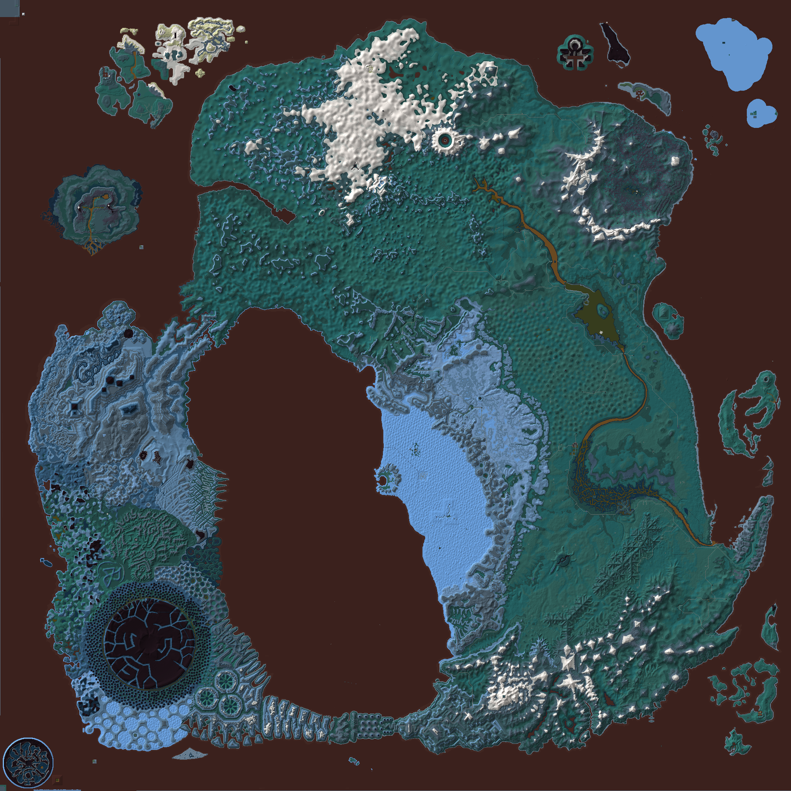
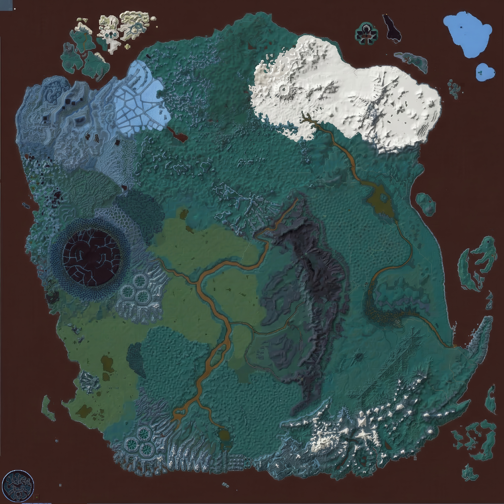
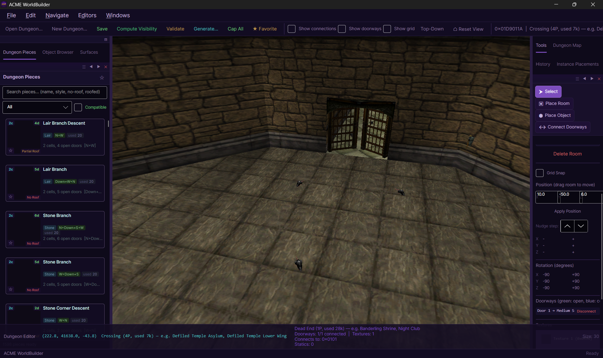
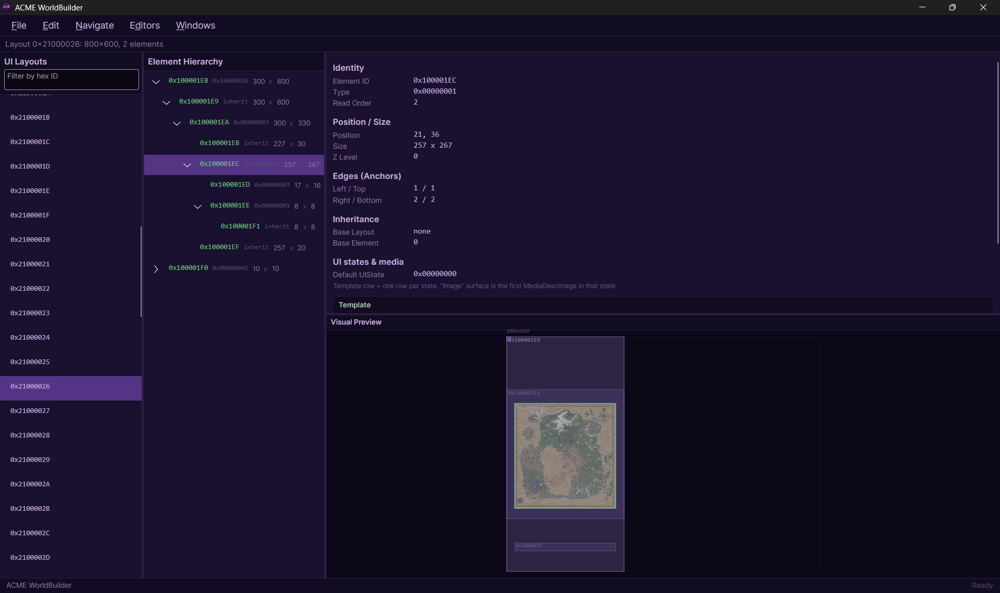
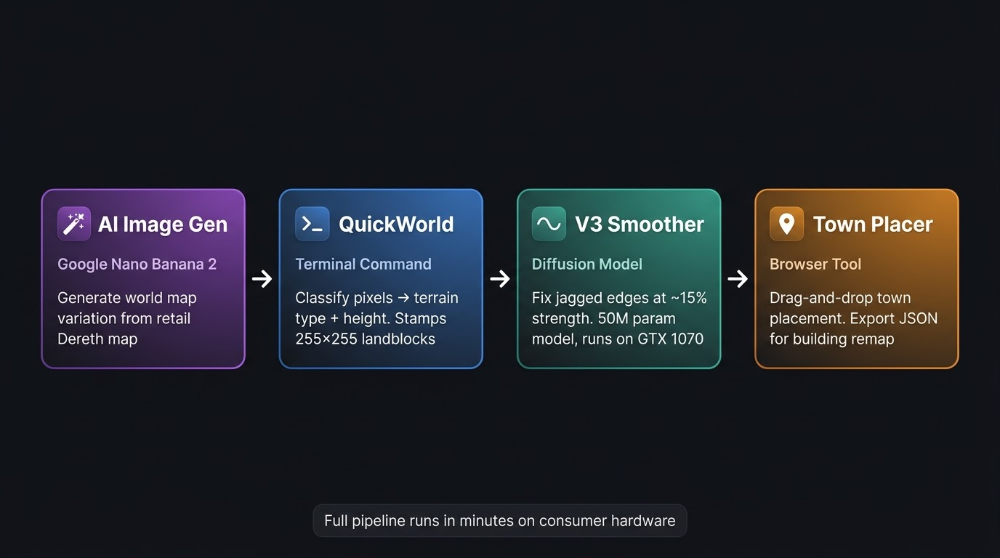
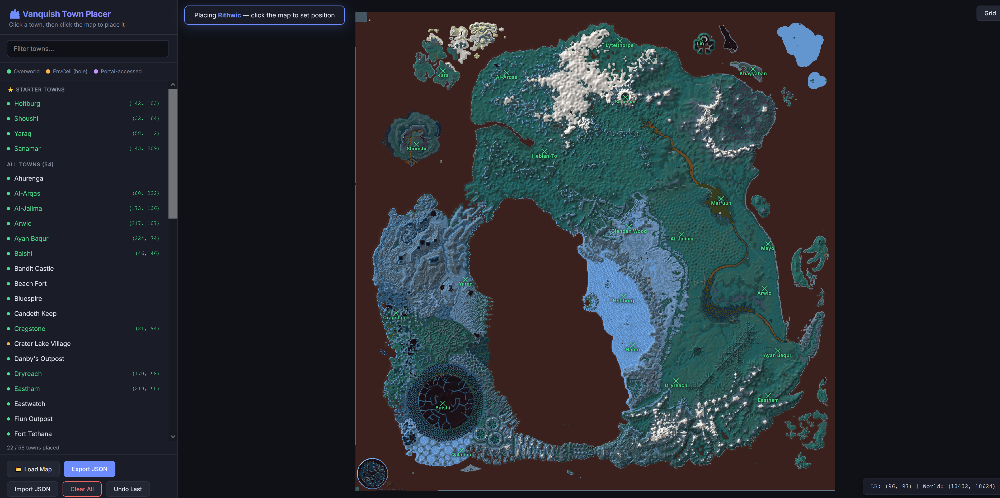

# ACME WorldBuilder

World building tool for Asheron's Call — edit terrain, dungeons, spells, skills, and more, and export directly to DAT files. The **ACME Edition** extends the original WorldBuilder with a **headless terminal** and **agent-driven pipeline**, laying the groundwork for AI-powered autonomous world development.

<p align="center">
  
  &nbsp;&nbsp;➜&nbsp;&nbsp;
  
</p>
<p align="center"><em>Left: Retail Dereth map fed to AI image gen &nbsp;|&nbsp; Right: AI-generated world map variation used by the terrain pipeline</em></p>

### GUI — Full Terrain & Object Editor

<p align="center">
  
</p>
<p align="center">
  
</p>

---

## Vision — Agent-Driven Worldbuilding

The ACME Edition's long-term goal is to move beyond point-and-click editing. By exposing every world-manipulation capability through a structured, machine-readable API, we enable **AI agents** and **procedural algorithms** to design, populate, and validate entire regions of Dereth — with the same fidelity as a human using the GUI.

The worldbuilding pipeline has three pillars:

1. **Command** — An AI agent (LLM, procedural generator, or hybrid) issues structured commands: *place this building, sculpt this hillside, connect these dungeon rooms.*
2. **Execute & Validate** — The headless engine applies the commands against the live DAT data, then runs geometric and structural validators that act as a safety net — rejecting collisions, broken portals, or terrain that violates AC's spatial constraints.
3. **Observe & Iterate** — The agent reads back the world state (heightmaps, object lists, dungeon graphs, spatial queries) and refines its plan in a tight feedback loop until the result passes validation.

None of this replaces the GUI. Every feature available in the visual editor remains fully intact — the terminal is a **parallel interface**, not a replacement. Human artists and AI agents can work on the same project files.

---

## Downloads

- **Latest (for testing)** — [Releases → Edge (pre-release)](https://github.com/Vanquish-6/WorldBuilder-ACME-Edition/releases) — automated build from the latest commit. Download **ACME-WorldBuilderInstall-*.exe** and run it.
- **Stable** — [Releases](https://github.com/Vanquish-6/WorldBuilder-ACME-Edition/releases) — pick a versioned release (e.g. v0.1.0) when available.

Requires **Windows 10/11**, **.NET 8.0** (installer can prompt to install it). The app can check for updates in-app once installed.

---

> **Beta software.** All features are under active development. The newer data editors (Spell, Skill, Vital, Experience, CharGen, SpellSet, Layout) are especially early and have not been thoroughly tested. Expect rough edges, and back up your DAT files before exporting.

> **First run note:** The initial launch will be slower than usual. ACME WorldBuilder builds several caches on first run (textures, thumbnails, terrain data) that persist across sessions. Subsequent launches will be significantly faster.

---

## WorldBuilder.Terminal — Headless CLI

`WorldBuilder.Terminal` is a standalone, headless console application that exposes the full WorldBuilder engine **without a GUI**. It operates in three modes:

| Mode | Command | Use Case |
|------|---------|----------|
| **Batch** | `--project X --export Y` | Automated DAT export (CI/CD, scripts) |
| **Interactive REPL** | `--project X` (or no args) | Human-friendly colored prompt |
| **Agent (stdin/stdout)** | `--stdin [--project X]` | JSON-line protocol for AI agent piping |

### Agent Protocol at a Glance

In `--stdin` mode, the terminal speaks **JSON-line** — one JSON object per line, in each direction. The agent spawns the process, receives a `ready` handshake, and then issues commands:

```
Agent                               WorldBuilder.Terminal
  │  spawn: --stdin --project X             │
  │─────────────────────────────────────────>│
  │  {"success":true,"command":"ready",...}  │
  │<─────────────────────────────────────────│
  │  {"command":"raise","x":1500,"y":2000,  │
  │   "radius":48,"delta":10}               │
  │─────────────────────────────────────────>│
  │  {"success":true,"verticesModified":30}  │
  │<─────────────────────────────────────────│
  │  {"command":"validate-all","lbX":7,     │
  │   "lbY":10}                             │
  │─────────────────────────────────────────>│
  │  {"success":true,"isValid":true,...}    │
  │<─────────────────────────────────────────│
```

The full protocol reference — every command, parameter, response schema, coordinate system, and diagnostic code — is documented in **[`docs/agent_api_reference.md`](docs/agent_api_reference.md)** and the companion **[`docs/agent_api_schema.json`](docs/agent_api_schema.json)**.

### Available Commands (40+)

| Category | Commands |
|----------|----------|
| **Project** | `load`, `export`, `info` |
| **Terrain Editing** | `smooth`, `raise`, `lower`, `set-height`, `paint`, `fill`, `road` |
| **Terrain Queries** | `get-height`, `terrain-info`, `get-heightmap`, `get-terrain-data` |
| **Object Management** | `list-objects`, `add-object`, `remove-object`, `move-object`, `rotate-object` |
| **Spatial Queries** | `query-radius` |
| **Dungeon Tools** | `analyze-dungeons`, `get-dungeon-info` |
| **Validation** | `validate-dungeon`, `validate-landblock`, `validate-terrain`, `validate-building-portals`, `validate-all` |
| **World Observation** | `list-landblocks`, `get-world-info`, `get-region` |
| **Ontology** | `scan-ontology`, `query-ontology`, `ontology-stats` |
| **Control** | `help`, `quit` / `exit` |

### Validation Engine

The terminal includes a headless **validation engine** with 30 diagnostic codes across four validators, designed to catch agent mistakes before they corrupt DAT data:

- **Dungeon** (DNG001–DNG011) — broken portal links, orphaned cells, portal symmetry, environment references, connectivity
- **Landblock** (LBK001–LBK009) — object bounds, Z-axis clamping, zero-scale, degenerate quaternions, model existence
- **Terrain** (TRN001–TRN005) — cliff detection, edge stitching, flat/mono-type warnings
- **Building Portals** (BLD001–BLD008) — portal targets, reciprocal exits, interior BFS, VisibleCells

The recommended agent workflow: **mutate → `validate-all` → fix errors → repeat**.

### Object Ontology Service

The `OntologyService` provides semantic awareness — mapping raw DAT model IDs to human-readable tags (`Architecture: Aluvian`, `Biome: Desert`, `Type: Scenery_Tree`) so that AI agents can make aesthetically and logically coherent placement decisions:

- Auto-classification pipeline scans all Setup (0x02) and GfxObj (0x01) entries from `portal.dat`
- Bounding box computation from GfxObj vertex data
- Cross-references `BuildingBlueprintCache` and Scene objects for definitive classification
- Heuristic classification by size, aspect ratio, part count, and polygon count
- Object ontology schema with 80+ manually tagged entries, 28 creature families, and 5 constraint presets
- Constraint presets enforce aesthetic cohesion (e.g., a "Desert Outpost" preset rejects Snowy-tagged objects)

### Integration Tests

Both **Python** (55+ tests) and **PowerShell** (25 checks) test harnesses validate the full `--stdin` protocol surface — startup handshake, error handling, CRUD roundtrips, validation report shapes, and serialization contracts. Zero external dependencies. See **[`tests/README.md`](tests/README.md)**.

---

## Architectural Roadmap

The following phases describe the path from the current state to a fully autonomous, agentic worldbuilding system.

### Phase 1 — Service Layer Consolidation ✅

Core GUI logic has been decoupled into `WorldBuilder.Shared` services, achieving 1:1 parity between the GUI and the headless CLI:

- `ITerrainService` / `IObjectPlacementService` / `IDungeonService` / `IStampService` — all extracted
- Terrain algorithms (smooth, raise/lower, set-height, paint, fill, road pathing) in `WorldBuilder.Shared/Lib/Terrain/`
- Portal snapping algorithms in `WorldBuilder.Shared/Lib/Dungeon/PortalSnapAlgorithms.cs`
- Dungeon room analysis in `WorldBuilder.Shared/Lib/Dungeon/DungeonRoomAnalyzer.cs`
- Shared `CommandEngine` ensures both REPL and JSON modes execute identical logic

### Phase 2 — State Telemetry & Observation ✅

The terminal exposes high-fidelity, machine-readable world state:

- Heightmap matrices (9×9 grids, world-space and raw index)
- Full vertex data (height, terrain type, road flags, scenery)
- Landblock enumeration with height statistics
- World metadata and constants
- Region data (height lookup table, terrain type names)
- Dungeon cell layout (cells, portals, static objects, positions)
- Spatial radius queries with distance, density, and model frequency analysis
- Quaternion-based orientation (avoiding gimbal lock for precise agent calculations)

### Phase 3 — Deterministic Validation ✅

The headless `ValidationEngine` acts as a strict gatekeeper:

- AABB-style object bounds checking
- Z-axis topographical clamping (below-terrain / floating detection)
- Portal link verification (symmetry, connectivity via BFS, environment existence)
- Terrain edge stitching validation between adjacent landblocks
- Cliff detection with configurable thresholds
- Degenerate quaternion and zero-scale detection
- 30 structured diagnostic codes with error/warning/info severity levels

### Phase 4 — Speed Testing & Bulk Operations 🔲

Before any procedural generation, the engine must prove sustained throughput:

- Benchmark harness measuring terrain edit, object placement, and validation throughput (ops/sec)
- Bulk landblock operations (`set-landblock-heightmap`, `set-landblock-terrain`) to bypass per-vertex overhead
- Memory growth and GC pressure analysis over 65K+ operations
- Throughput degradation detection over sustained runs

### Phase 5 — Procedural World Generation 🔲

CPU-bound prototyping on local hardware, scaling to 4×RTX 4090 cluster for final passes:

- **Terrain**: Perlin/Simplex/fBm noise with coastline polygon masking and height-to-texture auto-painting
- **Dungeons**: Graph Grammar / L-System engine (NOT Markov chains — they lack global awareness for valid portal graphs)
- **Objects**: Constraint-based settlement generation using OntologyService semantic tags
- **Architecture**: Producer-Consumer pipeline for multi-GPU scaling (GPUs never touch DAT files directly)


### Phase 6 — Semantic Tagging & Constraint Enforcement ✅

Bridging mathematical placement with aesthetic cohesion:

- Object ontology schema with type taxonomy and tag dimensions (architecture, biome, era, function)
- `OntologyService` auto-classification pipeline (21K+ entries from DAT scan, string table enrichment, material tagging)
- Constraint presets that reject aesthetically incoherent placements (Desert_Outpost, Aluvian_Village, Sho_Settlement, etc.)
- Creature family taxonomy with 28 families, level ranges, and biome affinities (sourced from Lifestoned data)
- Community tagging via CSV export, LLM-assisted classification, and catalog visual enrichment

---

## Create Custom Worlds

Generate your own Asheron's Call world in minutes on a GTX 1070 (or better). The pipeline turns any world map image into a near-retail quality playable terrain.

### The Pipeline

```
┌──────────────────┐    ┌──────────────────┐    ┌──────────────────┐    ┌──────────────────┐
│  1. AI Image     │    │  2. QuickWorld    │    │  3. V3 Smoother  │    │  4. Town Placer  │
│                  │    │                  │    │                  │    │                  │
│  Google Nano /   │───▶│  Terminal cmd:    │───▶│  V3 diffusion    │───▶│  Drag-and-drop   │
│  Banana 2 or any │    │  quick-world      │    │  at ~15% strength│    │  town placement  │
│  AI image gen    │    │  <codebook>  │    │  fixes jagged    │    │  (browser-based) │
│                  │    │                  │    │  QuickWorld edges │    │                  │
│  "Keep this      │    │  Classifies each  │    │                  │    │  tools/           │
│   pixel perfect  │    │  pixel → terrain  │    │  smooth_vanquish │    │  town_placer.html │
│   but randomize" │    │  type + height    │    │  _v3.py          │    │                  │
└──────────────────┘    └──────────────────┘    └──────────────────┘    └──────────────────┘
```

<p align="center">
  
</p>

### Step 1 — Generate a World Map Image

Use **Google Nano / Banana 2** (or any AI image generator). Take the retail Dereth world map and prompt the AI to create a variation — keeping the same pixel style and color palette but randomizing the terrain layout. The output should be a 2041×2041 PNG.

### Step 2 — Convert Image to Terrain

First, build a calibration codebook from the retail DAT data:

```bash
# In the WorldBuilder Terminal:
calibrate-world-map
```

Then reverse-engineer terrain from your new image:

```bash
quick-world pipeline_data/enrichment/terrain_codebook.json your_new_world_map.png
```

`quick-world` classifies each pixel's color to the nearest terrain type (via RGB distance to the codebook), estimates height from brightness, and stamps 255×255 landblocks with terrain + scenery objects. The result is a complete world — but with jagged, pixel-artifact edges at terrain boundaries.

### Step 3 — Smooth with V3 Diffusion

The V3 terrain diffusion model (~232 MB, 50M parameters) was overtrained on retail heightmaps. At ~15% diffusion strength, this "overtrained" property becomes a feature — it smooths the harsh QuickWorld edges while preserving the terrain's structural character:

```bash
python scripts/smooth_vanquish_v3.py \
    --model pipeline_data/models/v3/terrain_diffusion_v3.pt \
    --input pipeline_data/heightmaps/vanquish_heightmaps.jsonl \
    --output pipeline_data/heightmaps/vanquish_smoothed.jsonl
```

The smoother applies variable strength by terrain height band — mountains get lighter smoothing (they already look good), while mid-elevation plains (the worst QuickWorld artifacts) get stronger treatment.

**Hardware:** Runs on a GTX 1070 (8 GB VRAM). Inference takes a few minutes for the full 255×255 grid.

### Step 4 — Place Towns (Optional)

Open **[`tools/town_placer.html`](tools/town_placer.html)** in any browser. Load your world map image, click to place towns, and export the placement JSON for the downstream remap pipeline. This is the first-ever interactive town repositioning tool for Asheron's Call.

<p align="center">
  
</p>

---

## ML Models

Pre-trained model weights are included in the repository via **Git LFS**. When you clone, you get everything.

| Model | Architecture | Size | Purpose | Hardware | Training Script |
|---|---|---|---|---|---|
| **V1** | Conditional U-Net | 62 MB | Image → terrain heightmap + texture type | GTX 1070 (10-30 min training) | [`scripts/train_terrain_unet.py`](scripts/train_terrain_unet.py) |
| **V2** | Conditional U-Net (smaller) | 16 MB | Experimental iteration | — | — |
| **V3** | Conditional DDPM U-Net | 232 MB | Diffusion-based terrain smoothing | GTX 1070 (few min inference) | [`scripts/train_terrain_v3.py`](scripts/train_terrain_v3.py) |

### Pipeline Data (Git LFS)

The essential pipeline files are tracked via **Git LFS** (~530 MB total). Clone the repo and `git lfs pull` to get everything needed to run the terrain pipeline.

**LFS-tracked files:**

```
pipeline_data/
├── models/
│   ├── terrain_unet.pt              # V1 weights (62 MB)
│   ├── v1/terrain_unet.pt           # V1 weights (62 MB)
│   ├── v2/terrain_unet_v2.pt        # V2 weights (16 MB)
│   └── v3/terrain_diffusion_v3.pt   # V3 diffusion weights (232 MB)
├── heightmaps/
│   └── retail_heightmaps.jsonl      # Training data from retail DATs (61 MB)
└── reference/
    └── retail_dungeon_topology.json # Dungeon reference data (113 MB)
```

Model configs (`.json`), training loss plots (`.png`), and other small metadata files are tracked normally (not LFS). Additional pipeline data (enrichment, screenshots, population output) is generated locally and gitignored.

### Retraining

To retrain the V3 model from scratch on your own retail data:

```bash
# 1. Extract retail heightmaps (requires retail DATs loaded in a project)
#    In the Terminal:
extract-retail-heightmaps pipeline_data/heightmaps/retail_heightmaps.jsonl

# 2. Train the V3 diffusion model
python scripts/train_terrain_v3.py \
    --data pipeline_data/heightmaps/retail_heightmaps.jsonl \
    --output pipeline_data/models/v3/terrain_diffusion_v3.pt
```

Training runs in 10–30 minutes on a GTX 1070. The model converges quickly because the retail terrain data is relatively uniform — this is actually desirable, since the V3 model works best as a smoother (not a generator) at 15% diffusion strength.

---

## Tools

### Town Placer — [`tools/town_placer.html`](tools/town_placer.html)

Interactive, browser-based town placement tool. Open it directly in any browser — no server, no dependencies, no build step. Select towns from the sidebar, click to place them on the world map, and export the placement JSON for the building remap pipeline.

This is the first tool that allows moving Asheron's Call towns to new locations. Exported placements feed into `remap-buildings-v2` in the Terminal.

---

## GUI Features

The full visual editor is available via the platform-specific projects (`WorldBuilder.Windows`, `.Mac`, `.Linux`). All features listed below are fully functional and unrelated to the agentic extensions.

### Terrain Editing

- **Raise / Lower** — left-click to raise, shift+left-click to lower. Adjustable brush radius (0.5–200) and strength (1–50)
- **Set Height** — paint vertices to a target height (0–255)
- **Smooth** — blend height differences across vertices
- **Texture Brush** — paint terrain textures with a shader-based WYSIWYG preview inside the brush circle
- **Bucket Fill** — flood-fill terrain textures with live preview, constrained to visible landblocks
- **Texture Palette** — visual thumbnail palette that activates with terrain tools
- **Slope Overlay** — highlight unwalkable slopes with configurable threshold (default 45°)

### Roads

- **Point placement** — click individual vertices to set road flags
- **Line drawing** — draw road lines between points
- **Remove** — clear road flags from vertices

### Objects

- **Object Browser** — browse and search the full DAT object catalog (Setups and GfxObjs)
- **Search** — by hex ID or keyword, filter by buildings or scenery
- **Thumbnail previews** — rendered on the GPU, cached to disk across sessions
- **Placement** — click terrain to place, with terrain snap
- **Move / Rotate / Delete** — drag to move, drag to rotate, Delete key to remove
- **Multi-select** — Ctrl+Click or drag a marquee box (full bounding-box testing)
- **Multi-object rotate** — rotate a group of objects around their shared center
- **Copy / Paste** — Ctrl+C / Ctrl+V, supports multi-object paste with offset
- **Right-click context menu** — copy, paste, snap to terrain, delete
- **Properties panel** — edit position (X, Y, Z), rotation (Euler angles), view landcell, snap to terrain
- **Auto height adjustment** — objects stay on the ground when terrain changes beneath them
- **Terrain snap on rotate** — objects maintain ground contact when rotated on slopes
- **Selection highlights** — spheres scale proportionally to object size

### Buildings

- **Building blueprint system** — place buildings with interior cells
- **Move / Rotate** — correctly updates interior cell VisibleCells references
- **Interior toggle** — show or hide building interiors in the viewport

### Terrain Stamps (Clone & Paste)

- **Clone tool** — drag a rectangle to capture terrain heights, textures, and objects
- **Stamp library** — stores up to 10 stamps (configurable, max 50)
- **Paste with rotation** — 0°, 90°, 180°, 270° via `[` and `]` keys
- **Edge blending** — optional smooth blending at stamp borders
- **Include objects** — optionally stamp objects along with terrain
- **Grid snapping** — snaps to the 24-unit cell grid

### Layers

- Full layer system with groups, visibility toggles, and export toggles
- Each layer tracks height, texture, road, and scenery changes independently
- Drag-and-drop reordering and nesting
- Base layer always at bottom (cannot be deleted or reordered)
- Layer compositing for export (top-to-bottom, first non-null wins)

### History & Snapshots

- Undo / redo for all operations (default 50 entries, configurable 5–10,000)
- History panel — click any entry to jump to that state
- Named snapshots that persist between sessions
- Forward entries shown dimmed in the history panel

### Dungeon Editor

- **Room palette** — browse all dungeon environment rooms with 2D cross-section previews
- **Portal snapping** — rooms auto-snap together via portal connections
- **Surface editing** — change wall and floor textures per cell
- **Static objects** — place and move objects inside dungeon cells
- **Copy template** — duplicate a dungeon from one landblock to another
- **Undo / redo** — full history support for dungeon operations

### Spell Editor *(beta)*

- Browse and search all spells by name, school, or type
- Edit spell properties: power, range, duration, components (1–8 slots)
- Icon picker with visual DAT icon browser
- Add and delete spells, save back to SpellTable

### Spell Set Editor *(beta)*

- Edit equipment set spell assignments
- Tiered spell slot management (add/remove tiers and spells per tier)

### Skill Editor *(beta)*

- Browse and filter skills by category (Combat, Magic, Other)
- Edit training costs, formulas (attribute contributions, divisor), bounds, learn mod
- Icon picker, add/delete skills

### Experience Table Editor *(beta)*

- Edit level progression, attribute/vital/skill XP cost tables
- Auto-scale generator with power-curve formulas for quick table generation
- Add/remove levels and ranks

### Vital Table Editor *(beta)*

- Edit Health, Stamina, and Mana formulas
- Configure attribute contributions, divisors, and multipliers
- Live formula preview

### Character Creation Editor *(beta)*

- Edit heritage groups: names, icons, attribute/skill credits, setup models
- 3D model preview for heritage setups with rotation and zoom
- Manage starting areas and spawn locations

### UI Layout Viewer *(beta)*

- Browse all LayoutDesc entries from the DAT
- Element tree hierarchy with property inspector
- Visual preview canvas with selection highlighting

### Custom Textures

- **Terrain texture replacement** — import custom images to replace any terrain type
- **Dungeon surface import** — create new dungeon wall/floor textures
- Exports overwrite existing RenderSurface entries in-place (no DAT corruption)

### DAT Export

- Exports to `client_cell_1.dat`, `client_portal.dat`, `client_highres.dat`, and `client_local_English.dat`
- Configurable portal iteration
- Layer-based export control (toggle which layers are included)
- Overwrite protection

### Camera & Navigation

- **Perspective camera** — WASD + mouse look, Space to go up, Shift to go down
- **Top-down orthographic camera** — pan and zoom, ideal for large-scale editing
- **Toggle** — press Q to switch between modes
- **Go To Landblock** — Ctrl+G, enter a hex ID or X,Y coordinates
- **Location search** — search named locations (towns, dungeons, landmarks) and teleport to them
- **Camera bookmarks** — save and recall camera positions
- **Position HUD** — shows current coordinates in the viewport
- **Grid overlay** — landblock boundaries (magenta) and cell boundaries (cyan)
- **Overlay toggles** — grid, static objects, scenery, dungeons, unwalkable slopes
- Camera position and mode saved between sessions

### Projects

- Point at your base DAT directory, name your project, and go
- Recent projects list on the splash screen
- All project data stored in a local SQLite database

### Performance

- Streaming terrain chunks — only nearby chunks loaded, distant ones unloaded
- Background geometry generation — no frame stalls during terrain loading
- Frustum culling — only visible static objects are rendered
- Two-phase GPU upload — models load in background, upload to GPU in batches
- Texture disk cache — processed RGBA data cached to disk after first load
- Camera-aware streaming — top-down loads the visible rectangle, perspective uses proximity
- Zoom-scaled scenery — trees and rocks appear at appropriate zoom levels, buildings load everywhere
- Load/unload hysteresis — prevents objects flickering at view distance edges
- Distance-prioritized loading — closest landblocks load first
- Capped batch sizes and max loaded landblocks to keep memory and frame times stable

---

## Controls

### Camera

| Action | Key |
|---|---|
| Move forward / back / left / right | W / S / A / D or Arrow Keys |
| Rotate camera (perspective) | Shift + Arrow Keys, or mouse look |
| Move up | Space |
| Move down | Shift (held) |
| Toggle perspective / top-down | Q |
| Zoom in / out | Mouse wheel, or + / - |

### Editing

| Action | Key |
|---|---|
| Go to landblock | Ctrl+G |
| Undo | Ctrl+Z |
| Redo | Ctrl+Shift+Z or Ctrl+Y |
| Copy | Ctrl+C |
| Paste | Ctrl+V |
| Delete | Delete |
| Cancel / deselect | Escape |
| Multi-select | Ctrl+Click |
| Box select | Click and drag |
| Rotate stamp | [ / ] |
| Lower terrain (with raise tool) | Shift+Left-Click |
| Context menu | Right-Click |

---

## Default Settings

| Setting | Default |
|---|---|
| Projects directory | `Documents/ACME WorldBuilder/Projects` |
| History limit | 50 |
| Max draw distance | 4,000 units |
| Field of view | 60° |
| Mouse sensitivity | 1.0 |
| Movement speed | 1,000 units/sec |
| Light intensity | 0.45 |
| Grid visible | Yes |
| Grid opacity | 40% |
| Static objects visible | Yes |
| Scenery visible | Yes |
| Dungeons visible | Yes |
| Building interiors visible | No |
| Slope highlight | Off (threshold 45°) |
| Stamp library size | 10 |

All settings are configurable in the Settings panel and persist between sessions.

---

## Project Structure

```
WorldBuilder-ACME-Edition/
├── WorldBuilder/              # GUI application (Avalonia UI)
├── WorldBuilder.Shared/       # Shared services, algorithms, and data models
│   ├── Services/              #   ITerrainService, IObjectPlacementService, IDungeonService, etc.
│   ├── Lib/                   #   Pure algorithms (terrain, dungeon, validation, ontology)
│   │   ├── Terrain/           #     TerrainAlgorithms, SceneryAlgorithms, StampAlgorithms
│   │   ├── Dungeon/           #     PortalSnapAlgorithms, DungeonRoomAnalyzer
│   │   └── Validation/        #     ValidationEngine (30 diagnostic codes)
│   └── Documents/             #   SQLite-backed document storage
├── WorldBuilder.Terminal/     # Headless CLI (batch, REPL, agent stdin mode)
│   ├── Program.cs             #   Entry point — mode routing
│   ├── CommandEngine.cs       #   Shared business logic for all commands
│   ├── JsonCommandProcessor.cs#   stdin/stdout JSON-line protocol handler
│   ├── TerminalRepl.cs        #   Human-friendly interactive REPL
│   └── HeadlessProjectManager.cs  # DI-based project management
├── WorldBuilder.Windows/      # Windows platform target
├── WorldBuilder.Mac/          # macOS platform target
├── WorldBuilder.Linux/        # Linux platform target
├── pipeline_data/             # ML models, heightmaps, training data (Git LFS)
│   ├── models/                #   V1/V2/V3 model weights + configs
│   ├── heightmaps/            #   Extracted terrain data (JSONL, 40-85 MB each)
│   ├── data/                  #   Biome grids, feature catalogs
│   ├── enrichment/            #   Calibration codebooks, baselines
│   └── reference/             #   Retail dungeon topology, training data
├── scripts/                   # Python ML scripts
│   ├── train_terrain_v3.py    #   Train V3 conditional diffusion model
│   ├── smooth_vanquish_v3.py  #   Apply V3 smoothing to QuickWorld terrain
│   └── train_terrain_unet.py  #   Train V1 U-Net model
├── tools/                     # Browser-based utilities
│   └── town_placer.html       #   Interactive town placement (zero-dependency)
├── docs/                      # Documentation
│   ├── HowToMakeNewWorlds.md  #   World generation pipeline guide
│   ├── agent_api_reference.md #   Full command reference (1,400+ lines)
│   └── agent_api_schema.json  #   JSON schema for all commands
├── tests/                     # Integration test suites
│   ├── test_agent_protocol.py #   Python: 55+ protocol tests
│   └── Test-AgentProtocol.ps1 #   PowerShell: 25 smoke tests
└── projects/                  # World projects
    └── TestProject/           #   Sample project with retail DATs
```

---

## Building

Requires .NET 8.0 SDK or later.

```
dotnet build WorldBuilder.slnx
```

### Running the GUI

```
dotnet run --project WorldBuilder.Windows
```

Platform-specific projects are also available: `WorldBuilder.Windows` (recommended), `WorldBuilder.Mac`, `WorldBuilder.Linux`.

### Running the Terminal

```bash
# Interactive REPL
dotnet run --project WorldBuilder.Terminal

# Batch export
dotnet run --project WorldBuilder.Terminal -- --project MyWorld.wbproj --export ./output

# Agent mode (stdin/stdout JSON)
dotnet run --project WorldBuilder.Terminal -- --stdin --project MyWorld.wbproj
```

---

## Thanks

- **Vanquish-6** — this project is forked from [Vanquish-6/WorldBuilder-ACME-Edition](https://github.com/Vanquish-6/WorldBuilder-ACME-Edition)
- **Trevis** — original WorldBuilder vision and groundwork (DatReaderWriter + the base that this all grew from, before the big refactor...)
- **Gmriggs** — testing, research, and invaluable AC knowledge
- **Advan** — testing and bug reports
- **Vermino** — PRs and code contributions
- **The AC community** — everyone who has contributed, tested, reported bugs, or just kept Dereth going. If you helped and aren't listed, you know who you are.
