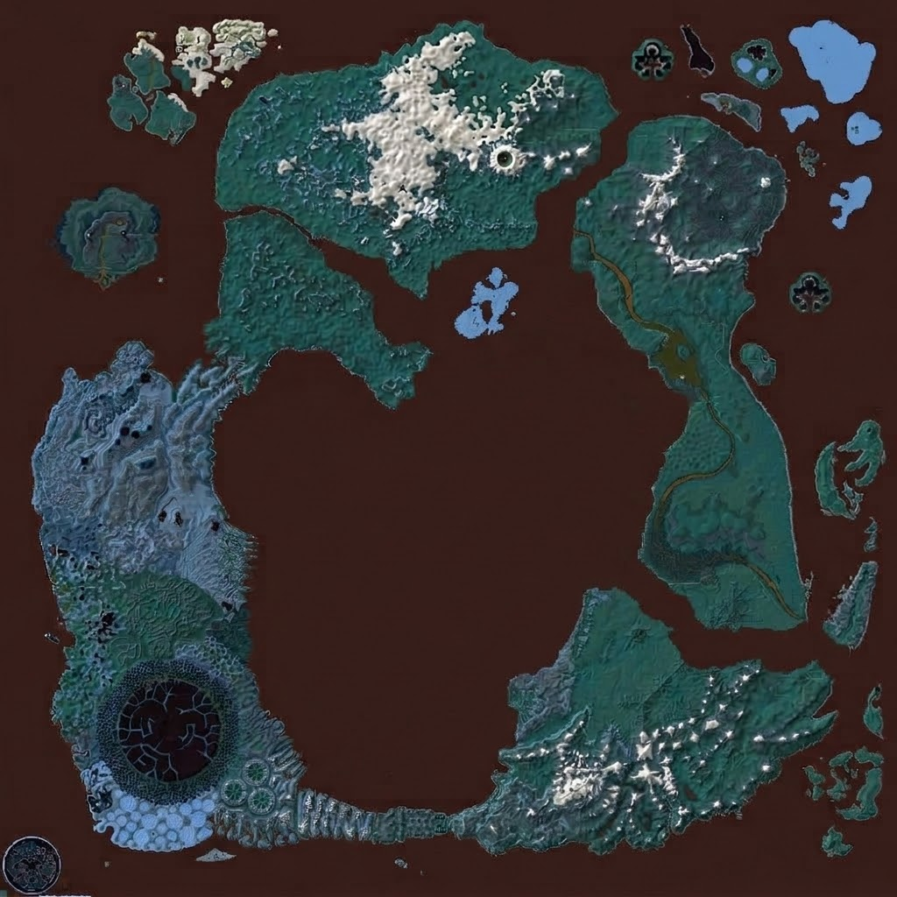
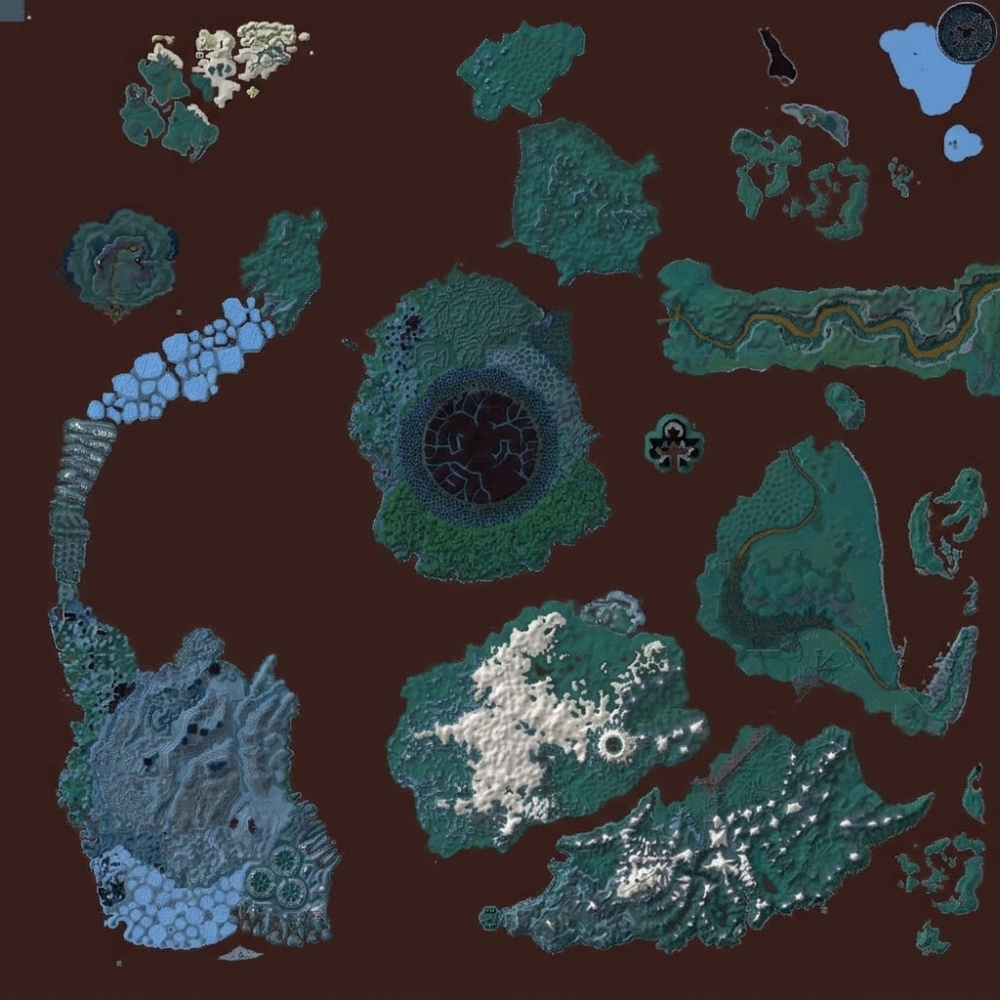
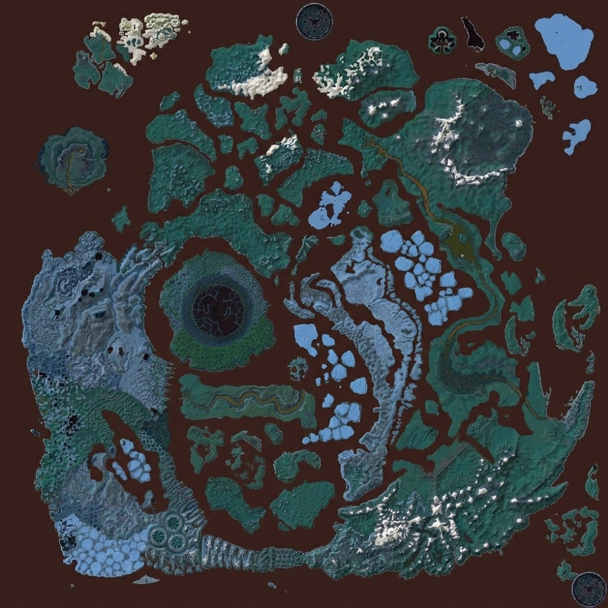
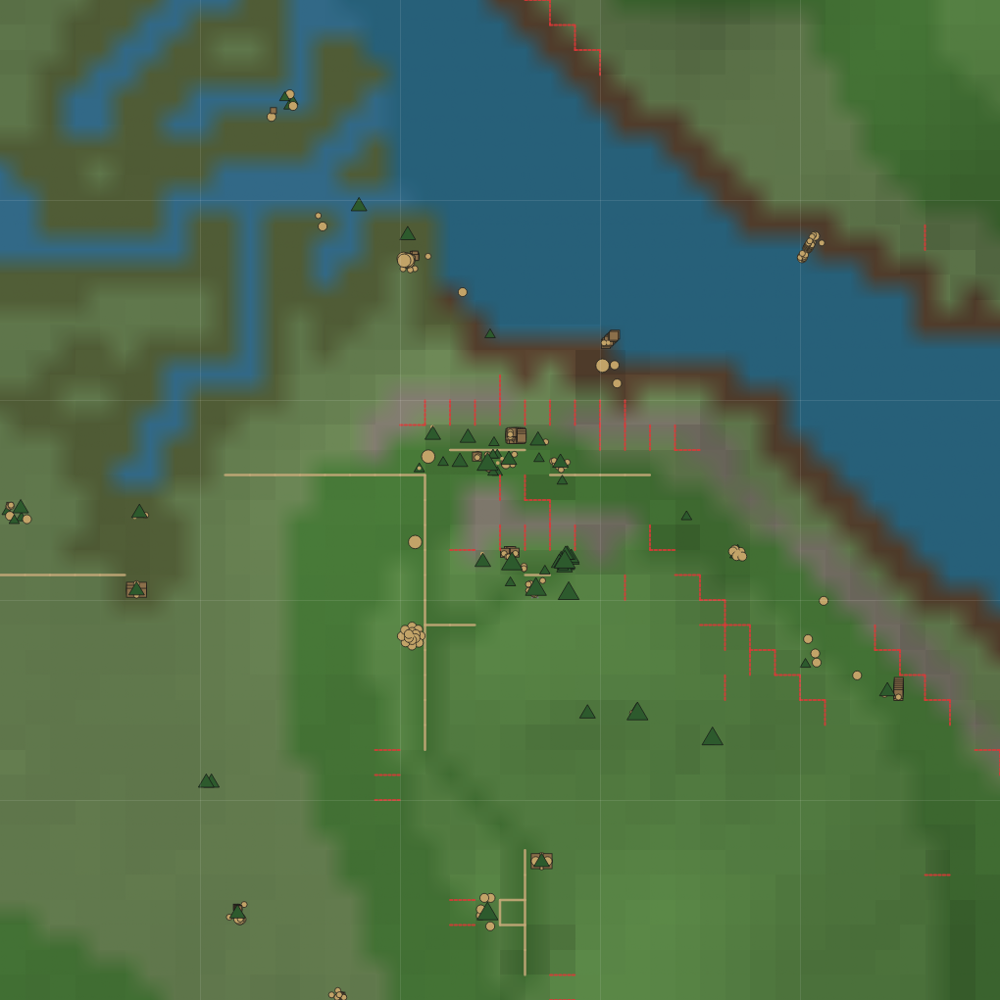
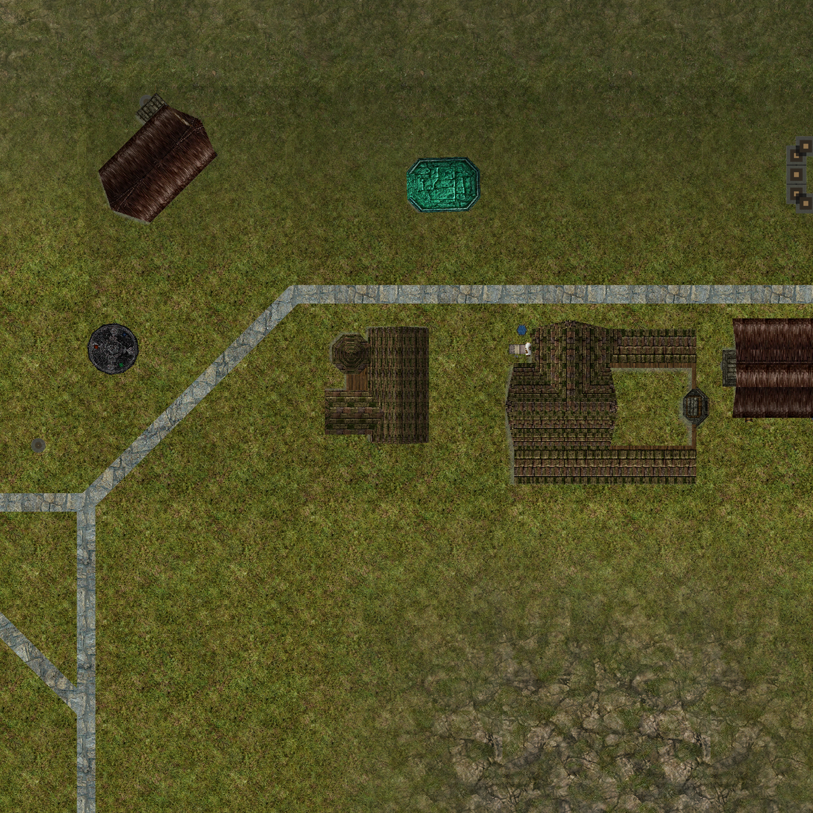

# ACME WorldBuilder

A modern world-building tool for Asheron's Call. Edit terrain, dungeons, spells, skills, creature visuals, and ACE weenie scalars in a full GUI — or drive the same engine headlessly from a terminal, a script, or an LLM agent. Both interfaces share one service layer, so anything you can do in the editor you can also do from a JSON command stream.

The **ACME Edition** layers the headless terminal, an agent JSON protocol, a deterministic validation engine, three structured observation channels, and an ML-driven world generation pipeline on top of the original WorldBuilder.

📖 **[User Guide](docs/USER_GUIDE.md)** — setup, editor walkthrough, export options, MySQL-backed tools.

<p align="center">
  
  &nbsp;&nbsp;➜&nbsp;&nbsp;
  
</p>
<p align="center"><em>Retail Dereth (left) → AI-regenerated variation (right). The pipeline turns either into a playable world.</em></p>

### GUI — Full Terrain & Object Editor

<p align="center">
  
</p>
<p align="center">
  
</p>

---

## How It Works

Every capability in the GUI is also exposed as a structured command on the terminal. AI agents, scripts, and procedural generators **command** the engine (place objects, sculpt terrain, connect dungeon rooms), the engine **executes and validates** against live DAT data, and three observation channels let the agent **read back** the world — visually (`render-preview`), factually (`describe-landblock`), or statistically (`compare-to-retail`) — to refine its plan in a tight loop.

The GUI and headless terminal are **parallel interfaces** sharing one service layer. Human artists and AI agents can work on the same project files.

---

## Quick Start

**Download** — [Releases](https://github.com/Vanquish-6/WorldBuilder-ACME-Edition/releases)

- *Edge (pre-release)*: latest commit, automated build — pick `ACME-WorldBuilderInstall-*.exe` and run it
- *Stable*: pick a versioned release (e.g. v0.1.0) when available

**Requirements** — Windows 10/11, .NET 8.0 (the installer can prompt to install it). The app checks for updates in-place once installed.

> ⚠️ **Beta software.** Active development across all features. The table-driven editors (Spell, Skill, Vital, Experience, CharGen, SpellSet, Layout), the Weenie Editor, and Object Debug are powerful but evolving. Back up your DAT files (and the ACE database when using DB-write features) before exporting.

> 💡 **First run is slow** — the app builds caches for textures, thumbnails, and terrain on initial launch. They persist across sessions; subsequent launches are significantly faster.

---

## Generate a Custom World

Build your own Asheron's Call world in minutes on a GTX 1070. The pipeline turns any world map image into near-retail playable terrain — the images at the top of this README came from this exact flow.

<p align="center">
  
</p>

### 1. Generate a world map image

Use **Google Nano Banana 2** (or any AI image generator). Feed it the retail Dereth map and ask for a variation that keeps the pixel style and color palette but randomizes the terrain layout. Aim for a 2041×2041 PNG.

<p align="center">
  
  &nbsp;
  
  &nbsp;
  
</p>
<p align="center"><em>Three Nano Banana 2 variations from the same retail prompt — same palette, three completely different worlds</em></p>

### 2. Convert image → terrain — `quick-world`

In the WorldBuilder Terminal, build a calibration codebook from retail DAT data, then run the conversion:

```bash
calibrate-world-map
quick-world pipeline_data/enrichment/terrain_codebook.json your_world_map.png
```

`quick-world` classifies each pixel's color to the nearest retail terrain type (RGB distance to the codebook), estimates height from brightness, and stamps 255×255 landblocks of terrain plus scenery objects. The output is a complete, playable world — but with jagged, pixel-artifact edges at terrain boundaries.

### 3. Smooth with V3 diffusion — `smooth_vanquish_v3.py`

The V3 conditional DDPM (~232 MB, ~61M params) was overtrained on retail heightmaps. At ~15 % diffusion strength that "overtrained" property becomes a feature: it erases the QuickWorld artifacts while preserving the terrain's structural character.

```bash
python scripts/smooth_vanquish_v3.py \
    --model  pipeline_data/models/v3/terrain_diffusion_v3.pt \
    --input  pipeline_data/heightmaps/vanquish_heightmaps.jsonl \
    --output pipeline_data/heightmaps/vanquish_smoothed.jsonl
```

Smoothing strength varies by terrain band — mountains get lighter treatment (they already look good), mid-elevation plains (the worst QuickWorld artifacts) get stronger treatment. **Hardware:** GTX 1070 with 8 GB VRAM is enough; full 255×255 grid takes a few minutes.

### 4. Place towns *(optional)* — `tools/town_placer.html`

Open **[`tools/town_placer.html`](tools/town_placer.html)** in any browser — no server, no build step. Load your world map, click to place towns, export the placement JSON for the building remap pipeline. This is the first interactive town repositioning tool for Asheron's Call.

<p align="center">
  
</p>

📖 Full pipeline guide: **[docs/HowToMakeNewWorlds.md](docs/HowToMakeNewWorlds.md)**

---

## Headless Terminal & Agent API

`WorldBuilder.Terminal` is a standalone console application that exposes the full WorldBuilder engine **without a GUI**. It runs in three modes:

| Mode | Command | Use Case |
|---|---|---|
| **Batch** | `--project X --export Y` | Automated DAT export (CI/CD, scripts) |
| **Interactive REPL** | `--project X` (or no args) | Human-friendly colored prompt |
| **Agent (stdin/stdout)** | `--stdin [--project X]` | JSON-line protocol for AI agents |

### Agent Protocol

In `--stdin` mode the terminal speaks **JSON-line** — one JSON object per line in each direction. The agent spawns the process, receives a `ready` handshake, then issues commands:

```
Agent                               WorldBuilder.Terminal
  │  spawn: --stdin --project X             │
  │─────────────────────────────────────────>│
  │  {"success":true,"command":"ready",...}  │
  │<─────────────────────────────────────────│
  │  {"command":"raise","x":1500,"y":2000,  │
  │   "radius":48,"delta":10}               │
  │─────────────────────────────────────────>│
  │  {"success":true,"verticesModified":30}  │
  │<─────────────────────────────────────────│
  │  {"command":"validate-all","lbX":7,     │
  │   "lbY":10}                             │
  │─────────────────────────────────────────>│
  │  {"success":true,"isValid":true,...}    │
  │<─────────────────────────────────────────│
```

Full protocol — every command, parameter, response schema, coordinate convention, and diagnostic code — is documented in **[`docs/agent_api_reference.md`](docs/agent_api_reference.md)** with a JSON schema in **[`docs/agent_api_schema.json`](docs/agent_api_schema.json)**.

### Command Catalog

The agent JSON protocol exposes **32 documented commands**; the REPL surface is wider — **110+ commands** including bulk operations, image-driven terrain, ontology export, ACE-database I/O, and dungeon document editing. Sample categories:

| Category | Commands |
|---|---|
| **Project** | `load`, `export`, `info` |
| **Terrain Editing** | `smooth`, `raise`, `lower`, `set-height`, `paint`, `fill`, `road` |
| **Terrain Queries** | `get-height`, `terrain-info`, `get-heightmap`, `get-terrain-data` |
| **Object Management** | `list-objects`, `add-object`, `remove-object`, `move-object`, `rotate-object` |
| **Spatial Queries** | `query-radius` |
| **Dungeons** | `analyze-dungeons`, `analyze-dungeon-topology`, `get-dungeon-info` |
| **Validation** | `validate-dungeon`, `validate-landblock`, `validate-terrain`, `validate-building-shells`, `validate-building-portals`, `validate-all` |
| **World Observation** | `list-landblocks`, `get-world-info`, `get-region` |
| **Ontology** | `scan-ontology`, `query-ontology`, `ontology-stats`, `enrich-unified` |
| **Bulk** | `set-landblock-heightmap`, `set-landblock-terrain`, `bulk-place-objects`, `benchmark` |
| **Image-Driven Terrain** | `calibrate-world-map`, `quick-world`, `analyze-map-image`, `extract-retail-heightmaps` |
| **Control** | `help`, `quit` / `exit` |

Full grouped catalog in **[`docs/terminal_repl_commands.md`](docs/terminal_repl_commands.md)**.

### Validation Engine

A headless validation engine with **34 diagnostic codes across four validators**, designed to catch agent mistakes before they corrupt DAT data:

- **Dungeon** (`DNG001`–`DNG011`) — broken portal links, orphaned cells, portal symmetry, environment refs, connectivity
- **Landblock** (`LBK001`–`LBK010`) — object bounds, Z-axis clamping, zero-scale, degenerate quaternions, model existence
- **Terrain** (`TRN001`–`TRN005`) — cliff detection, edge stitching, flat/mono-type warnings
- **Building Portals** (`BLD001`–`BLD008`) — portal targets, reciprocal exits, interior BFS, `VisibleCells`

Recommended agent loop: **mutate → `validate-all` → fix errors → repeat**.

### Atomic Mutation — `transact` & `transact-diff`

`transact` collapses the mutate → validate → fix loop into a single round-trip with a built-in safety net. The agent stages N commands as one batch; the engine snapshots the affected document projections, runs the ops sequentially, validates the staged delta, and either commits atomically or rolls back the in-memory state on any failure.

```jsonc
{
  "command": "transact",
  "ops": [
    { "command": "set-landblock-heightmap", "lbX": 169, "lbY": 180, "heights": [/*81*/] },
    { "command": "bulk-place-objects",      "lbX": 169, "lbY": 180, "objects": [/*…*/] }
  ],
  "rollback_on_fail": true,
  "validate": "auto"
}
```

- **Op alphabet** — reuses the JSON command surface; allow-listed to mutating commands only (terrain edits, object placement, `generate-dungeon`, `paste-stamp`). Read-only and side-effecting ops are rejected, as is nesting.
- **Rollback** — restores via `BaseDocument.LoadFromProjection` on touched documents and deletes any documents the batch created. Failure modes are distinguished by `reason` (`op-threw` / `op-returned-failure` / `validation-failure` / `rejected`).
- **Validation scope** — `auto` validates the touched landblocks plus cheap terrain checks on right/top neighbors (catches `TRN005` edge mismatches); `all`, `none`, or an explicit `{ "landblocks": [...] }` list are also supported.
- **Large batches** — pass `"opsFile": "/path/to/ops.json"` instead of inline `ops` to dodge stdin line-buffer limits on multi-thousand-op transactions.
- **Journal** — every response carries a transaction id, op-by-op outcome (with each inner command's full response embedded), the validation report, and the list of documents touched / created.

`transact-diff` closes the action loop by describing the **change** a `transact` produced — added / removed / moved objects, structural deltas, validation regressions, and an optional visual diff PNG (red glyphs for removals, green for additions, yellow with arrows for moves; cyan/magenta cell outlines for validation regressions/clears). Standalone (`transact-diff <txId>`) or piggy-backed via `"diff": true | "structured" | "visual" | "both"` on the original `transact` call. Snapshots are held in an in-memory LRU (default 32 entries / 256 MB, configurable) and lookups bump LRU on access; rolled-back transactions are not retained.

```jsonc
{ "command": "transact-diff", "txId": "<guid from a prior transact>", "render": true, "renderMode": "overlay" }
```

Both available on REPL (`transact <ops.json>`, `transact-diff <txId> [--render] …`) and JSON-agent channels.

### Three Observation Channels

Validation catches structural mistakes symbolically. The three observation channels catch *visual*, *factual*, and *statistical* mistakes — designed to be consumed by a vision-capable LLM, a structured-prose LLM, and a numeric tuning loop respectively.

#### `render-preview` — visual

A literal top-down PNG of any region, returned as base64 over the JSON channel. Catches clustering, mode-collapse, density drift, and awkward placement that symbolic validation can't see.

<p align="center">
  
</p>
<p align="center"><em>5×5 region around Holtburg (0xA9B4): bilinearly-blended terrain colors, north-west hillshade, road network in tan, object glyphs by ontology category (▲ scenery, ■ structure, ● prop, ◆ creature), red dashed cliff overlay tracing the highland-to-river drop, subtle landblock grid.</em></p>

```
render-preview <lbX> <lbY> [radius] [resolution] [--no-overlay] [--out path]
```

- **Region** — single landblock (`radius=0`) or `(2r+1)×(2r+1)` grid centered on `(lbX, lbY)`
- **Encoded** — terrain elevation (hillshade) + terrain type (color) + roads + object positions (glyphs sized by ontology scale, shaped by category) + cliff/portal/building-pairing overlays
- **Returned** — base64 PNG over the JSON channel; optionally also written to disk via `--out`
- **Headless** — pure SkiaSharp raster, no GPU, no GUI dependencies

Sample renders covering the design space (town, wilderness, ocean, multi-LB region) live in [`docs/images/render_preview/`](docs/images/render_preview/).

#### `describe-landblock` — factual (Living Atlas)

A factual, on-demand description of any landblock — verbal block, deeply structured fields, and an LRU-cached tile pyramid. The architectural axiom is **identity is stored, context is derived**: object positions, model IDs, and ontology tags persist on the documents; descriptions are computed fresh from current state on every call. When the world mutates via `transact`, the journal's affected landblocks are marked dirty and the next `get-tile` / `describe-landblock` regenerates — no stale prose.

```
Holtburg, Aluvian Heartlands (LB 0xA9B4, 169,180). Aluvian settlement. Rugged,
mostly lushgrass, road present, cliff-heavy (Z 30.0..96.0). 126 objects (12 structures).
Two-story building with 17 interior cells at (32532,34692) z=66.0 containing 7 objects
across 2 Z-bands. (+11 more structures.) Interior cells: 123, Z 66.0..94.0 (2 bands),
292 interior edges, 50 exterior portals.
  spawns [quest npc] (8): Alcott; Sean the Speedy; Buckminster; Alfrin; Worcer (+3)
  spawns [shopkeeper] (7): Sedor Wystan the Blacksmith; Monyra the Jeweler; Asenala (+4)
  wiki POI [Quest NPC]: Ahyara, Alcott, Brentsella (+10)
  validation: isValid=false, errors=1, warnings=19, info=48
```

Five data layers compose into the per-LB output, all loaded lazily from project-directory JSON:

1. **Structure derivation** — biome / cliff / road summary, real `FootprintExtractor` for Setups + GfxObj fallback, vertex Z-histogram for visual story counts, top/base XY-span ratio for roof shape (`spire` / `tapered` / `pitched` / `flat`), AC environment cell attribution per building. Type descriptions like *"two-story Aluvian building with pitched roof, 17 interior cells."* Memoized per `model_id`.
2. **Region + town gazetteer** — 13 AC-canonical cultural regions (Aluvian Heartlands, Sho Heartlands, Gharu'ndim Plains, Linvak Mountain, Empyrean Ruins, …) and 60 named retail towns with culture tags. Per-LB region resolved via nearest-town anchor with cache.
3. **Acpedia POI integration** — the AC community wiki XML dump (53k pages) streamed into a coordinate-keyed POI gazetteer via the validated wiki-N/E → LB-key formula `lbX = round((E·240 + 24384) / 192)`. **4,910 georeferenced wiki pages → 2,044 LBs with named POIs** (NPCs, shopkeepers, quest objects, landmarks).
4. **wcid → Acpedia per-object naming** — 14,915 LSD weenie wcids matched to Acpedia pages with HIGH/MED/LOW/NONE confidence tiering. A `entry.Name == acpedia.Title` (case-insensitive) sanity gate catches setupID-collision false positives.
5. **LSD spawnMap integration** — server-spawn data (1,162 spawnMaps → 53k entries → ~2k player-visible after the server-managed filter). Per-LB NPCs, creatures, and quest objects with positions and Acpedia categories, plus spawn-cluster detection for encounter groups (e.g. *"3× Drudge Prowler within ~5m at (153,−140) — encounter group."*).

Plus a per-LB **validation overlay** (the existing 45 codes across DNG / LBK / TRN / BSH / BLD), structure containment with Z-band relations, and an extensible relations layer. The LLM is reduced to an optional prose-synthesizer over the structured output — never a fact-extractor over raw DAT data.

**Tile pyramid:** three zoom levels via `get-tile`:

| Zoom | Source | Default size | Typical encoded |
|---|---|---:|---:|
| `lb` | `render-preview` 1024² → JPEG q85 at 512² | 512×512 | ~20 KB |
| `region` | `render-preview` covering region anchors → JPEG | 1024×1024 | 50–170 KB |
| `world` | SkiaSharp composite of all 13 region tiles → JPEG | 2048×2048 | ~150 KB |

Tiles persist under `<project>/atlas_tiles/{lb,region}/…jpg` with a `manifest.json` tracking sizes, generated/accessed timestamps, and dirty flags. **Lazy generation** — produced on first request, cached, served from disk thereafter. **2 GB LRU cap** by default; oldest LB tiles evict (region/world tiles pinned). Realistic full-pyramid disk for a populated retail world: **~360 MB** at LB-zoom + ~1.5 MB for region+world.

JSON commands: `get-tile`, `tile-stats`, `regenerate-dirty-tiles`, `list-dirty-tiles`, `mark-tiles-clean`, `prune-tiles`, `generate-atlas-tiles`.

#### `compare-to-retail` — statistical

Catches what `render-preview` doesn't see — mode collapse, density drift, surface/interior shift, long-tail loss, and out-of-context placements as numbers an autonomous tuning agent can drill into. Designed for the train → place → score → tune loop to run hot inside a single agent process.

```
compare-to-retail <generated.jsonl> [--retail-baseline path] [--top-k N]
                  [--anomaly-min-model N] [--no-per-lb]
```

- **Region** — auto-derived from `lb_x/lb_y` in the generated JSONL; retail filtered to the same landblock set before scoring
- **Signals** — per-LB density (min/p50/mean/p95/max), wcid coverage, per-LB Jaccard (theme / context coherence), surface vs. interior split, over/under-replicated wcids, novel and missing wcids, out-of-context fraction, weenieType share
- **Class-space ratio** — model-emitted vs. retail by `classIdSpace` (`wcid` / `model_id` / `ace_abstract` / `building_model`), so the agent can see what fraction of retail's placements live in class spaces the model doesn't yet emit
- **Per-landblock breakdown** — every LB in the region with model count, retail count, density delta, Jaccard, novel/missing wcid counts; sorted by `|density delta|` so outliers float to the top
- **Hot-loop caching** — region-keyed pickle snapshot of the filtered retail JSONL is reused across calls; the response carries `retailCacheHit` + elapsed seconds

Implementation subprocesses [`scripts/PopulationPipeline/Validation/compare_world_to_retail.py`](scripts/PopulationPipeline/Validation/compare_world_to_retail.py) so numeric semantics stay identical to prior offline runs. Override the script path with `WORLDBUILDER_COMPARATOR_PY` and the python interpreter with `WORLDBUILDER_PYTHON`.

### Object Ontology Service

`OntologyService` provides semantic awareness — mapping raw DAT model IDs to human-readable tags (`Architecture: Aluvian`, `Biome: Desert`, `Type: Scenery_Tree`) so AI agents can make aesthetically and logically coherent placements:

- Auto-classification scans all Setup (`0x02`) and GfxObj (`0x01`) entries from `portal.dat`
- Bounding box computed from GfxObj vertex data
- Cross-references `BuildingBlueprintCache` and Scene objects for definitive classification
- Heuristic classification by size, aspect ratio, part count, polygon count
- Object ontology schema with **80+ manually tagged entries**, **28 creature families**, and **5 constraint presets**
- Constraint presets enforce aesthetic cohesion (e.g., a "Desert Outpost" preset rejects Snowy-tagged objects)

### DerethMaps Enhanced — `emit-static-site`



*Holtburg in the live frontend at zoom 12. Buildings render as their own top-down sprites with drop shadows and true world-bounds scaling; the side panel lazy-loads the full `describe-landblock` output (region, town, architecture, terrain summary, body, verbal); the project switcher, floor selector, and overlay toggles are docked top and right. Rendered from the dist that ships at [`docs/sample-dist/`](docs/sample-dist/).*

`emit-static-site` is the human-viewable demonstration of the observation stack: a one-shot batch that composes `render-preview`, `describe-landblock`, `compare-to-retail`, `transact-diff`, and the ontology service into a self-contained `dist/` folder you can drag onto Google Drive, Cloudflare Pages, or your desktop.

```bash
echo '{"command":"emit-static-site","projectSlug":"vanilla","outDir":"./dist",
       "maxZoom":12,"emitObject":true,"emitFloor":true}' \
  | dotnet run --project WorldBuilder.Terminal -- --stdin --project projects/RetailSmoke/RetailSmoke.wbproj
```

Open `index.html` (HTTP origin or `file://`) and the entire generated world is browsable in a Google-Maps-style interface. **Five visual tiers** auto-switch by zoom level:

1. **World view (z=3)** — terrain palette only, 64 tiles covering the full 49,152 × 49,152 wu world
2. **Region view (z=4–6)** — terrain + structure footprints, downsampled from the deepest zoom
3. **Landblock view (z=7–10)** — terrain + structures + glyph dispatch (Structure brown squares, Scenery green triangles, Creature red diamonds, NPC yellow diamonds, Interactive teal rings, Sign orange triangles)
4. **Object view (z=11–12)** — sprite-mode swap-in: every placed model renders as its own top-down sprite from `generate-object-sprites`, scaled to true world bounds, lit by the same hillshade convention as the terrain. Atlas-packed for runtime efficiency.
5. **Floor view (z=12+)** — for any landblock with a `dungeon_<hex>` document, per-floor renders from `render-dungeon`. The floor partition is the cell Z-band clustering produced by `LandblockDescriber.ClusterByCellZ`, so vertical megadungeons (the Pit, Halls of Helm) get one image per playable level.

Hover any landblock and the right-side panel lazy-loads `desc/<lbHex>.js` — the full `describe-landblock` output (region, town, architecture, terrain summary, named POIs, server-spawn rosters, validation diagnostics, verbal paragraph). Click any sprite or glyph and the panel narrows to that placement — model id, ontology category, position, the matched Acpedia weenie page when one exists. Toggle overlays (towns, housing, NPC spawns, POIs, landblock grid, validation) from a layers panel. Multiple worlds (vanilla AC, custom-generated, regenerations of the same world) coexist via a project picker; deep-link any view via `?project=&z=&x=&y=&floor=`.

The frontend is plain ES6 + vendored Leaflet 1.9.4 — no build step, no npm, no `fetch()` (data files load via JSONP-style `<script>` injection so `file://` works without flags). Multi-project: a second invocation with a different `projectSlug` into the same `outDir` merges into `manifest.js` rather than wiping it, so vanilla AC + custom worlds can ship from one URL.

JSON commands (full schema in `docs/agent_api_reference.md`): `extract-cell-footprints`, `generate-object-sprites`, `render-dungeon`, `emit-tile-pyramid`, `describe-floor`, `emit-static-site`. The orchestrator chains them; each is independently runnable for inspection or partial regeneration.

### Integration Tests

Both **Python** (55+ tests) and **PowerShell** (25 checks) test harnesses validate the full `--stdin` protocol surface — startup handshake, error handling, CRUD roundtrips, validation report shapes, and serialization contracts. Zero external dependencies. See **[`tests/README.md`](tests/README.md)**.

---

## ML Models

Pre-trained terrain weights ship in the repo via **Git LFS**. Clone and `git lfs pull` to materialize.

| Model | Architecture | Params | Size | Purpose | Training |
|---|---|---|---|---|---|
| **V1** | Conditional U-Net | 5.4M | 62 MB | Image → terrain heightmap + texture (early experiment) | [`scripts/train_terrain_unet.py`](scripts/train_terrain_unet.py) |
| **V2** | Conditional U-Net (smaller) | 1.4M | 16 MB | Smaller iteration with augmentation, kept for reference | [`scripts/train_terrain_unet_v2.py`](scripts/train_terrain_unet_v2.py) |
| **V3** | Conditional DDPM U-Net | 60.8M | 232 MB | **Diffusion-based terrain smoothing — production** | [`scripts/train_terrain_v3.py`](scripts/train_terrain_v3.py) |

Alongside these live the **outdoor scene placer** (~50.5M-parameter Transformer — currently the load-bearing population model, scoring 83–85/100 on retail 20×20 regions) and the **settlement planner** (~100K MLP) that conditions the placer with macro/archetype distributions. Their training and inference flow lives under [`scripts/PopulationPipeline/`](scripts/PopulationPipeline/), and their checkpoints (`scene_placer_*.safetensors`, `settlement_planner.pt`) sit in `pipeline_data/models/` (also tracked via LFS).

### Pipeline Data (Git LFS)

The terrain-pipeline LFS payload is ~530 MB:

```
pipeline_data/
├── models/
│   ├── terrain_unet.pt              # V1 weights (62 MB)
│   ├── v1/terrain_unet.pt           # V1 weights (62 MB)
│   ├── v2/terrain_unet_v2.pt        # V2 weights (16 MB)
│   ├── v3/terrain_diffusion_v3.pt   # V3 diffusion weights (232 MB)
│   ├── scene_placer_*.safetensors   # Outdoor scene-placement Transformer
│   └── settlement_planner.pt        # Macro/archetype MLP
├── heightmaps/
│   └── retail_heightmaps.jsonl      # Training data from retail DATs (~61 MB)
└── reference/
    ├── retail_dungeon_topology.json # Dungeon reference data (~108 MB)
    └── placement_tensors.npz        # Outdoor placement training tensors
```

Model configs (`.json`), training loss plots, and small metadata files are tracked normally (not LFS). Generated locally and gitignored: enrichment, screenshots, population output, search runs.

### Retraining V3 from scratch

```bash
# 1. Extract retail heightmaps (in the Terminal, with retail DATs loaded in a project):
extract-retail-heightmaps pipeline_data/heightmaps/retail_heightmaps.jsonl

# 2. Train the V3 diffusion model:
python scripts/train_terrain_v3.py \
    --data   pipeline_data/heightmaps/retail_heightmaps.jsonl \
    --output pipeline_data/models/v3/terrain_diffusion_v3.pt
```

The shipped V3 checkpoint took **~12 hours on a GTX 1070** (197 epochs over 65,025 samples). For a quick smoke run you can stop early — the loss curve is nearly flat after the first few hours, and the model's job is to *smooth* (not *generate*) at ~15 % diffusion strength, so it tolerates an undertrained checkpoint surprisingly well. Inference on the full 255×255 grid takes a few minutes on the same card.

---

## GUI Features

The full visual editor is available via the platform-specific projects (`WorldBuilder.Windows`, `.Mac`, `.Linux`). Everything in this section is fully functional in the GUI today.

### Terrain Editing

- **Raise / Lower** — left-click to raise, shift+left-click to lower. Brush radius 0.5–200, strength 1–50
- **Set Height** — paint vertices to a target height (0–255)
- **Smooth** — blend height differences across vertices
- **Texture Brush** — paint terrain textures with a shader-based WYSIWYG preview inside the brush circle
- **Bucket Fill** — flood-fill terrain textures with live preview, constrained to visible landblocks
- **Texture Palette** — visual thumbnail palette that activates with terrain tools
- **Slope Overlay** — highlight unwalkable slopes with configurable threshold (default 45°)

### Roads

- **Point placement** — click individual vertices to set road flags
- **Line drawing** — draw road lines between points
- **Remove** — clear road flags from vertices

### Objects

- **Object Browser** — search the full DAT catalog (Setups + GfxObjs) by hex ID or keyword, filter by buildings or scenery, GPU-rendered thumbnails cached to disk across sessions
- **Placement** — click terrain to place, with terrain snap; auto height adjustment when terrain changes underneath; terrain snap on rotate
- **Manipulation** — drag to move/rotate, Delete key to remove, Ctrl+Click or marquee box for multi-select, multi-object rotate around shared center
- **Copy / Paste** — Ctrl+C / Ctrl+V with multi-object support and offset
- **Right-click context menu** — copy, paste, snap to terrain, delete
- **Properties panel** — edit position (X, Y, Z), rotation (Euler), view landcell, snap to terrain
- **Selection highlights** — spheres scale proportionally to object size

### Buildings

- **Building blueprint system** — place buildings with interior cells
- **Move / Rotate** — correctly updates interior cell `VisibleCells` references
- **Interior toggle** — show or hide building interiors in the viewport

### Terrain Stamps (Clone & Paste)

- **Clone tool** — drag a rectangle to capture terrain heights, textures, and objects
- **Stamp library** — up to 10 stamps (configurable, max 50)
- **Paste with rotation** — 0°, 90°, 180°, 270° via `[` and `]`
- **Edge blending** — optional smooth blending at stamp borders
- **Include objects** — optionally stamp objects along with terrain
- **Grid snapping** — snaps to the 24-unit cell grid

### Layers

- Full layer system with groups, visibility toggles, and export toggles
- Each layer tracks height, texture, road, and scenery changes independently
- Drag-and-drop reordering and nesting
- Base layer always at bottom (cannot be deleted or reordered)
- Top-to-bottom export compositing (first non-null wins)

### History & Snapshots

- Undo / redo for all operations (default 50, configurable 5–10,000)
- History panel — click any entry to jump to that state
- Named snapshots that persist between sessions
- Forward entries shown dimmed in the history panel

### Dungeon Editor

- **Room palette** — browse all dungeon environment rooms with 2D cross-section previews
- **Portal snapping** — rooms auto-snap together via portal connections
- **Surface editing** — change wall and floor textures per cell
- **Static objects** — place and move objects inside dungeon cells
- **Copy template** — duplicate a dungeon from one landblock to another
- **Undo / redo** — full history support for dungeon operations

### Table-Driven Editors *(beta)*

All editors below browse and modify the corresponding ACE table data with type-aware UI and DAT-aware previews:

- **Spell Editor** — browse all spells by name/school/type, edit power/range/duration/components (1–8 slots), DAT icon picker, add/delete, save back to SpellTable
- **Spell Set Editor** — equipment-set spell assignments, tiered slot management (add/remove tiers and spells per tier)
- **Skill Editor** — filter by category (Combat / Magic / Other), edit training costs, formulas (attribute contributions, divisor), bounds, learn mod, icon picker
- **Experience Table Editor** — level progression, attribute/vital/skill XP cost tables, auto-scale generator with power-curve formulas, add/remove levels and ranks
- **Vital Table Editor** — Health / Stamina / Mana formulas, attribute contributions, divisors, multipliers, live formula preview
- **Character Creation Editor** — heritage groups (names, icons, attribute/skill credits, setup models), 3D model preview with rotation/zoom, starting areas and spawn locations
- **UI Layout Viewer** — browse all `LayoutDesc` entries from the DAT, element tree hierarchy, property inspector, visual preview canvas with selection highlighting

### Object Debug

- Load any **Setup** (`0x02…`) or **GfxObj** (`0x01…`) by ID with searchable ID lists
- **3D preview** with orbit-style navigation (separate from the main terrain camera)
- **Export / import Wavefront OBJ** for mesh experimentation; optional **Surface DID** when importing (reuses a retail portal surface material)

### Weenie Editor *(beta)*

- **ACE MySQL** — browse weenies from your world database (configure connection in Settings)
- Edit **scalar** weenie properties (int, int64, bool, float, string, DID, IID) with add/remove rows per ACE property type
- **Create new weenie** in the database from scratch or from **JSON starter templates** (built-in + user template folders)
- **3D setup preview** and **icon** preview driven by DAT assets

### Custom Textures

- **Terrain texture replacement** — import custom images to replace terrain types where supported
- **Dungeon surface import** — create or replace dungeon wall/floor textures
- **Safe in-place replacement** — terrain and RenderSurface swaps require a compatible **A8R8G8B8**-style surface; mismatched or DXT data is rejected before write
- **Replace RenderSurface by ID** — overwrite a specific existing RenderSurface (e.g., creature textures); import/export validates pixel format so incompatible surfaces are rejected with a clear error instead of corrupting the DAT

### DAT Export

- Exports to `client_cell_1.dat`, `client_portal.dat`, `client_highres.dat`, and `client_local_English.dat`
- Configurable portal iteration
- Layer-based export control (toggle which layers are included)
- Overwrite protection
- Optional **ACE MySQL instance reposition** after export (with connection test and threshold options)
- **Instance SQL alongside DATs** when your project has placements: writes `dungeon_instances.sql` for dungeon generator/item/portal placements and `landblock_instances.sql` for outdoor placements; optional **apply directly** to MySQL when enabled

### Camera & Navigation

- **Perspective camera** — WASD + mouse look, Space up, Shift down
- **Top-down orthographic camera** — pan and zoom for large-scale editing
- **Toggle (Q)** — switch between modes
- **Go To Landblock** — Ctrl+G, hex ID or X,Y coordinates
- **Location search** — search named locations (towns, dungeons, landmarks) and teleport
- **Camera bookmarks** — save and recall positions
- **Position HUD** — current coordinates in the viewport
- **Grid overlay** — landblock boundaries (magenta) and cell boundaries (cyan)
- **Overlay toggles** — grid, static objects, scenery, dungeons, unwalkable slopes
- Camera position and mode saved between sessions

### Projects

- Point at your **base DAT directory**, choose a **name** and **folder**, save a **`.wbproj`** file
- Recent projects list on the splash screen
- All edit state stored in a **local SQLite** database inside the project; originals are not modified until you **Export Dats…**

### Performance

- Streaming terrain chunks — only nearby chunks loaded, distant ones unloaded
- Background geometry generation — no frame stalls during terrain loading
- Frustum culling — only visible static objects are rendered
- Two-phase GPU upload — models load in background, batched upload to GPU
- Texture disk cache — processed RGBA data cached after first load
- Camera-aware streaming — top-down loads the visible rectangle, perspective uses proximity
- Zoom-scaled scenery — trees and rocks at appropriate zoom levels, buildings load everywhere
- Load/unload hysteresis — prevents flickering at view distance edges
- Distance-prioritized loading — closest landblocks load first
- Capped batch sizes and max loaded landblocks to keep memory and frame times stable

### Other Tools

- **File → Analyze Dungeon Rooms…** — utility for dungeon room analysis workflows

---

## Browser Tools

Both ship as zero-dependency, single-file HTML — no server, no build step, just open in a browser.

- **[`tools/town_placer.html`](tools/town_placer.html)** — interactive town placement on a world map. Select towns from the sidebar, click to place, export the placement JSON for `remap-buildings-v2` in the Terminal. The first tool that allows moving Asheron's Call towns to new locations.
- **[`tools/heightmap_extractor.html`](tools/heightmap_extractor.html)** — companion tool for inspecting and exporting heightmap data alongside the town-placement workflow.

---

## Controls

### Camera

| Action | Key |
|---|---|
| Move forward / back / left / right | W / S / A / D or Arrow Keys |
| Rotate camera (perspective) | Shift + Arrow Keys, or mouse look |
| Move up | Space |
| Move down | Shift (held) |
| Toggle perspective / top-down | Q |
| Zoom in / out | Mouse wheel, or + / − |

### Editing

| Action | Key |
|---|---|
| Go to landblock | Ctrl+G |
| Undo | Ctrl+Z |
| Redo | Ctrl+Shift+Z or Ctrl+Y |
| Copy | Ctrl+C |
| Paste | Ctrl+V |
| Delete | Delete |
| Cancel / deselect | Escape |
| Multi-select | Ctrl+Click |
| Box select | Click and drag |
| Rotate stamp | [ / ] |
| Lower terrain (with raise tool) | Shift+Left-Click |
| Context menu | Right-Click |

### Default Settings

| Setting | Default |
|---|---|
| Projects directory | `Documents/ACME WorldBuilder/Projects` |
| History limit | 50 |
| Max draw distance | 4,000 units |
| Field of view | 60° |
| Mouse sensitivity | 1.0 |
| Movement speed | 1,000 units/sec |
| Light intensity | 0.45 |
| Grid visible | Yes (40 % opacity) |
| Static objects / scenery / dungeons visible | Yes |
| Building interiors visible | No |
| Slope highlight | Off (threshold 45°) |
| Stamp library size | 10 |

All settings are configurable in the Settings panel and persist between sessions.

---

## Building & Running

Requires **.NET 8.0 SDK** or later.

```bash
# Build
dotnet build WorldBuilder.slnx

# GUI (Windows recommended; Mac and Linux targets also available)
dotnet run --project WorldBuilder.Windows

# Terminal — interactive REPL
dotnet run --project WorldBuilder.Terminal

# Terminal — batch export
dotnet run --project WorldBuilder.Terminal -- --project MyWorld.wbproj --export ./output

# Terminal — agent mode (stdin/stdout JSON)
dotnet run --project WorldBuilder.Terminal -- --stdin --project MyWorld.wbproj
```

Platform-specific projects: `WorldBuilder.Windows` (recommended), `WorldBuilder.Mac`, `WorldBuilder.Linux`, plus an experimental `WorldBuilder.Browser` WASM target.

---

## Architectural Status

| Phase | Status | What's there today |
|---|---|---|
| **1. Service Layer Consolidation** | ✅ | GUI logic extracted into `WorldBuilder.Shared`. `ITerrainService`, `IObjectPlacementService`, `IDungeonService`, `IStampService` all in place. Both GUI and CLI run through the same `CommandEngine`. |
| **2. State Telemetry & Observation** | ✅ | Heightmap matrices, full vertex data, landblock enumeration, dungeon cell layout, spatial radius queries, quaternion orientation, region/world metadata — all machine-readable. |
| **3. Deterministic Validation** | ✅ | 34-code `ValidationEngine` covering AABB bounds, Z-axis clamping, portal symmetry, terrain edge stitching, cliff detection, degenerate quaternions. |
| **4. Speed & Bulk Operations** | 🟡 | `benchmark`, `set-landblock-heightmap`, `set-landblock-terrain`, `bulk-place-objects` all in place. The image-driven worldgen pipeline exercises the bulk path at scale. A sustained-throughput regression suite is still wishlist. |
| **5. ML-Driven World Generation** | 🟡 | V3 terrain diffusion in production. Outdoor scene placer (50.5M Transformer) at 83–85/100 on retail 20×20 regions. Settlement planner MLP working. Unified outdoor + interior placer in flight. |
| **6. Gameplay Population** | 🔲 | Encounters, NPC placement, vendor inventories, loot tables, quest scaffolds. Contingent on Phase 5 hitting retail-quality population. The `OntologyService` (semantic tags, constraint presets, 28-family creature taxonomy) is the natural input substrate when this phase begins. |

---

## Project Structure

```
WorldBuilder-ACME-Edition/
├── WorldBuilder/                  # GUI application (Avalonia UI)
├── WorldBuilder.Shared/           # Shared services, algorithms, and data models
│   ├── Services/                  #   ITerrainService, IObjectPlacementService, IDungeonService, etc.
│   ├── Lib/                       #   Pure algorithms (terrain, dungeon, validation, ontology)
│   │   ├── Terrain/               #     TerrainAlgorithms, SceneryAlgorithms, StampAlgorithms
│   │   ├── Dungeon/               #     PortalSnapAlgorithms, DungeonRoomAnalyzer
│   │   └── Validation/            #     ValidationEngine (34 diagnostic codes)
│   └── Documents/                 #   SQLite-backed document storage
├── WorldBuilder.Terminal/         # Headless CLI (batch, REPL, agent stdin mode)
│   ├── Program.cs                 #   Entry point — mode routing
│   ├── CommandEngine.cs           #   Shared business logic for all commands
│   ├── JsonCommandProcessor.cs    #   stdin/stdout JSON-line protocol handler
│   ├── TerminalRepl.cs            #   Human-friendly interactive REPL
│   └── HeadlessProjectManager.cs  #   DI-based project management
├── WorldBuilder.{Windows,Mac,Linux,Browser}/  # Platform targets
├── WorldBuilder.Tests/            # xUnit tests for shared services and algorithms
├── pipeline_data/                 # ML models, heightmaps, training data (Git LFS)
├── scripts/                       # Python ML & worldgen scripts
│   ├── PopulationPipeline/        #   Staged population pipeline (the ML home)
│   │   ├── OutdoorML/             #     Scene-placer transformer + planner
│   │   ├── WorldGrammar/          #     Retail world-grammar prior
│   │   ├── Interiors/             #     Interior support / micro-placement research
│   │   ├── Planning/              #     Heuristic + semantic planning passes
│   │   ├── MacroPlacement/        #     Deterministic reseed/remap helpers
│   │   ├── Scatter/ Encounters/   #     Stage placeholders
│   │   └── Validation/            #     Eval-time scoring harness
│   ├── train_terrain_v3.py        #   Train V3 conditional diffusion model
│   ├── smooth_vanquish_v3.py      #   Apply V3 smoothing to QuickWorld terrain
│   └── train_terrain_unet.py      #   Train V1 U-Net model
├── tools/                         # Browser-based utilities (zero-dependency)
├── town_kits/                     # Per-town placement kits driving the population pipeline
├── external/                      # Vendored third-party data (e.g. LSD-Partial)
├── docs/                          # Documentation
│   ├── HowToMakeNewWorlds.md      #   World generation pipeline guide
│   ├── agent_api_reference.md     #   Full command reference (1,400+ lines)
│   ├── agent_api_schema.json      #   JSON schema for all commands
│   └── PopulationPipeline*.md     #   ML pipeline strategy / progress notes
├── tests/                         # Integration test suites
│   ├── test_agent_protocol.py     #   Python: 50+ protocol tests
│   └── Test-AgentProtocol.ps1     #   PowerShell: ~25 smoke checks
└── projects/                      # World projects (sample TestProject with retail DATs)
```

---

## Thanks

- **Vanquish-6** — this project is forked from [Vanquish-6/WorldBuilder-ACME-Edition](https://github.com/Vanquish-6/WorldBuilder-ACME-Edition)
- **Trevis** — original WorldBuilder vision and groundwork (DatReaderWriter + the base that this all grew from, before the big refactor…)
- **Gmriggs** — testing, research, and invaluable AC knowledge
- **Advan** — testing and bug reports
- **Vermino** — PRs and code contributions
- **The AC community** — everyone who has contributed, tested, reported bugs, or just kept Dereth going. If you helped and aren't listed, you know who you are.
