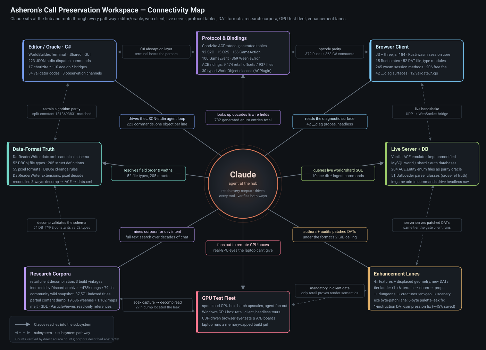

# Connectivity Map

*An Asheron's Call preservation and emulation workspace, viewed as a set of pathways rather than a set of folders — with an AI agent (Claude) at the hub of all of them.*

Diagram: [`connectivity-map.svg`](connectivity-map.svg) (vector) · [`connectivity-map.png`](connectivity-map.png) (raster, 1400×1010)

---

## Why this document exists

This workspace is not one program. It is a **modern world editor**, a **browser game client**, a
**server**, several **protocol and format oracles**, a pile of **research corpora**, a small **GPU
test fleet**, and a set of **asset-enhancement lanes** that ship new game data to real players.
Each of those alone is legible. What makes the workspace work is the *edges between them* — a
terminal command that reaches into a live database, a Rust crate that must agree with a C# enum
table, a decompiled function that settles an argument about a magic constant.

Claude sits in the middle of that graph. It is the only participant that touches every node: it
drives the tooling, reads every corpus, cross-checks one source of truth against another, and
carries findings from one subsystem into a fix in a different one.

This map catalogues **one example per connection type** — the pathway, a concrete instance of it,
a number you can verify from open source in the tree, and one sentence on why the edge matters.
Numbers below were produced by counting the actual sources, not from memory.

**A note on scope.** Some resources this workspace reaches are private archives (a retail client
decompilation corpus, an indexed community chat archive, a wiki snapshot, retail game data files).
They are described here by **role and rough scale class only** — never by location, layout, or
provenance detail. Counts drawn from open-source components are given exactly.

---

## Table of grounded counts

| Thing counted | Count | Source counted |
|---|---:|---|
| Terminal JSON dispatch commands | **223** | `WorldBuilder.Terminal/JsonCommandProcessor.cs` |
| — of those, live-DB bridge commands (`ace-*`) | **10** | same |
| — of those, protocol/DAT oracle commands (`chorizite-*`) | **17** | same |
| — of those, headless retail-UI commands (`ui-*`) | **5** | same |
| Server→client message opcodes (`S2CMessageType`) | **92** | `external/chorizite/Chorizite.ACProtocol/.../Enums/` |
| Client→server message opcodes (`C2SMessageType`) | **15** | same |
| Game-action opcodes (`GameActionType`) | **156** | same |
| Game-event opcodes (`GameEventType`) | **100** | same |
| Error codes (`WeenieError`) | **369** | same |
| Generated protocol enum entries, total | **732** | sum of the five above |
| Retail address annotations in ACBindings | **9,474** across **937** files | `external/chorizite/ACBindings/Generated/` |
| Typed `WorldObject` classes (ACPlugin) | **30** | `external/chorizite/ACPlugin/` |
| DAT top-level file types (`DBObj` subclasses) | **52** | `external/DatReaderWriter/.../dats.xml` |
| DAT struct definitions | **205** | same |
| Pixel-format enum entries | **55** | same |
| Rust `file_type` parser modules in the web client | **52** | `external/holtburger/crates/holtburger-dat/src/file_type/` |
| Rust workspace crates / apps | **15** / **6** | `external/holtburger/crates`, `.../apps` |
| wasm session methods / free functions | **245** / **206** | `holtburger_web.d.ts` |
| Browser diagnostic surfaces (`window.__diag.*`) | **42** | `apps/holtburger-web/scene3d/`, `index.html` |
| Standalone parity validators (`validate_*.cjs`) | **12** | `apps/holtburger-web/` |
| Diagnostic surfaces with a canonical oracle | **14 of 14** | `docs/diagnostic-toolset-plan-2026-05-19.md` |
| Server DAT parser classes (cross-reference truth) | **51** | ACE `ACE.DatLoader/FileTypes/` |
| Server enum definition files | **204** | `external/ACE/Source/ACE.Entity/Enum/` |
| Rust opcode constants (parity target) | **372** | `crates/holtburger-protocol/src/opcodes.rs` |
| `DB_TYPE_*` constants in the decompilation | **54** | retail decomp corpus |
| Editor validation diagnostic codes | **34** across 4 validators | `README.md` / validation engine |
| Community content dump: weenies / recipes / spawn maps | **19,686** / **7,347** / **1,162** | `external/LSD-Partial-*/` |
| Wiki snapshot: indexed titles | **37,571** | `external/acpedia/acpedia_index.jsonl` |
| Indexed developer chat archive | **~478k** messages, **79** channels, 2019–2026 | private index (scale class only) |
| Retail client build vintages cross-referenced | **3** | private decomp corpus (2013 build, 2015 end-of-retail build, symbol-table dump) |

---

# The pathways

## A. Claude → the tooling

### A1. Agent → editor engine over a JSON-line protocol
**Example:** `{"command":"describe-landblock","lbX":169,"lbY":180}` written to `WorldBuilder.Terminal --stdin`; one JSON object in, one JSON object out.
**Grounded:** **223** dispatch commands in `JsonCommandProcessor.cs`.
**Why it matters:** it makes the entire world editor — terrain, dungeons, objects, DAT export, validation, rendering — a *callable API* rather than a GUI. Everything downstream in this map is reachable because this one edge exists.

### A2. Agent → a packaged skill that teaches the protocol
**Example:** `.claude/skills/worldbuilder-terminal/` ships the command surface, invocation conventions, and failure modes as a loadable skill, so an agent that has never seen the repo can drive the engine correctly on its first call.
**Grounded:** 1 in-repo skill covering the 223-command surface.
**Why it matters:** the tooling's *knowledge* is versioned next to the tooling, so the agent and the code can't drift apart.

### A3. Agent → the world's three observation channels
**Example:** `render-preview` returns a base64 top-down PNG; `describe-landblock` returns structured prose; `compare-to-retail` returns distribution statistics.
**Grounded:** **3** channels, backed by **34** validation diagnostic codes across 4 validators.
**Why it matters:** an agent that can only *write* to a world will happily corrupt it. These channels let it read the world back visually, factually, and statistically before committing — the mutate → validate → observe → fix loop.

---

## B. Editor / oracle (C#) outward

### B1. Terminal command → live server database ingestion
**Example:** `ace-db-connect`, then `ace-db-ingest-npcs` / `-creatures` / `-housing` / `-spawns` / `-encounters` / `-weenie-index` pull canonical rosters out of the running server's world database into per-project gazetteer files.
**Grounded:** **10** `ace-*` commands (8 world/shard ingest + connect/status pairs).
**Why it matters:** it makes the *server's* idea of what exists in the world available to an editor and a map emitter that would otherwise only know what the client data files contain.

### B2. Terminal command → protocol/DAT record parsing via the vendored C# stack
**Example:** `chorizite-parse-dat-record` with a record id and a type name returns the fully decoded record as JSON; siblings cover enum dumps, opcode dumps, wire pack/unpack, surface and texture-chain decoding, string hashing, and sound resolution.
**Grounded:** **17** `chorizite-*` commands.
**Why it matters:** this is the **C# absorption layer**. Rather than reimplementing decoders in three languages and hoping they agree, the terminal hosts the reference C# implementations and every other layer is checked *against* them.

### B3. Terminal command → headless retail UI rendering from game data
**Example:** `ui-layout-list` / `ui-layout-render` reconstruct retail interface layouts — inheritance, states, bitmap-font text — straight out of the data files into a PNG, with no game client running.
**Grounded:** **5** `ui-*` commands.
**Why it matters:** UI is the last subsystem people usually reverse-engineer; making it inspectable headlessly turns "what did this screen look like" into a query.

### B4. Editor engine ↔ decompilation, as algorithm ground truth
**Example:** the terrain height-sampling routine in `WorldBuilder.Shared/Lib/Terrain/TerrainAlgorithms.cs` picks its triangle split using the magic constant `1813693831` — the *same* constant the retail client uses.
**Grounded:** the constant appears **12** times in the decompiled client and **1** time in our C#; heights match rather than approximately match.
**Why it matters:** it is the difference between "our terrain looks about right" and "our terrain is the client's terrain". Every physics sink, every camera clip, every placement Z depends on it.

### B5. Editor ↔ canonical DAT schema
**Example:** field order and widths for `GfxObj`, `Setup`, `Surface`, `ParticleEmitter`, `Region`, `EnvCell`, `MotionTable`, `ClothingTable` and the rest are read from `DatReaderWriter`'s `dats.xml` rather than guessed.
**Grounded:** **52** top-level file types, **205** struct definitions, **55** pixel formats.
**Why it matters:** it's the shared vocabulary. When the C# editor, the Rust client, and the server disagree about a record, `dats.xml` names the field they're disagreeing about.

### B6. Pixel decode as a shared extension layer
**Example:** `DatReaderWriter.Extensions` converts the game's pixel formats to RGBA8 — including the formats that store channels in a surprising order.
**Grounded:** **55** pixel-format enum entries covered.
**Why it matters:** the same decode feeds the editor's thumbnails, the map emitter's sprites, the parity validators, and the texture-enhancement lane. One decoder, four consumers, no drift.

---

## C. Browser client (JS + Rust/wasm)

### C1. wasm runtime → game data files parsed in the browser
**Example:** the client's Rust DAT crate carries one parser module per file type and reads real retail data at runtime through an HTTP resource source that lazily fetches shards.
**Grounded:** **52** `file_type` modules — exactly matching the **52** `DBObj` types in the canonical schema.
**Why it matters:** the browser client isn't fed a pre-chewed export. It reads the *same* files the retail client reads, which is what makes parity claims meaningful.

### C2. Manifest/shard pipeline → first-paint bandwidth
**Example:** the manifest resource source replaced a whole-bundle prefetch with a boot pack plus lazy per-namespace catalogs and on-demand shards.
**Grounded:** first paint fell from **~605 MB to ~5 MB**; the top-level manifest fell from **~203 MB to ~2 KB** at the v2 revision.
**Why it matters:** it is the edge that turns "a client that technically runs in a browser" into "a client someone will actually load".

### C3. Rust protocol crate ↔ generated C# opcode tables (parity)
**Example:** `crates/holtburger-protocol/src/opcodes.rs` mirrors the generated `S2CMessageType` / `C2SMessageType` / `GameActionType` / `GameEventType` tables; the terminal's `chorizite-dump-opcodes` command emits the C# side so the two can be diffed mechanically.
**Grounded:** **372** Rust opcode constants against **363** generated C# message/action/event entries (**732** including the 369 error codes).
**Why it matters:** a single wrong opcode is an unexplainable disconnect at 3 a.m. Making parity a *diff* instead of a memory removes an entire class of bug.

### C4. Validators → the C# oracle, as a long-lived subprocess
**Example:** `validate_*.cjs` spawn `WorldBuilder.Terminal --stdin` and drive it as an oracle while exercising the browser runtime, diffing client output against the C# answer record by record.
**Grounded:** **12** validators covering **14 of 14** diagnostic surfaces — wire conformance, DAT parity, enum parity, physics, motion, texture decode, mesh triangulation, cell-portal graph, skybox, and data integrity.
**Why it matters:** it is the workspace's central correctness idea — *the runtime under test never grades itself*; a different implementation in a different language grades it.

### C5. Agent → the client's diagnostic surface, headlessly
**Example:** a headless browser boots the client with auto-login and null-render flags, then the agent reads `window.__diag` — render stats, residency, motion, particles, wasm memory, spawn outcomes — without ever drawing a frame.
**Grounded:** **42** distinct `__diag` surfaces.
**Why it matters:** it lets an agent debug a 3D client on a machine with no usable GPU, and lets a protocol test run without paying for rendering.

### C6. Browser client ↔ live server, over a UDP↔WebSocket bridge
**Example:** the Rust protocol crate drives the real login → character list → enter world → player description handshake against an unmodified server; a small bridge app translates the game's UDP to WebSocket for the browser.
**Grounded:** the full handshake plus **~30** typed world-object classes dispatching live packets.
**Why it matters:** the browser is a *real client on the real protocol*, not a viewer. Anything that works here works against any server that speaks the retail protocol.

---

## D. Server and database

### D1. Server source as DAT-format cross-reference truth
**Example:** when the schema and the decompilation disagree about a count or a width, the server's clean DAT parser classes are read as a third opinion.
**Grounded:** **51** parser classes in the server's DatLoader; the community tooling reference vendors its own **47**.
**Why it matters:** three independent implementations of the same format make a majority possible. Two would only make an argument.

### D2. Server enums as a shared property vocabulary
**Example:** the server's property enums decode the keyed stat blocks in the community content dump (`intStats`, `didStats`, `floatStats`, and friends) into names.
**Grounded:** **204** enum definition files.
**Why it matters:** without them the content dump is thousands of integer keys; with them it's a searchable description of every item and creature in the game.

### D3. Server admin commands as headless navigation
**Example:** the client sends a teleport-to-point-of-interest chat command through its own session handle, and the world streams in around the new position — an agent's substitute for walking.
**Grounded:** teleport-by-name and teleport-by-coordinate commands, both proven to move and stream a headless session.
**Why it matters:** headless walking is unreliable at low frame rates; teleport hops make world-streaming tests deterministic and fast.

### D4. Live server database → enhancement-lane work lists
**Example:** the world database's landblock instance table is walked to weenie → setup → parts → geometry objects → surfaces, producing the exact set of textures a player actually sees near spawn points; the offline community dump reproduces the same census without a server.
**Grounded:** one creature census produced **6,801** spawnable content ids → **1,343** distinct render surfaces, of which **811** were recolor-live and deliberately left untouched.
**Why it matters:** it makes asset work *demand-driven* — patch what players look at, in the order they look at it, instead of patching everything.

---

## E. Research corpora

### E1. Retail decompilation as behavioural ground truth
**Example:** questions like "is there a texture-dimension cap?", "when is a level-of-detail record actually used?", "what does the renderer do with a surface's translucency?" are answered by reading the decompiled function, not by experiment.
**Grounded:** **3** build vintages cross-referenced (a 2013 build, the 2015 end-of-retail build, and a symbol-table dump), plus a set of chapter-by-chapter deep-dive digests covering architecture, physics, networking, object model, combat/magic, UI, rendering, data resources, client core, and audio.
**Why it matters:** it converts the project's hardest questions from archaeology into reading. It also imposes a discipline: **the builds differ**, so an address from one is never trusted verbatim against another — patches are located by byte signature instead.

### E2. Decompilation ↔ canonical schema, as mutual validation
**Example:** the decompiled client's file-type constant table is compared against the schema's declared top-level types.
**Grounded:** **54** `DB_TYPE_*` constants in the decompilation against **52** `DBObj` types in the schema — the small delta is itself a finding, not noise.
**Why it matters:** it's the cheapest possible completeness check on a format description that everything else depends on.

### E3. Indexed developer chat archive → developer intent
**Example:** a full-text query across a decade of emulator- and tool-developer channels recovers *why* something is the way it is — a known client bug, a rejected approach, an undocumented field's meaning.
**Grounded:** **~478k** messages across **79** channels spanning 2019–2026, full-text indexed; roughly a dozen channels carry the technical signal, the rest are excluded as noise.
**Why it matters:** it is the workspace's institutional memory. Reading it turns "nobody knows" into "three people solved this in 2021".

### E4. Wiki snapshot → lore, quests, and georeferenced places
**Example:** wiki coordinates are converted to landblock keys, giving every landblock a set of named points of interest — NPCs, shopkeepers, quest objects, landmarks — which then appear in the editor's `describe-landblock` output and in the emitted map site.
**Grounded:** **37,571** indexed page titles; **4,910** georeferenced pages resolving onto **2,044** landblocks; **14,915** content ids matched to pages with confidence tiering.
**Why it matters:** it is the only bridge from raw numeric game data to the names players actually used, and it's what makes generated world descriptions read like a place instead of a table.

### E5. Community content dump → spawn, recipe, and reverse lookups
**Example:** "which landblocks spawn this creature" and "which recipe produces this item" are one grep each over the dump's spawn maps and recipes.
**Grounded:** **19,686** weenies, **7,347** recipes, **1,162** spawn maps.
**Why it matters:** it gives the editor and the map emitter a server-independent picture of world population — and it is explicitly *partial*, so a zero result is treated as "unknown", never "absent".

### E6. Community tooling as a read-only research reference
**Example:** a vendored copy of an established community DAT tool is kept purely to *read* — its b-tree surgery, geometry, and texture utilities inform our parsers; its custom-content workflows are deliberately not adopted.
**Grounded:** vendored with an explicit provenance note declaring read-only intent; several sibling references (a C++ server reference, a particle viewer, a weenie viewer, a map front-end) are kept on the same terms.
**Why it matters:** it lets the project learn from prior art without inheriting its assumptions — and the written boundary keeps that decision from eroding.

---

## F. GPU test fleet

### F1. Agent → remote GPU boxes for work the dev machine can't do
**Example:** heavy Rust/wasm release builds, batch neural texture upscales, and parallel agent fan-out are dispatched to an ephemeral spot cloud GPU instance; the development laptop runs everything else inside a memory-capped build jail.
**Grounded:** one batch of ~100 texture upscales completed in well under a minute of GPU time; the local jail exists because the laptop reliably runs out of memory on a workspace-wide build.
**Why it matters:** it keeps the interactive machine responsive and makes expensive work a scheduling decision rather than a blocker.

### F2. Agent → a real GPU running the browser client, for visual truth
**Example:** flagged-off rendering work is queued up and eye-tested in a single batched session on a machine with a real discrete GPU and a warm shader cache, off-screen so it never disturbs the machine's human user.
**Grounded:** the software rasteriser on the dev laptop cannot validate shaders, shadows, or post-processing at all; A/B measurements require a fresh browser profile per arm because the shader cache warms the second arm.
**Why it matters:** rendering claims that were only ever checked on a software rasteriser are not checks. This edge is where "it looks right" becomes true.

### F3. Agent → the retail client itself, driven headlessly
**Example:** an isolated retail client install is launched, walked through a scripted multi-town tour, and recorded, with an idle guard and a human-presence check so an automated run never hijacks a person's machine.
**Grounded:** multi-stop tours held **300+ seconds** of stable session per gate run, with video and still evidence captured per tier.
**Why it matters:** it closes the loop stated as the project's hardest-won lesson — *tooling round-trips prove structure; only the retail client proves render semantics.*

---

## G. Enhancement lanes (shipping to players)

### G1. Enhanced data files → consumed by both the retail client and the server
**Example:** a lane bakes 4× upscaled textures and displacement-derived geometry into new client data files; the server is pointed at the same files so that gate sessions and real play see identical content.
**Grounded:** a shipped tier carried **447** architecture geometry objects displaced with physics left byte-identical, plus **571 of 768** building surfaces re-baked; later tiers added **475** dungeon surfaces and **251** creature-adjacent surfaces.
**Why it matters:** it is the pathway where preservation research turns into something a player installs. The physics-identical constraint is what keeps it a *visual* change rather than a different game.

### G2. Tiered releases with a rollback ladder
**Example:** each lane ships as its own package, stacked in a fixed order, so any tier can be rolled back to the one below without re-baking.
**Grounded:** six gated tiers — textures → terrain → doors → props → dungeons → creatures + environment geometry → scenery — each with its own gate-status record, all kept under the client format's hard **2 GiB** file ceiling.
**Why it matters:** it makes a large, risky content change *reversible*, which is the only reason it can be shipped to a live population at all.

### G3. Executable byte-patch lane, grounded in the decompilation
**Example:** a long-standing client memory leak was located in the decompilation (two factory methods each taking one reference too many), then fixed on disk by replacing six bytes with no-ops — same executable, same protocol, no injected code.
**Grounded:** a 27-hour soak captured **56,664** leaked palette objects holding roughly **446 MB** of orphaned buffers before the fix; the patch is exactly **6 bytes**, in two 3-byte runs.
**Why it matters:** it is the cleanest demonstration of the whole map working end to end — a symptom observed on the GPU fleet, a cause read in the decompilation, a minimal fix, and a benefit every player gets.

### G4. Byte-patching for headroom, not features
**Example:** a survey of ten assumed client limits found most of them already lifted or non-existent; the one genuinely high-value patch is a single-instruction fix that restores the client's built-in data compression.
**Grounded:** measured **~45–50%** on-disk saving on the main data file, validated in-client end to end; the two limits people most often assume are the problem — the 2 GB address space and a texture-dimension cap — turned out to be **already lifted** and **nonexistent** respectively.
**Why it matters:** it replaces folklore about client limits with a verdict table, and it buys real budget under a ceiling that cannot be patched away.

### G5. Format truth as a *constraint* on the enhancement lanes
**Example:** the game's palette-swap system (equipment dye, skin tone, item tinting) requires certain textures to stay palette-indexed; naively converting them to plain colour would silently break recolouring, so a global "recolour-reachable" set is computed and treated as untouchable.
**Grounded:** **1,917** clothing tables expanded to **1,975** setups → **1,624** protected render surfaces; separately, a dungeon census walked **734,976** environment cells to find **804** surfaces / **712** render surfaces / **769** environments.
**Why it matters:** it is the clearest case of a *format* edge protecting a *content* edge — the schema knowledge is what keeps a visual upgrade from breaking a gameplay system.

---

## H. Cross-cutting edges

### H1. Bake output parity against the server's own placement logic
**Example:** the client's Rust scenery baker is diffed against the server's placement algorithm over a full landblock ring.
**Grounded:** bit-for-bit identical across **16,700** placements; the ring itself is **169** landblocks (~2.4 km square).
**Why it matters:** scenery is procedurally derived, not stored — so "the same inputs give the same output" is the only way to know the world you're standing in is the real one.

### H2. Fusion: server DB + wiki + content dump → one description per place
**Example:** the map emitter composes structure derivation, a region/town gazetteer, wiki points of interest, content-id-to-page naming, and server spawn rosters into a single readable paragraph per landblock, regenerated whenever the world changes.
**Grounded:** **5** independent data layers fused per landblock, over **2,044** landblocks with named points of interest.
**Why it matters:** it is the workspace's synthesis edge — the point where every corpus in this map lands in the same sentence.

### H3. Data-integrity gates on the input side
**Example:** bakes and validators refuse to run against anything but pristine base data, reject modified-source markers, and emit a source checksum sidecar alongside every output.
**Grounded:** integrity is one of the **14** diagnostic surfaces, with the checksum sidecar as its artifact.
**Why it matters:** every parity claim in this document is only as good as the certainty that the inputs were unmodified. This edge is what makes the other thirty edges quotable.

---

## The shape of the whole thing

Read the map as three concentric commitments.

**Innermost — one callable engine.** A GUI, a headless terminal, and a browser client ride a single
service layer, and that layer is addressable as 223 JSON commands. That is what lets an agent
participate at all.

**Middle — nothing grades itself.** Every claim of correctness crosses a language or an
implementation boundary: Rust checked against C#, C# checked against a decompiled binary, a
baker checked against a server, a schema checked against a symbol table. Where a fourth opinion
exists, it is kept.

**Outermost — the retail client is the final judge.** Tooling proves structure; only the original
client proves render semantics. Every enhancement tier passes through a real client on real
hardware before it is called done.

Claude's role is the connective tissue in all three: it drives the engine, it carries evidence
across the boundaries, and it is usually the thing that notices two sources of truth have quietly
started to disagree.
