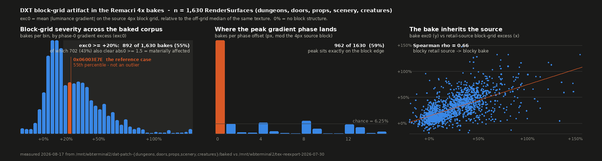
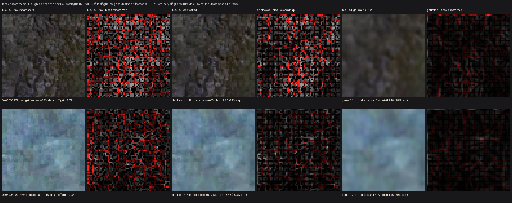
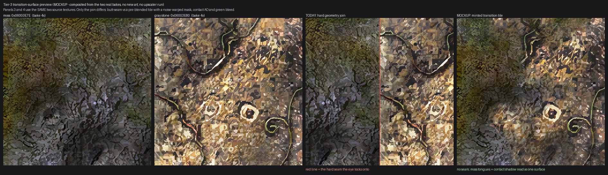

# Block-artifact graphical research — how widespread, what it looks like, does deblock-prebake work

**Date** 2026-08-17 · **Scope** initial research only (quantify + visualise; no pipeline rebuilt, nothing rebaked)
**Corpus** the union of `/mnt/wbterminal2/dat-patch-{dungeons,doors,props,scenery,creatures}/baked/*.png`
— 1,657 PNGs, **1,630 scored** (27 skipped: mostly-transparent or too small for a 16-px fold)
**Retail reference** `/mnt/wbterminal2/tex-reexport-2026-07-30/` — **every one of the 1,657 bakes has its retail source there**, so scale factors are exact, not assumed (1,566 scored bakes are 4x, 64 are 2x).
Figures + full per-surface CSV: `reports/block-artifact-2026-08-17/` (2.4 MB total).
`dat-patch-r7/` was read only, never written.

---

## 0. Headline

1. **The artifact is systemic, not a handful of bad textures.** 59% of bakes (962/1,630) have their
   single strongest luminance-gradient phase sitting *exactly* on the source's 4-px DXT block edge —
   chance would be 6.25%. **43% (702) are materially affected**, 13% (207) severely.
2. **`0x06003E7E` — the case that started this — is a median case, not an outlier** (55th percentile).
   Whatever we saw there, 700+ other surfaces have it as badly or worse. Dungeons are the worst lane
   (66% material, median +38%).
3. **The bake inherits the source.** Retail-source block-grid excess and bake block-grid excess
   correlate at Spearman ρ = 0.66; **90% of the retail sources already carry positive block-grid
   excess** (median +22%). Remacri is not inventing the grid, it is *sharpening* a grid the DXT
   sources hand it. That is why the r7 tile-edge fix changed nothing in the interiors — it was
   fixing a different seam.
4. **A source-side deblock removes the grid without costing detail.** On the 40 worst sources, a
   2-pass 4-tap block-edge filter drives grid excess from **+92% mean → +2.7% mean (median +0.1%)**
   while retaining **103% of off-grid detail** (p10 = 85%). A generic 1.2-px gaussian, by contrast,
   only halves the grid (residual +15%) and throws away 22% of real detail. **Blur is the wrong
   tool; a grid-targeted filter is the right one.**
5. **The GPU A/B is small.** From the real upscale ledger, the 702-surface material set is
   **~14 GPU-minutes** of Remacri on the T4; the entire 1,630 corpus is **~31 GPU-minutes**.

---

## 1. How widespread — the metric and the numbers

### The metric (`exc0`)

Both the source and the bake are read as luminance. For the bake, the source's 4-px DXT block grid
maps to a period of `P = 4 x scale` bake pixels (16 px at 4x). We take the mean absolute luminance
gradient per column and per row, fold each profile modulo `P`, average the two, and compare the
value at phase 0 (the block edge) against the median of the other 15 phases:

```python
dx = |diff(L, axis=1)| ; dy = |diff(L, axis=0)|          # alpha-masked (a > 8)
gx = dx.mean(axis=0)   ; gy = dy.mean(axis=1)
f  = 0.5 * (fold(gx, P).mean(0) + fold(gy, P).mean(0))   # 16 numbers, phase 0..P-1
base = median(f[1:])
exc0 = (f[0] - base) / base       # relative severity, dimensionless
abs0 =  f[0] - base               # absolute severity, luminance levels 0..255
```

`exc0` is scale-free (a flat texture and a busy texture are comparable); `abs0` says how many
luminance levels the artifact is actually worth, which is what the eye sees. A surface counts as
**material** at `exc0 >= +20% AND abs0 >= 1.5`, **severe** at `exc0 >= +50% AND abs0 >= 2.5`.
The same metric with `P = 4` run directly on the retail PNG gives the source-side number.

### Validation

| check | result |
|---|---|
| does `0x06003E7E` register? | yes — `exc0 = +27%`, `abs0 = +2.71`, **peak phase = 0 on both axes** |
| does it rank *high*? | **no — 55th percentile.** It is a textbook-clear but ordinary case (see §2c) |
| do visually clean bakes rank low? | yes — `0x06006CC7` `exc0 = +4%` and `0x06006D68` `+5%`, both busy 256x512 props sources (`base` 17.5 / 22.1), flat phase histogram, no grid visible (fig 2d) |
| is the signal real or an artifact of the metric? | **real** — 962/1,630 bakes peak at phase 0 exactly (chance 1/16). Phases ±1 add 126 more; **67% land within one pixel of the block edge** |

The one thing the metric does *not* separate is a low-detail texture with a small absolute artifact
from a busy texture with a large one — hence `abs0` is carried alongside and used in the material
threshold. Ranks 1, 2, 6, 9 in the top-30 below are all `base < 2.0` (very flat textures where a
modest absolute step is a huge relative one); ranks 3 and 5 are the ones you would *notice*.

### Distribution


`block-artifact-2026-08-17/fig1-distribution.png`

| lane | n | median exc0 | material (exc0>=+20%, abs0>=1.5) | severe (exc0>=+50%, abs0>=2.5) |
|---|--:|--:|--:|--:|
| dungeons | 473 | +38% | 314 (66%) | 90 (19%) |
| doors | 71 | +25% | 32 (45%) | 13 (18%) |
| scenery | 331 | +23% | 147 (44%) | 51 (15%) |
| props | 513 | +16% | 153 (30%) | 36 (7%) |
| creatures | 242 | +15% | 56 (23%) | 17 (7%) |
| **all** | **1630** | **+24%** | **702 (43%)** | **207 (13%)** |

Percentiles of `exc0` across the corpus: p25 +11%, p50 +24%, p75 +43%, p90 +64%, p99 +118%.

### Top 30 offenders

Full ranked list for all 1,630: `block-artifact-2026-08-17/block-scores.csv`
(columns `rank,rsId,lane,exc0,abs0,base,peakPhase,scale,srcW,srcH,bakeW,bakeH,srcGridExcessPct,material,severe`).

| # | RenderSurface | lane | exc0 | abs0 (lum) | base | retail src | bake | src-side grid excess |
|--:|---|---|--:|--:|--:|---|---|--:|
| 1 | `0x06003E9C` | doors | **+296%** | +4.28 | 1.4 | 64x64 | 256x256 | +389% |
| 2 | `0x0600678A` | props | **+202%** | +3.10 | 1.5 | 256x256 | 1024x1024 | +183% |
| 3 | `0x0600378C` | doors | **+195%** | +10.50 | 5.4 | 256x256 | 1024x1024 | +42% |
| 4 | `0x06003C83` | dungeons | **+189%** | +3.61 | 1.9 | 256x256 | 1024x1024 | +111% |
| 5 | `0x06003944` | scenery | **+179%** | +12.77 | 7.1 | 256x128 | 1024x512 | +41% |
| 6 | `0x060043E8` | dungeons | **+172%** | +2.42 | 1.4 | 512x512 | 2048x2048 | +117% |
| 7 | `0x06005DAB` | props | **+163%** | +5.60 | 3.4 | 256x128 | 1024x512 | +28% |
| 8 | `0x060066B8` | creatures | **+147%** | +5.88 | 4.0 | 128x128 | 512x512 | +35% |
| 9 | `0x06005D46` | dungeons | **+132%** | +1.34 | 1.0 | 512x512 | 2048x2048 | +158% |
| 10 | `0x0600378D` | props | **+132%** | +4.39 | 3.3 | 256x256 | 1024x1024 | +83% |
| 11 | `0x06003CA2` | dungeons | **+132%** | +6.23 | 4.7 | 512x512 | 2048x2048 | +72% |
| 12 | `0x06006546` | scenery | **+131%** | +2.65 | 2.0 | 64x128 | 256x512 | +244% |
| 13 | `0x06006440` | props | **+128%** | +8.41 | 6.6 | 32x32 | 128x128 | +50% |
| 14 | `0x060048E7` | props | **+126%** | +5.01 | 4.0 | 32x32 | 128x128 | +47% |
| 15 | `0x060039D0` | doors | **+126%** | +2.56 | 2.0 | 16x128 | 64x512 | n/a |
| 16 | `0x06003F0E` | dungeons | **+122%** | +2.82 | 2.3 | 128x128 | 512x512 | +75% |
| 17 | `0x06003EB6` | props | **+120%** | +10.51 | 8.8 | 16x16 | 64x64 | n/a |
| 18 | `0x060048E9` | props | **+118%** | +4.92 | 4.2 | 32x32 | 128x128 | +43% |
| 19 | `0x06003A9C` | props | **+118%** | +15.19 | 12.9 | 64x16 | 256x64 | n/a |
| 20 | `0x06005A76` | creatures | **+118%** | +5.68 | 4.8 | 256x256 | 1024x1024 | +47% |
| 21 | `0x06006BAC` | dungeons | **+117%** | +2.03 | 1.7 | 256x256 | 1024x1024 | +125% |
| 22 | `0x06006BA1` | dungeons | **+116%** | +3.68 | 3.2 | 256x256 | 1024x1024 | +96% |
| 23 | `0x06006BA3` | dungeons | **+113%** | +1.91 | 1.7 | 256x256 | 1024x1024 | +128% |
| 24 | `0x06006BA4` | dungeons | **+113%** | +1.91 | 1.7 | 256x256 | 1024x1024 | +128% |
| 25 | `0x06005DCA` | scenery | **+110%** | +3.64 | 3.3 | 256x256 | 1024x1024 | +74% |
| 26 | `0x06005E17` | creatures | **+110%** | +4.42 | 4.0 | 256x256 | 1024x1024 | +83% |
| 27 | `0x06005DA1` | creatures | **+108%** | +2.65 | 2.5 | 128x128 | 512x512 | +95% |
| 28 | `0x06005D47` | creatures | **+106%** | +4.35 | 4.1 | 128x256 | 512x1024 | +47% |
| 29 | `0x06005DC0` | scenery | **+105%** | +3.59 | 3.4 | 256x256 | 1024x1024 | +75% |
| 30 | `0x06003C9D` | dungeons | **+103%** | +4.05 | 3.9 | 512x256 | 2048x1024 | +67% |

`0x06006BA1/BA3/BA4/BAC` are a family of dungeon surfaces that all fail together — the source set,
not the bake, is the common factor. `0x0600378C/378D` likewise.

---

## 2. What it looks like

Four strips, one per severity tier. Each is **retail source (nearest-neighbour) | Remacri 4x bake
(same crop) | the phase histogram for the whole texture**. Crops are auto-picked at the window of
maximum grid excess and levels-stretched identically on both sides so the artifact is visible in
dark textures. **Red ticks mark the source 4-px block grid** projected into bake space.

| file | tier |
|---|---|
| `block-artifact-2026-08-17/fig2a-severe-0x0600378C.png` | **SEVERE**, top 0.2% — `exc0 +195%`. The bake is literally a quilt of 16-px squares; the upscaler resolved each DXT block into its own flat facet. |
| `block-artifact-2026-08-17/fig2b-high-0x06003C9E.png` | **HIGH**, top 5% — `exc0 +95%`. Rectangular tiling locked to the ticks, worst where the mortar/stone materials meet. |
| `block-artifact-2026-08-17/fig2c-median-0x06003E7E.png` | **MEDIAN**, the reference — `exc0 +27%`. The "crisp blobs that stop at 4 px" look; the shard edges terminate on the ticks, and the moss/stone boundary is the worst region of the texture. |
| `block-artifact-2026-08-17/fig2d-clean-control-0x06006CC7.png` | **CLEAN CONTROL**, bottom 3% — `exc0 +4%`. Flat phase histogram, no grid, no facets. This is what a good bake looks like and it proves the metric is not just measuring "texture busyness". |

The two-material claim holds up: in every severe case the auto-picked worst window lands on a
**material boundary** (moss→stone, mortar→brick, wood→metal), because that is where DXT1's 2-endpoint
per-block encoding has to quantise a colour ramp and therefore where the per-block colour steps are
largest.

---

## 3. Does deblock-prebake work in principle

**Not tested through the actual upscaler — that needs a GPU pass (see §5).** What is demonstrated
here is the *input-side* half: that the block grid can be removed from the source without removing
the source's real detail. If the grid is gone from the input, the upscaler has nothing to amplify.


`block-artifact-2026-08-17/fig3-deblock-prefilter.png` — two offender sources (`0x06003E7E`,
`0x06003C83`), each shown raw / deblocked / gaussian-blurred, alongside a **block-excess map**
where red is gradient sitting on the 4-px grid *in excess of its off-grid neighbours* (the artifact
seed) and grey is ordinary detail (what must survive).

### The filter

Not a blur. A wrap-aware H.264-style 4-tap smoothing applied **only at multiples of 4**, per RGB
channel, gated by a luminance-step threshold so genuine strong edges that happen to land on the grid
are left alone. The threshold is binary-searched per texture to drive grid excess to zero:

```
p1 p0 | q0 q1     at every x ≡ 0 (mod 4), wrapping at the tile edge
if |lum(p0) - lum(q0)| < thr:   p0' = (p1 + 2·p0 + q0)/4 ,  q0' = (p0 + 2·q0 + q1)/4
```

### Numbers (40 worst sources by bake `exc0`, all >= 64 px)

| filter | source grid excess after | off-grid detail retained |
|---|--:|--:|
| none (raw) | **+92% mean / +76% median** | 100% |
| **deblock, 1 pass, auto threshold** | +10.4% mean / +4.9% median | 105% mean, p10 91% |
| **deblock, 2 passes, auto threshold** | **+2.7% mean / +0.1% median** | **103% mean, p10 85%** |
| deblock, 3 passes | +1.8% mean / +0.0% median | 102% mean, p10 82% |
| gaussian σ = 1.2 px | +15% mean (grid *survives*) | **78% mean** |

Per-texture examples: `0x06003E7E` +26% → −0.0% with 87% detail kept (gaussian: +10% with 25% kept);
`0x06003E80` +29% → +0.0% with 89% kept; `0x06003C83` +111% → +7.5% (1 pass) with 103% kept.
"Detail retained > 100%" is real — redistributing the block step into the two adjacent pixels can
raise the off-grid gradient slightly.

**Conclusion:** the source-side premise is sound and the right filter is grid-targeted, not
isotropic. A blur strong enough to kill the grid destroys 3/4 of the detail the upscale exists to
exploit; the deblock kills the grid and keeps ~100% of it. Cost is negligible: 0.06 s per texture
on this laptop including the 12-step binary search, i.e. **under 2 CPU-minutes for the whole 1,630
corpus**.

**What this does NOT prove:** that Remacri's output is visibly better from a deblocked input. That
is a hypothesis with a strong mechanism behind it, and the A/B is cheap (§5) — but it is untested.

---

## 4. Transition-surface preview (Tier 3 seam idea) — mockup only


`block-artifact-2026-08-17/fig4-transition-mockup.png`

Four panels from the two **real Muggy Guruk bakes**: `0x06003E7E` (mossy green ground) and
`0x06003E80` (grey/tan cobble). Panel 3 is the join as it works today — two tiles butted at a
geometry edge, red line marking the seam the eye locks onto. Panel 4 is a **minted transition tile**:
the same two textures blended through a multi-octave noise-warped smoothstep mask, plus a contact-AO
darkening band and a green bleed just inside the stone side, so moss reads as *growing over* the
cobble instead of stopping at a polygon boundary.

This is a composite for discussion, not a proposed asset — no new art, no upscaler run, the mask is
procedural. Sibling check: of `0x06003E7B..0x06003E82`, only `7C, 7E, 80, 82` exist in the
tex-reexport corpus and only `7E` and `80` have bakes, so those two are the pair.

---

## 5. Recommended next step, sized

Sizing comes from the **real upscale ledger** `/mnt/wbterminal2/upscale-corpus/corpus-ledger.jsonl`
(4,041 rows with per-texture `runtimeSec` from the original cuda run, which covers 91% of this
corpus), not from a guess.

| step | where | size |
|---|---|---|
| **A. Deblock the material set** (702 surfaces, `material=1` in the CSV) | laptop, CPU | **< 2 CPU-minutes** compute; ~1 h engineering to wire the filter into `tools/dat-patch/matlib.py` as a pre-`tex_path` stage + a `--deblock` flag |
| **B. Remacri A/B on the deblocked inputs** | buildbox T4 | **~14 GPU-minutes** for the 702 material set (mean 1.18 s/tex from the ledger); **~31 GPU-minutes** for all 1,630. Add ~10 min for corpus up/down and model load. Budget **one T4 hour**. |
| **C. Re-score the A/B bakes with `exc0`** | laptop | ~7 min wall (the scan in this report took ~7 min at 3 workers). Pass bar: material count drops from 702 to < 150 and no surface loses > 15% off-grid detail |
| **D. Re-encode + DAT import for whatever ships** | laptop | measured 1.84 s/surface from `dat-patch-texture-remacri/rebake.log` (1,053 s / 572 surfaces) → **~22 min for 702**, ~50 min for the full corpus |
| **E. Eye-test** | 1070 / T4, batched off-screen | one queued session per §1070-eyetests-batched |

Total to a decision: **~1 T4 hour + ~2 laptop hours**, most of it engineering rather than compute.

Do **A → B → C** first and let `exc0` decide before spending any eye-test time. Tier-3 transition
surfaces (§4) are a separate, much larger art-authoring track and should not gate the deblock work.

### Caveats

- `exc0` measures grid-locked gradient energy, not perceived ugliness. It correlates well at the
  extremes (§1 validation) but a mid-range score is not a verdict — hence the `abs0` gate.
- 27 bakes could not be scored (mostly-transparent or < 4 blocks per axis). They are not in the CSV.
- The 2x-scale bakes (64 surfaces) use `P = 8` and are directly comparable; nothing special was done
  for them.
- `exc0 >= +20%` alone flags 892 surfaces (55%); the `abs0 >= 1.5` gate trims that to the 702 (43%)
  quoted throughout, dropping very flat textures where a small absolute step is a large relative one.
- Source-side excess could not be computed for 25 surfaces whose retail source is < 32 px on a side.
