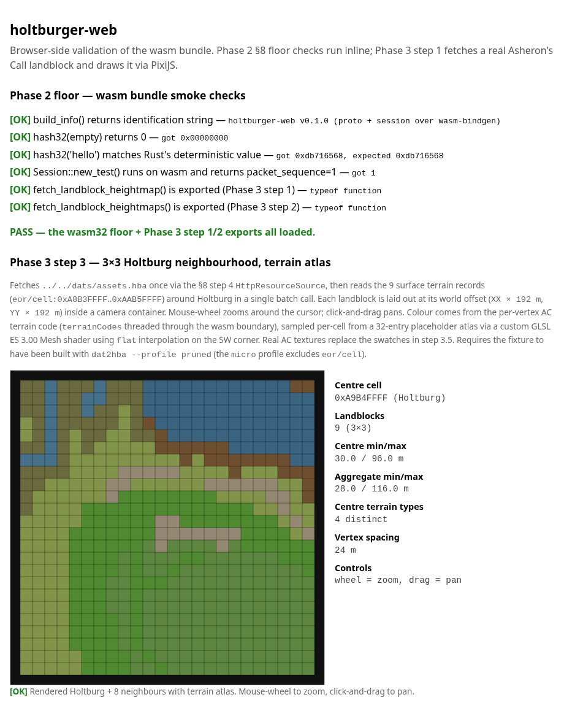

# Phase 3 — PixiJS renderer (as-built)

> **Status:** Steps 1, 2, and 3 landed (2026-05-04). The browser bundle
> fetches a 3×3 neighbourhood of real Asheron's Call landblocks around
> Holtburg in one batch call, lays them out at correct world offsets,
> and PixiJS draws them on a `<canvas>` as **AC terrain** (not a height
> ramp): grass, water, sand, dirt sampled per-cell from a 32-entry
> placeholder atlas via a custom GLSL ES 3.00 Mesh shader. Mouse-wheel
> zooms around the cursor; click-and-drag pans. See
> [`phase-3-step-1-handoff.md`](phase-3-step-1-handoff.md),
> [`phase-3-step-2-handoff.md`](phase-3-step-2-handoff.md), and
> [`phase-3-step-3-handoff.md`](phase-3-step-3-handoff.md) for the
> framing briefs; this file is the as-built reference.



The step 3 screenshot is the current deliverable artefact: the same
contiguous 3×3 grid as step 2, but now reading as recognisable AC
terrain — blue water in the north, green grasslands at the Holtburg
town centre, scattered patchy and dirt textures across the southern
cells. Compare to the static-site z=12 PNG at
[`images/DerethMapsEnhanced_zoom.png`](images/DerethMapsEnhanced_zoom.png) —
same place, same palette signature, even though our render lacks
the pre-baked sprite-atlas objects (those land in step 4). The step 2
height-ramp deliverable is archived at
[`images/phase-3-step-2-multi-landblock.png`](images/phase-3-step-2-multi-landblock.png),
and the step 1 single-landblock at
[`images/phase-3-step-1-landblock.png`](images/phase-3-step-1-landblock.png),
as the cleanest references for the geometry-only renders in isolation.

---

## What step 1 ships

**One new wasm-bindgen export** in `apps/holtburger-web`:

```rust
fetch_landblock_heightmap(asset_url: String, cell_id: u32)
    -> Promise<LandblockMesh>
```

Plus the `LandblockMesh` struct with four getters:
- `positions: Float32Array` — 81 vertices × 3 floats `(x, y, z)` in
  metres.
- `indices: Uint16Array` — 384 triangle indices (64 quads × 6).
- `heightMin: number`, `heightMax: number` — elevation bounds in
  metres.

The export reuses the §8-step-4 `HttpResourceSource` for the fetch
and the existing `holtburger_dat::landblock::CellLandblock::unpack`
for the parse, so the wasm side adds only the tessellation loop.

**One new HTML render path** in `apps/holtburger-web/index.html`:

- PixiJS 8.18.1 imported via an import map from jsdelivr — no JS
  bundler. The pin lives in `index.html` and `apps/holtburger-web/README.md`.
- `renderLandblock(canvas, mesh)` builds a `PIXI.MeshGeometry` from
  the wasm mesh's 2D positions + per-vertex height-encoded UVs,
  textures it with a 256×1 gradient canvas, and overlays a thin black
  `PIXI.Graphics` wireframe. World units (metres) map to canvas
  pixels via `container.scale.set(scale, -scale)` — the y-flip puts
  AC's +north at the top of the screen.

**Smoke test extended from 8 to 14 checks.** The Phase 3 additions are:
- symbol presence for `fetch_landblock_heightmap`,
- positions/indices typed-array shape and length,
- corner-vertex coordinates `(0,0)` and `(24,24)`,
- height bounds in `[0, 510]` metres (the AC heightmap range),
- max index `< 81` (every triangle vertex is in the 9×9 grid).

---

## Files touched

| File | What |
|---|---|
| [`external/holtburger/apps/holtburger-web/src/lib.rs`](../external/holtburger/apps/holtburger-web/src/lib.rs) | New `LandblockMesh` struct + `fetch_landblock_heightmap` export |
| [`external/holtburger/apps/holtburger-web/index.html`](../external/holtburger/apps/holtburger-web/index.html) | PixiJS importmap, `<canvas>`, `renderLandblock` |
| [`external/holtburger/apps/holtburger-web/smoke_test.cjs`](../external/holtburger/apps/holtburger-web/smoke_test.cjs) | 6 new checks: symbol-presence + 5 mesh-shape assertions |
| [`external/holtburger/apps/holtburger-web/README.md`](../external/holtburger/apps/holtburger-web/README.md) | New "Frontend dependencies" section + PixiJS pin |
| [`external/holtburger/dats/README.md`](../external/holtburger/dats/README.md) | Profile guidance: `pruned` for renderer, `micro` for §8-step-4 floor |
| [`docs/phase-2-wasm-spike.md`](phase-2-wasm-spike.md) | §8 step 6 status flipped to "in flight via Phase 3 step 1" |
| [`docs/phase-3-renderer.md`](phase-3-renderer.md) | This file |
| [`docs/images/phase-3-step-1-landblock.png`](images/phase-3-step-1-landblock.png) | Browser screenshot of the rendered landblock |

---

## The landblock

The hardcoded cell is `eor/cell:0xA9B4FFFF` — Holtburg town centre's
surface terrain (`CellLandblock` record, 252 bytes). AC's cell-id
convention:

| Pattern | Meaning |
|---|---|
| `XXYY0000`..`XXYY00FE` | Per-cell records (interior cells, dungeons) |
| `XXYYFFFE` | `LandblockInfo` — object placements within the landblock |
| `XXYYFFFF` | `CellLandblock` — surface terrain (9×9 height grid + tile types) |

`XX` is the east–west landblock index (00..FE), `YY` is the
north–south landblock index (00..FE). `0xA9B4` was picked because:
- Holtburg is the project's namesake; the rendered patch is visually
  recognisable from existing static-site outputs.
- The landblock is well-populated (a town centre, not an ocean cell).
- The handoff brief specified it.

If a future step needs a different cell, the JS side just changes the
hex constant. Multi-cell rendering is a step 2 or 3 problem.

---

## Coordinate convention

The Rust side speaks **metres**, **(x = east, y = north, z = elevation)**:

- A **landblock** is **192 m × 192 m**. It contains 8×8 = 64 *cells*,
  each 24 m × 24 m. The canonical constant is
  `holtburger_common::position::METERS_PER_LANDBLOCK = 192.0` (see
  [`crates/holtburger-common/src/position.rs:5`](../external/holtburger/crates/holtburger-common/src/position.rs)).
- The 9×9 vertex grid covers the **whole landblock**, so vertices are
  `192 / 8 = 24 m apart` on each axis. The `CellLandblock` record name
  is misleading — despite the "Cell" prefix, it is the *landblock*-level
  surface terrain record, not a single cell.
- Heights are `u8 × 2.0` per `CellLandblock::get_height` (see
  [`crates/holtburger-dat/src/landblock.rs`](../external/holtburger/crates/holtburger-dat/src/landblock.rs)),
  so the elevation range is `[0, 510]` metres — that's the AC vertical
  range.

> **Correction note (Phase 3 step 2):** Step 1 originally documented
> "vertices 3 m apart, cell 24 m wide" here and used `x as f32 * 3.0`
> in the tessellation loop. That framing was wrong — the constant
> source is 192 m / 8 = 24 m, and a `CellLandblock` covers a whole
> landblock, not a single cell. The render still looked correct in
> step 1 because the container scale `drawSize / 24.0` absorbed the
> unit error. Step 2 fixed the tessellation (`x * 24.0`), the JS
> scale (`drawSize / 192.0`), and the smoke test corner-vertex
> assertion ((24, 24) → (192, 192)).

The JS side **flips y** at the container level
(`container.scale.set(scale, -scale)`) so AC's +y (north) maps to
canvas-up. The 192 m landblock width is mapped to `canvas.width - 32 px`
of margin (≈ 2.5 px / m at a 512 px canvas). The current implementation
throws away the z component on the JS side and encodes it as a
`u`-coordinate (0..1) into a 256×1 gradient texture; the default `Mesh`
shader then reads per-fragment colour from the ramp. Smooth
interpolation across vertices comes for free from GL's barycentric
blend.

---

## How rendering composes

```
+-------------------------------------------------------------+
|  HBA bytes on disk (dats/assets.hba — git-ignored)          |
|  ──────────────►  fetch() in JS  ──────────────►            |
|     HttpResourceSource (§8 step 4) parses HBA               |
|        ──────────────►  ResourceSource::get_file_by_key     |
|           ──────────────►  CellLandblock::unpack            |
|              ──────────────►  build_mesh() — Rust           |
|                 ──────────────►  LandblockMesh              |
|                    ──────────────►  JS receives             |
|                       ──────────────►  PIXI.MeshGeometry    |
|                          ──────────────►  canvas pixels     |
+-------------------------------------------------------------+
```

The wasm-bindgen boundary is crossed exactly **once** per landblock:
a single `LandblockMesh` struct comes back from `await
fetch_landblock_heightmap(...)`. JS owns the per-frame work (currently
zero — single static draw, no animation, no input). This split is the
template for entity rendering later: Rust computes the buffer, JS
reads it once per frame and tells PixiJS what to draw.

---

## Why the choices were made

- **CDN PixiJS, not bundled.** Adding a JS bundler is maintenance load
  forever. The bundle has zero JS today; one `<script type="importmap">`
  pinning a specific version keeps it that way. When Phase 3 grows
  enough JS to need a bundler (multiple JS files, per-feature module
  splits, custom shaders in separate files), that's the right time to
  introduce one.
- **Parsing in Rust, drawing in JS.** PixiJS is a JS-native API and
  per-call wasm-bindgen interop has measurable cost. One typed-array
  crossing is far cheaper than hundreds of `pixi_mesh.set_position(...)`
  calls. Future entity work follows the same pattern: Rust produces
  an entity buffer, JS reads it once per frame.
- **Texture-mapped colour ramp, not a custom shader.** A 256×1
  gradient canvas + `Texture.from(canvas)` + the default `MeshShader`
  is two API calls and zero GLSL. Custom shaders enter the picture
  when texture atlases land in step 2 (the AC terrain palette is 32
  textured tile types over a 256-entry surface table — that *needs*
  a custom fragment shader, which is the right time to write one).
- **Wireframe overlay.** Diagnostic, but it makes the 9×9 mesh
  tessellation legible at a glance — and that's the whole point of
  step 1's "prove the geometry" framing. It also gives us a fallback
  signal in environments where WebGL is unavailable (the Mesh layer
  goes blank but the wireframe stays — Graphics has a Canvas2D path).
- **Single hardcoded landblock.** Multi-landblock streaming needs
  bookkeeping (which neighbours to pre-fetch, how to evict). One
  landblock proves the pipeline; streaming is an optimisation on a
  working system.

---

## Browser-side validation

Two paths, both end-to-end:

**Headless screenshot via Playwright + Chromium** (used to capture
the deliverable image — Firefox headless on Linux disables WebGL by
default, which makes the textured Mesh blank but leaves the
wireframe visible):

```sh
cd external/holtburger
python3 -m http.server 0 --bind 127.0.0.1 &
# Note the printed port, then in a Playwright script:
#   page.goto("http://127.0.0.1:<port>/apps/holtburger-web/index.html")
#   page.waitForFunction(() =>
#     document.getElementById("render-status")
#       .textContent.includes("[OK]") ||
#     document.getElementById("render-status")
#       .textContent.includes("[FAIL]"),
#     { timeout: 60000 });
#   page.screenshot({ path: "phase-3-step-1-landblock.png", fullPage: true });
```

**Manual** — open the same URL in a real Firefox or Chrome and watch
the canvas paint. The wasm bundle's `start()` installs
`console_error_panic_hook`, so any panic in `fetch_landblock_heightmap`
or `build_mesh` surfaces in devtools. The page's `render-status`
element shows OK / FAIL inline — no devtools needed for the happy
path.

---

## Phase 3 step 2 landed (2026-05-04)

Step 2 turns the renderer from "one static landblock" into "an
explorable terrain neighbourhood". On a fresh page load, the bundle:

1. Builds the 9 cell IDs for the 3×3 around Holtburg
   (`0xA8B3FFFF`..`0xAAB5FFFF`) inline from `(HOLTBURG_X +
   dx, HOLTBURG_Y + dy)`.
2. Calls `fetch_landblock_heightmaps(asset_url, ids)` once. The
   plural export opens `HttpResourceSource` once and returns 9
   `LandblockMesh` entries in input order, so the ~230 MB HBA fetch
   + parse cost lands once instead of nine times.
3. Lays each mesh into its own `landblockContainer` positioned at
   `(XX * 192, YY * 192)` world metres inside a `worldContainer`
   that owns the AC y-flip (`scale.set(1, -1)`), inside a
   `cameraContainer` that owns zoom + pan.
4. Wires `app.stage` event handlers for mouse-wheel zoom (around
   the cursor, scale clamped to `[0.05, 5.0]`) and pointer
   drag-to-pan (`pointerdown/move/up/upoutside/leave`). CSS toggles
   the canvas cursor between `grab` and `grabbing` for affordance.

What step 2 ships, on top of step 1:

| Surface | Before step 2 | After step 2 |
|---|---|---|
| Wasm exports | `fetch_landblock_heightmap` | + `fetch_landblock_heightmaps` (batch) |
| Tessellation | inline in `fetch_landblock_heightmap` | factored to `fn build_mesh(&CellLandblock)` |
| Vertex spacing | 3.0 m (wrong) | 24.0 m (correct, via `METERS_PER_LANDBLOCK / 8.0`) |
| Landblock side | 24 m (wrong) | 192 m (correct, the canonical AC constant) |
| Scene graph | `app.stage → container` | `stage → cameraContainer → worldContainer → 9 × landblockContainer` |
| Camera | none — fixed view | mouse-wheel zoom around cursor, drag-to-pan |
| Smoke checks | 14 | 17 |

The colour ramp normalises against the *aggregate* min/max across
all 9 landblocks so neighbours share a single gradient — otherwise
each tile self-normalises and seams jump in colour. The wireframe
stroke widens from 0.06 m to 0.4 m so the 9×9 tessellation stays
legible at the 3×3-fits-canvas zoom level (stroke is in world units
and scales naturally with the camera).

The unit error step 1 shipped (`x as f32 * 3.0` framing landblocks
as 24 m × 24 m) was fixed on the way into step 2 — see the
"Correction note" in the coordinate-convention section above. The
container scale absorbed the error in step 1 because there was only
one landblock; step 2's offsets at multiples of 192 m would have
left an `8 × (24 - 3) = 168 m` gap between neighbours otherwise.

### Files touched in step 2

| File | What |
|---|---|
| [`apps/holtburger-web/Cargo.toml`](../external/holtburger/apps/holtburger-web/Cargo.toml) | Promoted `holtburger-common` from transitive to direct dep — `METERS_PER_LANDBLOCK` is now read from the canonical source |
| [`apps/holtburger-web/src/lib.rs`](../external/holtburger/apps/holtburger-web/src/lib.rs) | Factored `build_mesh`, fixed vertex spacing, added `fetch_landblock_heightmaps` |
| [`apps/holtburger-web/index.html`](../external/holtburger/apps/holtburger-web/index.html) | Multi-landblock scene graph, batch fetch loop, mouse-wheel + pointer handlers, shared height-ramp texture |
| [`apps/holtburger-web/smoke_test.cjs`](../external/holtburger/apps/holtburger-web/smoke_test.cjs) | Corner-vertex assertion bumped (24, 24) → (192, 192); 3 new checks for the batch round-trip |
| [`docs/phase-3-renderer.md`](phase-3-renderer.md) | This file |
| [`docs/phase-2-wasm-spike.md`](phase-2-wasm-spike.md) | Status banner now reads "step 1 + step 2 landed"; §8 step 6 closed |
| [`docs/images/phase-3-step-2-multi-landblock.png`](images/phase-3-step-2-multi-landblock.png) | Browser screenshot of the 3×3 grid |

---

## Phase 3 step 3 landed (2026-05-04)

Step 3 turns the renderer from "topographic-map heightmap" into
"recognisable AC terrain". On a fresh page load, the bundle:

1. Decodes each vertex's `terrain[]` u16 (per the ACE bit packing —
   road=bits 0-1, type=bits 2-6, scenery=bits 11-15) and threads the
   5-bit terrain-type field through the wasm boundary as a
   `Uint8Array(81)` per landblock.
2. Builds a 32-pixel-wide RGBA atlas in JS, one column per terrain
   type. Colours are placeholder swatches (per the handoff brief's
   scope-reducer guidance — the AC Texture (`0x06`) parser is a
   multi-week reverse-engineering job, deferred to step 3.5).
3. Attaches a custom GLSL ES 3.00 Mesh shader to each landblock that
   reads the SW corner's terrain code via `flat in int` and samples
   the atlas at the column centre. The SW corner is the WebGL2
   provoking vertex (last index of each triangle), so both triangles
   of a cell shade as one type — hard-edges, no diagonal smear.

What step 3 ships, on top of step 2:

| Surface | Before step 3 | After step 3 |
|---|---|---|
| Wasm boundary | `positions, indices, heightMin, heightMax` | + `terrainCodes: Uint8Array(81)` |
| `CellLandblock` API | `get_height(x, y)` | + `terrain_type/road_type/scenery(x, y)` + `terrain_at(x, y)` |
| Triangle index winding | SW vertex first | SW vertex **last** (provoking-vertex contract for `flat`) |
| Mesh attribute | `aPosition (vec2) + aUV (vec2 height-encoded)` | `aPosition (vec2) + aTerrainCode (float)` |
| Mesh shader | default `MeshShader` (height-ramp texture) | custom GLSL ES 3.00 with per-cell `flat` atlas sample |
| Colour source | `(height - hmin) / range → 1D gradient` | `terrain_code → 32-entry placeholder atlas` |
| Smoke checks | 17 | 20 |
| Native lib tests | 1086 | 1090 (+4 bit-decode tests) |

The placeholder palette mirrors AC's `TerrainTextureType` enum
(DatReaderWriter `dats.xml` lines 183-217 / `ACE.DatLoader.Entity.
TerrainType` in the cloned upstream): 32 base types from `BarrenRock`
(0x00) through `DesolateLands` (0x1F). Entry 0x20 (`RoadType`) lives
in the road-bit field, not the type-bit field, and never appears in
the per-vertex stream — road overlays are step 5 polish.

**The PixiJS-8 footguns hit during implementation, captured here so
step 3.5 doesn't relive them:**

- **WebGL path uses individual uniforms, not UBO blocks.** First
  shader attempt declared `layout(std140) uniform globalUniforms {
  ... }` and `layout(std140) uniform localUniforms { ... }` — the
  WebGPU-style layout. WebGL flagged "used but unbound uniform
  buffer" because PixiJS's `local-uniform-bit` template emits
  `uniform mat3 uTransformMatrix; uniform vec4 uColor; uniform float
  uRound;` and binds them by name through `glUniform*` from the
  MeshPipe's UniformGroups (set on `shader.groups[100]` and
  `shader.groups[101]` per frame by the WebGL mesh adaptor). Fix:
  declare individual uniforms matching that template — `uTransformMatrix`,
  `uColor`, `uRound`, `uProjectionMatrix`, `uWorldTransformMatrix`,
  `uWorldColorAlpha`, `uResolution`. The WGSL/WebGPU branch (a
  future polish step) flips back to UBO blocks.
- **Provoking-vertex ordering matters.** The default 9×9 → 384 index
  vector put `v00` (cell SW corner) **first** in each triangle.
  WebGL2's `flat` interpolation samples from the **last** vertex of a
  triangle, so under the original winding, both triangles of a cell
  drew with two different terrain codes (whichever vertex happened to
  be last in each triangle). Reordering to put `v00` last in both
  triangles makes the cell shade uniformly. Winding stays CCW so
  consumers depending on triangle orientation aren't affected (PixiJS
  Mesh doesn't backface-cull anyway).
- **Module-level `const` declarations are TDZ-blocked.** Hoisted
  function declarations work above their declaration line, but
  module-level GLSL string literals as `const` don't — the first
  arrangement put the GLSL constants below the `try { … render(…) }`
  block at the bottom of the module and crashed with `Cannot access
  'TERRAIN_VERTEX_GLSL' before initialization`. Fix: put all
  rendering primitives + their `const` literals above the render
  trigger, with the trigger itself moved to the bottom of the script.

### Files touched in step 3

| File | What |
|---|---|
| [`crates/holtburger-dat/src/landblock.rs`](../external/holtburger/crates/holtburger-dat/src/landblock.rs) | `terrain_at` / `terrain_type` / `road_type` / `scenery` helpers + 4 unit tests pinning the bit layout |
| [`apps/holtburger-web/src/lib.rs`](../external/holtburger/apps/holtburger-web/src/lib.rs) | `LandblockMesh.terrain_codes: Vec<u8>` field + `terrainCodes` getter; SW-last index reordering in `build_mesh` |
| [`apps/holtburger-web/index.html`](../external/holtburger/apps/holtburger-web/index.html) | `TERRAIN_TYPES` (32 placeholder colours), `buildTerrainAtlas`, custom GLSL shader, `buildTerrainShader`, `buildLandblockChildren` rewrite to use the new geometry + shader |
| [`apps/holtburger-web/smoke_test.cjs`](../external/holtburger/apps/holtburger-web/smoke_test.cjs) | 3 new checks: `terrainCodes` shape, range, and ≥3 distinct types at Holtburg centre |
| [`apps/holtburger-web/capture_step3.cjs`](../external/holtburger/apps/holtburger-web/capture_step3.cjs) | Playwright + Chromium harness for re-capturing the docs/images screenshot |
| [`docs/phase-3-renderer.md`](phase-3-renderer.md) | This file |
| [`docs/phase-2-wasm-spike.md`](phase-2-wasm-spike.md) | Status banner now reads "steps 1, 2, 3 landed" |
| [`docs/emit-dynamic-site.md`](emit-dynamic-site.md) | §4.5 quality-ladder row 2 (texture atlas + surface table) flips from `open` to `✅ landed` |
| [`docs/images/phase-3-step-3-textured.png`](images/phase-3-step-3-textured.png) | Browser screenshot — 3×3 grid with terrain atlas |

---

## What's next (Phase 3 step 4 candidates)

These are independent — pick by user priority. Step 3's shader
pipeline is the load-bearing foundation that step 4-or-later builds on.

### a) Real texture parser (step 3.5)

Replace the placeholder palette with the actual AC terrain textures:
- New `crates/holtburger-dat/src/file_type/texture.rs` parser for the
  Texture (`0x06`) record format — palette-based with header (width,
  height, pixel-format, palette-id pointing to a Palette `0x04` record).
- New `fetch_terrain_textures(asset_url, texture_ids)` wasm export
  returning RGBA8 blobs.
- JS-side packs the 32-or-fewer real tiles into a 1024×1024-or-larger
  atlas. The shader's `(code + 0.5) / 32` lookup generalises to per-
  region `(u, v, w, h)` math passed as `uniform vec4 uAtlasRegions[32]`.

### b) Sprite-atlas reuse for object art (step 4 in the design doc)

Layer object sprites + LandblockInfo on top of the textured terrain
by reusing the static-site sprite atlas at
`dist/projects/<slug>/sprites/atlas.{png,js}`. This is the core
§4.5 quality-ladder progression. Needs:
- A wasm export reading `LandblockInfo` records (`XXYYFFFE`) for
  each landblock and emitting placement records (object ID, x, y,
  rotation).
- JS-side sprite pool keyed by object ID, looked up against the
  static-site atlas.

### c) Road overlays + atmospherics (step 5 polish)

Use the `road_type` bits the step 3 helpers expose to draw a second
texture layer for road tiles. The static-site approach is a separate
pass; alternatively a dual-texture-per-fragment shader. Atmospherics
(fog of war, day/night gradient) sit alongside.

### d) Multi-landblock streaming

Extend beyond the 3×3 hardcode to N×N visible landblocks driven by
the camera. Needs a landblock-id → `LandblockMesh` cache, camera-
driven prefetch, eviction, and LOD/culling.

### e) Soft-blend cell boundaries

Replace `flat` interpolation with a triangle-barycentric blend so
adjacent cells with different terrain types fade smoothly instead of
showing hard edges. About 50 lines of GLSL plus possibly per-vertex
duplication; ship hard-edges first (this commit) and decide if
quality demands the extra work.

### Tangentially: Live ACE session (Phase 4)

Still gated on a wasm-side AC handshake export; the wasm bundle's
existing `try_ws_handshake_smoke` constructs a Session but doesn't
drive login. When that lands, `ClientViewEvent` → entity sprites
becomes the data path and the renderer grows a "from live session"
feed alongside the "from static HBA" feed step 1 took.
