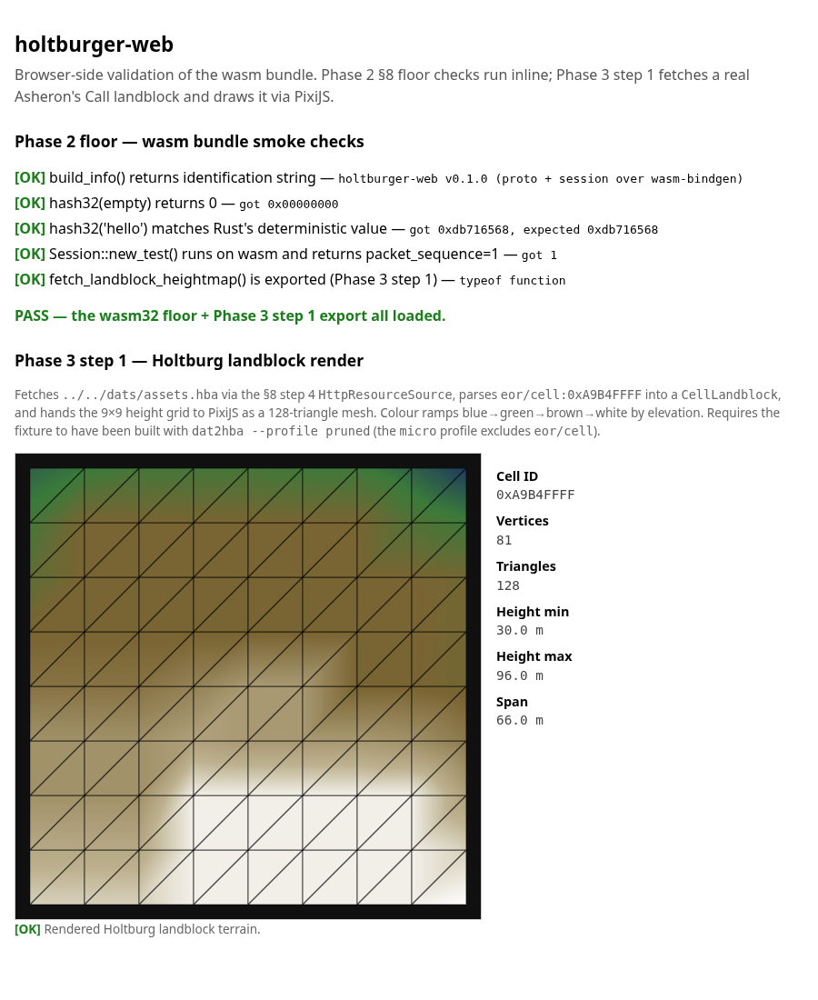

# Phase 3 — PixiJS renderer (as-built)

> **Status:** Step 1 landed (2026-05-04). The browser bundle fetches
> a real Asheron's Call landblock and PixiJS draws it on a `<canvas>`.
> See [`phase-3-step-1-handoff.md`](phase-3-step-1-handoff.md) for the
> framing brief; this file is the as-built reference.



The screenshot is the deliverable artefact. The 9×9 wireframe shows
the 128-triangle tessellation; the colour ramp (deep blue → green →
brown → tan → white) maps to elevation in the 30 m – 96 m range that
the Holtburg heightmap actually contains.

---

## What step 1 ships

**One new wasm-bindgen export** in `apps/holtburger-web`:

```rust
fetch_landblock_heightmap(asset_url: String, cell_id: u32)
    -> Promise<LandblockMesh>
```

Plus the `LandblockMesh` struct with four getters:
- `positions: Float32Array` — 81 vertices × 3 floats `(x, y, z)` in
  metres.
- `indices: Uint16Array` — 384 triangle indices (64 quads × 6).
- `heightMin: number`, `heightMax: number` — elevation bounds in
  metres.

The export reuses the §8-step-4 `HttpResourceSource` for the fetch
and the existing `holtburger_dat::landblock::CellLandblock::unpack`
for the parse, so the wasm side adds only the tessellation loop.

**One new HTML render path** in `apps/holtburger-web/index.html`:

- PixiJS 8.18.1 imported via an import map from jsdelivr — no JS
  bundler. The pin lives in `index.html` and `apps/holtburger-web/README.md`.
- `renderLandblock(canvas, mesh)` builds a `PIXI.MeshGeometry` from
  the wasm mesh's 2D positions + per-vertex height-encoded UVs,
  textures it with a 256×1 gradient canvas, and overlays a thin black
  `PIXI.Graphics` wireframe. World units (metres) map to canvas
  pixels via `container.scale.set(scale, -scale)` — the y-flip puts
  AC's +north at the top of the screen.

**Smoke test extended from 8 to 14 checks.** The Phase 3 additions are:
- symbol presence for `fetch_landblock_heightmap`,
- positions/indices typed-array shape and length,
- corner-vertex coordinates `(0,0)` and `(24,24)`,
- height bounds in `[0, 510]` metres (the AC heightmap range),
- max index `< 81` (every triangle vertex is in the 9×9 grid).

---

## Files touched

| File | What |
|---|---|
| [`external/holtburger/apps/holtburger-web/src/lib.rs`](../external/holtburger/apps/holtburger-web/src/lib.rs) | New `LandblockMesh` struct + `fetch_landblock_heightmap` export |
| [`external/holtburger/apps/holtburger-web/index.html`](../external/holtburger/apps/holtburger-web/index.html) | PixiJS importmap, `<canvas>`, `renderLandblock` |
| [`external/holtburger/apps/holtburger-web/smoke_test.cjs`](../external/holtburger/apps/holtburger-web/smoke_test.cjs) | 6 new checks: symbol-presence + 5 mesh-shape assertions |
| [`external/holtburger/apps/holtburger-web/README.md`](../external/holtburger/apps/holtburger-web/README.md) | New "Frontend dependencies" section + PixiJS pin |
| [`external/holtburger/dats/README.md`](../external/holtburger/dats/README.md) | Profile guidance: `pruned` for renderer, `micro` for §8-step-4 floor |
| [`docs/phase-2-wasm-spike.md`](phase-2-wasm-spike.md) | §8 step 6 status flipped to "in flight via Phase 3 step 1" |
| [`docs/phase-3-renderer.md`](phase-3-renderer.md) | This file |
| [`docs/images/phase-3-step-1-landblock.png`](images/phase-3-step-1-landblock.png) | Browser screenshot of the rendered landblock |

---

## The landblock

The hardcoded cell is `eor/cell:0xA9B4FFFF` — Holtburg town centre's
surface terrain (`CellLandblock` record, 252 bytes). AC's cell-id
convention:

| Pattern | Meaning |
|---|---|
| `XXYY0000`..`XXYY00FE` | Per-cell records (interior cells, dungeons) |
| `XXYYFFFE` | `LandblockInfo` — object placements within the landblock |
| `XXYYFFFF` | `CellLandblock` — surface terrain (9×9 height grid + tile types) |

`XX` is the east–west landblock index (00..FE), `YY` is the
north–south landblock index (00..FE). `0xA9B4` was picked because:
- Holtburg is the project's namesake; the rendered patch is visually
  recognisable from existing static-site outputs.
- The landblock is well-populated (a town centre, not an ocean cell).
- The handoff brief specified it.

If a future step needs a different cell, the JS side just changes the
hex constant. Multi-cell rendering is a step 2 or 3 problem.

---

## Coordinate convention

The Rust side speaks **metres**, **(x = east, y = north, z = elevation)**:

- A **landblock** is **192 m × 192 m**. It contains 8×8 = 64 *cells*,
  each 24 m × 24 m. The canonical constant is
  `holtburger_common::position::METERS_PER_LANDBLOCK = 192.0` (see
  [`crates/holtburger-common/src/position.rs:5`](../external/holtburger/crates/holtburger-common/src/position.rs)).
- The 9×9 vertex grid covers the **whole landblock**, so vertices are
  `192 / 8 = 24 m apart` on each axis. The `CellLandblock` record name
  is misleading — despite the "Cell" prefix, it is the *landblock*-level
  surface terrain record, not a single cell.
- Heights are `u8 × 2.0` per `CellLandblock::get_height` (see
  [`crates/holtburger-dat/src/landblock.rs`](../external/holtburger/crates/holtburger-dat/src/landblock.rs)),
  so the elevation range is `[0, 510]` metres — that's the AC vertical
  range.

> **Correction note (Phase 3 step 2):** Step 1 originally documented
> "vertices 3 m apart, cell 24 m wide" here and used `x as f32 * 3.0`
> in the tessellation loop. That framing was wrong — the constant
> source is 192 m / 8 = 24 m, and a `CellLandblock` covers a whole
> landblock, not a single cell. The render still looked correct in
> step 1 because the container scale `drawSize / 24.0` absorbed the
> unit error. Step 2 fixed the tessellation (`x * 24.0`), the JS
> scale (`drawSize / 192.0`), and the smoke test corner-vertex
> assertion ((24, 24) → (192, 192)).

The JS side **flips y** at the container level
(`container.scale.set(scale, -scale)`) so AC's +y (north) maps to
canvas-up. The 192 m landblock width is mapped to `canvas.width - 32 px`
of margin (≈ 2.5 px / m at a 512 px canvas). The current implementation
throws away the z component on the JS side and encodes it as a
`u`-coordinate (0..1) into a 256×1 gradient texture; the default `Mesh`
shader then reads per-fragment colour from the ramp. Smooth
interpolation across vertices comes for free from GL's barycentric
blend.

---

## How rendering composes

```
+-------------------------------------------------------------+
|  HBA bytes on disk (dats/assets.hba — git-ignored)          |
|  ──────────────►  fetch() in JS  ──────────────►            |
|     HttpResourceSource (§8 step 4) parses HBA               |
|        ──────────────►  ResourceSource::get_file_by_key     |
|           ──────────────►  CellLandblock::unpack            |
|              ──────────────►  build_mesh() — Rust           |
|                 ──────────────►  LandblockMesh              |
|                    ──────────────►  JS receives             |
|                       ──────────────►  PIXI.MeshGeometry    |
|                          ──────────────►  canvas pixels     |
+-------------------------------------------------------------+
```

The wasm-bindgen boundary is crossed exactly **once** per landblock:
a single `LandblockMesh` struct comes back from `await
fetch_landblock_heightmap(...)`. JS owns the per-frame work (currently
zero — single static draw, no animation, no input). This split is the
template for entity rendering later: Rust computes the buffer, JS
reads it once per frame and tells PixiJS what to draw.

---

## Why the choices were made

- **CDN PixiJS, not bundled.** Adding a JS bundler is maintenance load
  forever. The bundle has zero JS today; one `<script type="importmap">`
  pinning a specific version keeps it that way. When Phase 3 grows
  enough JS to need a bundler (multiple JS files, per-feature module
  splits, custom shaders in separate files), that's the right time to
  introduce one.
- **Parsing in Rust, drawing in JS.** PixiJS is a JS-native API and
  per-call wasm-bindgen interop has measurable cost. One typed-array
  crossing is far cheaper than hundreds of `pixi_mesh.set_position(...)`
  calls. Future entity work follows the same pattern: Rust produces
  an entity buffer, JS reads it once per frame.
- **Texture-mapped colour ramp, not a custom shader.** A 256×1
  gradient canvas + `Texture.from(canvas)` + the default `MeshShader`
  is two API calls and zero GLSL. Custom shaders enter the picture
  when texture atlases land in step 2 (the AC terrain palette is 32
  textured tile types over a 256-entry surface table — that *needs*
  a custom fragment shader, which is the right time to write one).
- **Wireframe overlay.** Diagnostic, but it makes the 9×9 mesh
  tessellation legible at a glance — and that's the whole point of
  step 1's "prove the geometry" framing. It also gives us a fallback
  signal in environments where WebGL is unavailable (the Mesh layer
  goes blank but the wireframe stays — Graphics has a Canvas2D path).
- **Single hardcoded landblock.** Multi-landblock streaming needs
  bookkeeping (which neighbours to pre-fetch, how to evict). One
  landblock proves the pipeline; streaming is an optimisation on a
  working system.

---

## Browser-side validation

Two paths, both end-to-end:

**Headless screenshot via Playwright + Chromium** (used to capture
the deliverable image — Firefox headless on Linux disables WebGL by
default, which makes the textured Mesh blank but leaves the
wireframe visible):

```sh
cd external/holtburger
python3 -m http.server 0 --bind 127.0.0.1 &
# Note the printed port, then in a Playwright script:
#   page.goto("http://127.0.0.1:<port>/apps/holtburger-web/index.html")
#   page.waitForFunction(() =>
#     document.getElementById("render-status")
#       .textContent.includes("[OK]") ||
#     document.getElementById("render-status")
#       .textContent.includes("[FAIL]"),
#     { timeout: 60000 });
#   page.screenshot({ path: "phase-3-step-1-landblock.png", fullPage: true });
```

**Manual** — open the same URL in a real Firefox or Chrome and watch
the canvas paint. The wasm bundle's `start()` installs
`console_error_panic_hook`, so any panic in `fetch_landblock_heightmap`
or `build_mesh` surfaces in devtools. The page's `render-status`
element shows OK / FAIL inline — no devtools needed for the happy
path.

---

## What's next (Phase 3 step 2 candidates)

These are independent — pick by user priority.

### a) Texture-atlas terrain palette

Replace the height-ramp colour with the 32 textured tile types resolved
through the 256-entry surface table. Needs:
- A new wasm-bindgen export returning the per-vertex tile-type-id
  alongside positions/indices.
- A texture atlas built from the AC terrain textures (likely loaded
  from `eor/portal:` records and stitched in JS).
- A custom GLSL fragment shader that samples the atlas with per-vertex
  tile coordinates, blending across triangle edges.

This is the obvious next step from a "look like AC" perspective.

### b) Pan / zoom camera

Wire mouse-wheel + drag to `container.scale` and `container.position`.
Trivial in PixiJS — `app.stage.eventMode = "static"` plus a couple of
event handlers. Unblocks "look at any landblock" UX without
multi-landblock streaming.

### c) Multi-landblock streaming

Render N×N adjacent landblocks. Needs:
- A landblock-id → `LandblockMesh` cache in JS.
- Camera-driven prefetch (which neighbours to load when the camera
  moves).
- LOD / culling once the visible area exceeds a few landblocks.

### d) `ClientViewEvent` → entity sprites

Wire the live ACE feed (when the backend unblocks) through to PixiJS
sprite updates. Needs:
- A new wasm-bindgen export reading from `holtburger-core::client::view`
  and producing an entity buffer per frame.
- A JS-side sprite pool keyed by entity id.
- Sprite assets (likely from `eor/portal:` ICON_DESC + pre-rendered
  facing animations).

The design doc puts ClientViewEvent → entity wiring in **Phase 4**, so
this candidate is technically out of Phase 3 scope. Listed here for
completeness.

### Tangentially: Live ACE session

Still blocked on three MySQL DBs + DAT files for ACE. When that
unblocks, `try_ws_handshake_smoke` becomes the entry point and the
renderer's data feed grows a "from session" path alongside the
"from static HBA" path step 1 took.
