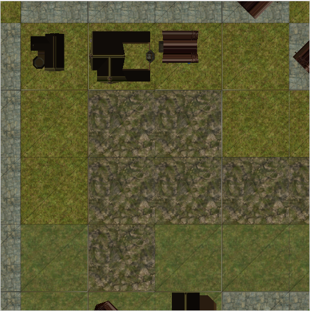
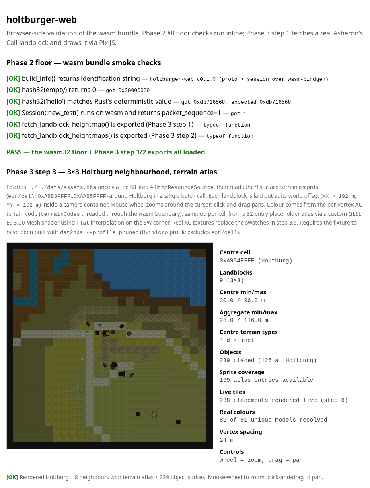

# Phase 3 — PixiJS renderer (as-built)

> **Status:** Phase 3 closed enough to start Phase 4. Steps 1, 2, 3,
> 3.5, 4, 4.5, 5 (partial — roads), and **6 (live runtime per-model
> rendering)** landed (2026-05-04). The browser bundle fetches a 3×3
> neighbourhood of real Asheron's Call landblocks around Holtburg in
> one batch call, lays them out at correct world offsets, and PixiJS
> draws them on a `<canvas>` as **AC terrain with real retail
> textures, stone-road network, and 239 placed object/building
> sprites rendered in-browser at runtime via per-poly UV-mapped
> textures** — same pipeline as the static-site emitter's
> `ObjectSpriteGenerator.cs::DrawTriangle` but at runtime, so
> user-imported custom models render without a re-bake step.
> Mouse-wheel zooms around the cursor; click-and-drag pans. **Phase
> 4 step 1 (wasm-driven AC login) landed (2026-05-04)** — the
> renderer now boots as a backdrop after the wasm bundle's
> `start_session` reaches `GameMessage::CharacterList` against a
> live ACE; see [`phase-4-renderer.md`](phase-4-renderer.md). See
> [`phase-3-step-1-handoff.md`](phase-3-step-1-handoff.md),
> [`phase-3-step-2-handoff.md`](phase-3-step-2-handoff.md),
> [`phase-3-step-3-handoff.md`](phase-3-step-3-handoff.md), and
> [`phase-3-step-4.5-handoff.md`](phase-3-step-4.5-handoff.md) for the
> framing briefs; this file is the as-built reference.





The step 4.5 screenshot is the current deliverable: same 3×3 grid as
step 4 (real terrain + roads + 239 sprites), now with **per-poly real
colours** baked into each sprite tile by the static-site emitter
(`WorldBuilder.Terminal/ObjectSpriteGenerator.cs`). The atlas was
swapped from the older 4096×1296 greyscale-silhouette build to the
production **8192×4088 full-color atlas with 169 model entries** —
stone walls, wood beams, roof tiles all rendered in their real AC
colours per pixel. The runtime per-model tint (`fetch_object_colours`
walk, 81 of 81 Holtburg models resolved with 54 distinct ARGB values)
is now reserved for the **fallback dot** path when a placement has no
atlas tile; sprites that hit the atlas render at PIXI tint = white
(identity) so per-poly colours pass through unchanged. Compare to the
static-site z=12 reference at
[`images/DerethMapsEnhanced_zoom.png`](images/DerethMapsEnhanced_zoom.png) —
same place, same general layout. Visual gap remaining: the larger
custom-coloured landmarks (the green pyramid / lifestone). Step 5's
atmospheric polish (fog, day/night) is still open. Earlier
deliverables archived at
[`images/phase-3-step-3.5-real-textures.png`](images/phase-3-step-3.5-real-textures.png) (terrain + roads, no objects),
[`images/phase-3-step-5-roads.png`](images/phase-3-step-5-roads.png) (placeholder + roads),
[`images/phase-3-step-3-textured.png`](images/phase-3-step-3-textured.png) (placeholder, hard-edges),
[`images/phase-3-step-2-multi-landblock.png`](images/phase-3-step-2-multi-landblock.png) (height-ramp),
[`images/phase-3-step-1-landblock.png`](images/phase-3-step-1-landblock.png) (single landblock).

---

## What step 1 ships

**One new wasm-bindgen export** in `apps/holtburger-web`:

```rust
fetch_landblock_heightmap(asset_url: String, cell_id: u32)
    -> Promise<LandblockMesh>
```

Plus the `LandblockMesh` struct with four getters:
- `positions: Float32Array` — 81 vertices × 3 floats `(x, y, z)` in
  metres.
- `indices: Uint16Array` — 384 triangle indices (64 quads × 6).
- `heightMin: number`, `heightMax: number` — elevation bounds in
  metres.

The export reuses the §8-step-4 `HttpResourceSource` for the fetch
and the existing `holtburger_dat::landblock::CellLandblock::unpack`
for the parse, so the wasm side adds only the tessellation loop.

**One new HTML render path** in `apps/holtburger-web/index.html`:

- PixiJS 8.18.1 imported via an import map from jsdelivr — no JS
  bundler. The pin lives in `index.html` and `apps/holtburger-web/README.md`.
- `renderLandblock(canvas, mesh)` builds a `PIXI.MeshGeometry` from
  the wasm mesh's 2D positions + per-vertex height-encoded UVs,
  textures it with a 256×1 gradient canvas, and overlays a thin black
  `PIXI.Graphics` wireframe. World units (metres) map to canvas
  pixels via `container.scale.set(scale, -scale)` — the y-flip puts
  AC's +north at the top of the screen.

**Smoke test extended from 8 to 14 checks.** The Phase 3 additions are:
- symbol presence for `fetch_landblock_heightmap`,
- positions/indices typed-array shape and length,
- corner-vertex coordinates `(0,0)` and `(24,24)`,
- height bounds in `[0, 510]` metres (the AC heightmap range),
- max index `< 81` (every triangle vertex is in the 9×9 grid).

---

## Files touched

| File | What |
|---|---|
| [`external/holtburger/apps/holtburger-web/src/lib.rs`](../external/holtburger/apps/holtburger-web/src/lib.rs) | New `LandblockMesh` struct + `fetch_landblock_heightmap` export |
| [`external/holtburger/apps/holtburger-web/index.html`](../external/holtburger/apps/holtburger-web/index.html) | PixiJS importmap, `<canvas>`, `renderLandblock` |
| [`external/holtburger/apps/holtburger-web/smoke_test.cjs`](../external/holtburger/apps/holtburger-web/smoke_test.cjs) | 6 new checks: symbol-presence + 5 mesh-shape assertions |
| [`external/holtburger/apps/holtburger-web/README.md`](../external/holtburger/apps/holtburger-web/README.md) | New "Frontend dependencies" section + PixiJS pin |
| [`external/holtburger/dats/README.md`](../external/holtburger/dats/README.md) | Profile guidance: `pruned` for renderer, `micro` for §8-step-4 floor |
| [`docs/phase-2-wasm-spike.md`](phase-2-wasm-spike.md) | §8 step 6 status flipped to "in flight via Phase 3 step 1" |
| [`docs/phase-3-renderer.md`](phase-3-renderer.md) | This file |
| [`docs/images/phase-3-step-1-landblock.png`](images/phase-3-step-1-landblock.png) | Browser screenshot of the rendered landblock |

---

## The landblock

The hardcoded cell is `eor/cell:0xA9B4FFFF` — Holtburg town centre's
surface terrain (`CellLandblock` record, 252 bytes). AC's cell-id
convention:

| Pattern | Meaning |
|---|---|
| `XXYY0000`..`XXYY00FE` | Per-cell records (interior cells, dungeons) |
| `XXYYFFFE` | `LandblockInfo` — object placements within the landblock |
| `XXYYFFFF` | `CellLandblock` — surface terrain (9×9 height grid + tile types) |

`XX` is the east–west landblock index (00..FE), `YY` is the
north–south landblock index (00..FE). `0xA9B4` was picked because:
- Holtburg is the project's namesake; the rendered patch is visually
  recognisable from existing static-site outputs.
- The landblock is well-populated (a town centre, not an ocean cell).
- The handoff brief specified it.

If a future step needs a different cell, the JS side just changes the
hex constant. Multi-cell rendering is a step 2 or 3 problem.

---

## Coordinate convention

The Rust side speaks **metres**, **(x = east, y = north, z = elevation)**:

- A **landblock** is **192 m × 192 m**. It contains 8×8 = 64 *cells*,
  each 24 m × 24 m. The canonical constant is
  `holtburger_common::position::METERS_PER_LANDBLOCK = 192.0` (see
  [`crates/holtburger-common/src/position.rs:5`](../external/holtburger/crates/holtburger-common/src/position.rs)).
- The 9×9 vertex grid covers the **whole landblock**, so vertices are
  `192 / 8 = 24 m apart` on each axis. The `CellLandblock` record name
  is misleading — despite the "Cell" prefix, it is the *landblock*-level
  surface terrain record, not a single cell.
- Heights are `u8 × 2.0` per `CellLandblock::get_height` (see
  [`crates/holtburger-dat/src/landblock.rs`](../external/holtburger/crates/holtburger-dat/src/landblock.rs)),
  so the elevation range is `[0, 510]` metres — that's the AC vertical
  range.

> **Correction note (Phase 3 step 2):** Step 1 originally documented
> "vertices 3 m apart, cell 24 m wide" here and used `x as f32 * 3.0`
> in the tessellation loop. That framing was wrong — the constant
> source is 192 m / 8 = 24 m, and a `CellLandblock` covers a whole
> landblock, not a single cell. The render still looked correct in
> step 1 because the container scale `drawSize / 24.0` absorbed the
> unit error. Step 2 fixed the tessellation (`x * 24.0`), the JS
> scale (`drawSize / 192.0`), and the smoke test corner-vertex
> assertion ((24, 24) → (192, 192)).

The JS side **flips y** at the container level
(`container.scale.set(scale, -scale)`) so AC's +y (north) maps to
canvas-up. The 192 m landblock width is mapped to `canvas.width - 32 px`
of margin (≈ 2.5 px / m at a 512 px canvas). The current implementation
throws away the z component on the JS side and encodes it as a
`u`-coordinate (0..1) into a 256×1 gradient texture; the default `Mesh`
shader then reads per-fragment colour from the ramp. Smooth
interpolation across vertices comes for free from GL's barycentric
blend.

---

## How rendering composes

```
+-------------------------------------------------------------+
|  HBA bytes on disk (dats/assets.hba — git-ignored)          |
|  ──────────────►  fetch() in JS  ──────────────►            |
|     HttpResourceSource (§8 step 4) parses HBA               |
|        ──────────────►  ResourceSource::get_file_by_key     |
|           ──────────────►  CellLandblock::unpack            |
|              ──────────────►  build_mesh() — Rust           |
|                 ──────────────►  LandblockMesh              |
|                    ──────────────►  JS receives             |
|                       ──────────────►  PIXI.MeshGeometry    |
|                          ──────────────►  canvas pixels     |
+-------------------------------------------------------------+
```

The wasm-bindgen boundary is crossed exactly **once** per landblock:
a single `LandblockMesh` struct comes back from `await
fetch_landblock_heightmap(...)`. JS owns the per-frame work (currently
zero — single static draw, no animation, no input). This split is the
template for entity rendering later: Rust computes the buffer, JS
reads it once per frame and tells PixiJS what to draw.

---

## Why the choices were made

- **CDN PixiJS, not bundled.** Adding a JS bundler is maintenance load
  forever. The bundle has zero JS today; one `<script type="importmap">`
  pinning a specific version keeps it that way. When Phase 3 grows
  enough JS to need a bundler (multiple JS files, per-feature module
  splits, custom shaders in separate files), that's the right time to
  introduce one.
- **Parsing in Rust, drawing in JS.** PixiJS is a JS-native API and
  per-call wasm-bindgen interop has measurable cost. One typed-array
  crossing is far cheaper than hundreds of `pixi_mesh.set_position(...)`
  calls. Future entity work follows the same pattern: Rust produces
  an entity buffer, JS reads it once per frame.
- **Texture-mapped colour ramp, not a custom shader.** A 256×1
  gradient canvas + `Texture.from(canvas)` + the default `MeshShader`
  is two API calls and zero GLSL. Custom shaders enter the picture
  when texture atlases land in step 2 (the AC terrain palette is 32
  textured tile types over a 256-entry surface table — that *needs*
  a custom fragment shader, which is the right time to write one).
- **Wireframe overlay.** Diagnostic, but it makes the 9×9 mesh
  tessellation legible at a glance — and that's the whole point of
  step 1's "prove the geometry" framing. It also gives us a fallback
  signal in environments where WebGL is unavailable (the Mesh layer
  goes blank but the wireframe stays — Graphics has a Canvas2D path).
- **Single hardcoded landblock.** Multi-landblock streaming needs
  bookkeeping (which neighbours to pre-fetch, how to evict). One
  landblock proves the pipeline; streaming is an optimisation on a
  working system.

---

## Browser-side validation

Two paths, both end-to-end:

**Headless screenshot via Playwright + Chromium** (used to capture
the deliverable image — Firefox headless on Linux disables WebGL by
default, which makes the textured Mesh blank but leaves the
wireframe visible):

```sh
cd external/holtburger
python3 -m http.server 0 --bind 127.0.0.1 &
# Note the printed port, then in a Playwright script:
#   page.goto("http://127.0.0.1:<port>/apps/holtburger-web/index.html")
#   page.waitForFunction(() =>
#     document.getElementById("render-status")
#       .textContent.includes("[OK]") ||
#     document.getElementById("render-status")
#       .textContent.includes("[FAIL]"),
#     { timeout: 60000 });
#   page.screenshot({ path: "phase-3-step-1-landblock.png", fullPage: true });
```

**Manual** — open the same URL in a real Firefox or Chrome and watch
the canvas paint. The wasm bundle's `start()` installs
`console_error_panic_hook`, so any panic in `fetch_landblock_heightmap`
or `build_mesh` surfaces in devtools. The page's `render-status`
element shows OK / FAIL inline — no devtools needed for the happy
path.

---

## Phase 3 step 2 landed (2026-05-04)

Step 2 turns the renderer from "one static landblock" into "an
explorable terrain neighbourhood". On a fresh page load, the bundle:

1. Builds the 9 cell IDs for the 3×3 around Holtburg
   (`0xA8B3FFFF`..`0xAAB5FFFF`) inline from `(HOLTBURG_X +
   dx, HOLTBURG_Y + dy)`.
2. Calls `fetch_landblock_heightmaps(asset_url, ids)` once. The
   plural export opens `HttpResourceSource` once and returns 9
   `LandblockMesh` entries in input order, so the ~230 MB HBA fetch
   + parse cost lands once instead of nine times.
3. Lays each mesh into its own `landblockContainer` positioned at
   `(XX * 192, YY * 192)` world metres inside a `worldContainer`
   that owns the AC y-flip (`scale.set(1, -1)`), inside a
   `cameraContainer` that owns zoom + pan.
4. Wires `app.stage` event handlers for mouse-wheel zoom (around
   the cursor, scale clamped to `[0.05, 5.0]`) and pointer
   drag-to-pan (`pointerdown/move/up/upoutside/leave`). CSS toggles
   the canvas cursor between `grab` and `grabbing` for affordance.

What step 2 ships, on top of step 1:

| Surface | Before step 2 | After step 2 |
|---|---|---|
| Wasm exports | `fetch_landblock_heightmap` | + `fetch_landblock_heightmaps` (batch) |
| Tessellation | inline in `fetch_landblock_heightmap` | factored to `fn build_mesh(&CellLandblock)` |
| Vertex spacing | 3.0 m (wrong) | 24.0 m (correct, via `METERS_PER_LANDBLOCK / 8.0`) |
| Landblock side | 24 m (wrong) | 192 m (correct, the canonical AC constant) |
| Scene graph | `app.stage → container` | `stage → cameraContainer → worldContainer → 9 × landblockContainer` |
| Camera | none — fixed view | mouse-wheel zoom around cursor, drag-to-pan |
| Smoke checks | 14 | 17 |

The colour ramp normalises against the *aggregate* min/max across
all 9 landblocks so neighbours share a single gradient — otherwise
each tile self-normalises and seams jump in colour. The wireframe
stroke widens from 0.06 m to 0.4 m so the 9×9 tessellation stays
legible at the 3×3-fits-canvas zoom level (stroke is in world units
and scales naturally with the camera).

The unit error step 1 shipped (`x as f32 * 3.0` framing landblocks
as 24 m × 24 m) was fixed on the way into step 2 — see the
"Correction note" in the coordinate-convention section above. The
container scale absorbed the error in step 1 because there was only
one landblock; step 2's offsets at multiples of 192 m would have
left an `8 × (24 - 3) = 168 m` gap between neighbours otherwise.

### Files touched in step 2

| File | What |
|---|---|
| [`apps/holtburger-web/Cargo.toml`](../external/holtburger/apps/holtburger-web/Cargo.toml) | Promoted `holtburger-common` from transitive to direct dep — `METERS_PER_LANDBLOCK` is now read from the canonical source |
| [`apps/holtburger-web/src/lib.rs`](../external/holtburger/apps/holtburger-web/src/lib.rs) | Factored `build_mesh`, fixed vertex spacing, added `fetch_landblock_heightmaps` |
| [`apps/holtburger-web/index.html`](../external/holtburger/apps/holtburger-web/index.html) | Multi-landblock scene graph, batch fetch loop, mouse-wheel + pointer handlers, shared height-ramp texture |
| [`apps/holtburger-web/smoke_test.cjs`](../external/holtburger/apps/holtburger-web/smoke_test.cjs) | Corner-vertex assertion bumped (24, 24) → (192, 192); 3 new checks for the batch round-trip |
| [`docs/phase-3-renderer.md`](phase-3-renderer.md) | This file |
| [`docs/phase-2-wasm-spike.md`](phase-2-wasm-spike.md) | Status banner now reads "step 1 + step 2 landed"; §8 step 6 closed |
| [`docs/images/phase-3-step-2-multi-landblock.png`](images/phase-3-step-2-multi-landblock.png) | Browser screenshot of the 3×3 grid |

---

## Phase 3 step 3 landed (2026-05-04)

Step 3 turns the renderer from "topographic-map heightmap" into
"recognisable AC terrain". On a fresh page load, the bundle:

1. Decodes each vertex's `terrain[]` u16 (per the ACE bit packing —
   road=bits 0-1, type=bits 2-6, scenery=bits 11-15) and threads the
   5-bit terrain-type field through the wasm boundary as a
   `Uint8Array(81)` per landblock.
2. Builds a 32-pixel-wide RGBA atlas in JS, one column per terrain
   type. Colours are placeholder swatches (per the handoff brief's
   scope-reducer guidance — the AC Texture (`0x06`) parser is a
   multi-week reverse-engineering job, deferred to step 3.5).
3. Attaches a custom GLSL ES 3.00 Mesh shader to each landblock that
   reads the SW corner's terrain code via `flat in int` and samples
   the atlas at the column centre. The SW corner is the WebGL2
   provoking vertex (last index of each triangle), so both triangles
   of a cell shade as one type — hard-edges, no diagonal smear.

What step 3 ships, on top of step 2:

| Surface | Before step 3 | After step 3 |
|---|---|---|
| Wasm boundary | `positions, indices, heightMin, heightMax` | + `terrainCodes: Uint8Array(81)` |
| `CellLandblock` API | `get_height(x, y)` | + `terrain_type/road_type/scenery(x, y)` + `terrain_at(x, y)` |
| Triangle index winding | SW vertex first | SW vertex **last** (provoking-vertex contract for `flat`) |
| Mesh attribute | `aPosition (vec2) + aUV (vec2 height-encoded)` | `aPosition (vec2) + aTerrainCode (float)` |
| Mesh shader | default `MeshShader` (height-ramp texture) | custom GLSL ES 3.00 with per-cell `flat` atlas sample |
| Colour source | `(height - hmin) / range → 1D gradient` | `terrain_code → 32-entry placeholder atlas` |
| Smoke checks | 17 | 20 |
| Native lib tests | 1086 | 1090 (+4 bit-decode tests) |

The placeholder palette mirrors AC's `TerrainTextureType` enum
(DatReaderWriter `dats.xml` lines 183-217 / `ACE.DatLoader.Entity.
TerrainType` in the cloned upstream): 32 base types from `BarrenRock`
(0x00) through `DesolateLands` (0x1F). Entry 0x20 (`RoadType`) lives
in the road-bit field, not the type-bit field, and never appears in
the per-vertex stream — road overlays are step 5 polish.

**The PixiJS-8 footguns hit during implementation, captured here so
step 3.5 doesn't relive them:**

- **WebGL path uses individual uniforms, not UBO blocks.** First
  shader attempt declared `layout(std140) uniform globalUniforms {
  ... }` and `layout(std140) uniform localUniforms { ... }` — the
  WebGPU-style layout. WebGL flagged "used but unbound uniform
  buffer" because PixiJS's `local-uniform-bit` template emits
  `uniform mat3 uTransformMatrix; uniform vec4 uColor; uniform float
  uRound;` and binds them by name through `glUniform*` from the
  MeshPipe's UniformGroups (set on `shader.groups[100]` and
  `shader.groups[101]` per frame by the WebGL mesh adaptor). Fix:
  declare individual uniforms matching that template — `uTransformMatrix`,
  `uColor`, `uRound`, `uProjectionMatrix`, `uWorldTransformMatrix`,
  `uWorldColorAlpha`, `uResolution`. The WGSL/WebGPU branch (a
  future polish step) flips back to UBO blocks.
- **Provoking-vertex ordering matters.** The default 9×9 → 384 index
  vector put `v00` (cell SW corner) **first** in each triangle.
  WebGL2's `flat` interpolation samples from the **last** vertex of a
  triangle, so under the original winding, both triangles of a cell
  drew with two different terrain codes (whichever vertex happened to
  be last in each triangle). Reordering to put `v00` last in both
  triangles makes the cell shade uniformly. Winding stays CCW so
  consumers depending on triangle orientation aren't affected (PixiJS
  Mesh doesn't backface-cull anyway).
- **Module-level `const` declarations are TDZ-blocked.** Hoisted
  function declarations work above their declaration line, but
  module-level GLSL string literals as `const` don't — the first
  arrangement put the GLSL constants below the `try { … render(…) }`
  block at the bottom of the module and crashed with `Cannot access
  'TERRAIN_VERTEX_GLSL' before initialization`. Fix: put all
  rendering primitives + their `const` literals above the render
  trigger, with the trigger itself moved to the bottom of the script.

### Files touched in step 3

| File | What |
|---|---|
| [`crates/holtburger-dat/src/landblock.rs`](../external/holtburger/crates/holtburger-dat/src/landblock.rs) | `terrain_at` / `terrain_type` / `road_type` / `scenery` helpers + 4 unit tests pinning the bit layout |
| [`apps/holtburger-web/src/lib.rs`](../external/holtburger/apps/holtburger-web/src/lib.rs) | `LandblockMesh.terrain_codes: Vec<u8>` field + `terrainCodes` getter; SW-last index reordering in `build_mesh` |
| [`apps/holtburger-web/index.html`](../external/holtburger/apps/holtburger-web/index.html) | `TERRAIN_TYPES` (32 placeholder colours), `buildTerrainAtlas`, custom GLSL shader, `buildTerrainShader`, `buildLandblockChildren` rewrite to use the new geometry + shader |
| [`apps/holtburger-web/smoke_test.cjs`](../external/holtburger/apps/holtburger-web/smoke_test.cjs) | 3 new checks: `terrainCodes` shape, range, and ≥3 distinct types at Holtburg centre |
| [`apps/holtburger-web/capture_step3.cjs`](../external/holtburger/apps/holtburger-web/capture_step3.cjs) | Playwright + Chromium harness for re-capturing the docs/images screenshot |
| [`docs/phase-3-renderer.md`](phase-3-renderer.md) | This file |
| [`docs/phase-2-wasm-spike.md`](phase-2-wasm-spike.md) | Status banner now reads "steps 1, 2, 3 landed" |
| [`docs/emit-dynamic-site.md`](emit-dynamic-site.md) | §4.5 quality-ladder row 2 (texture atlas + surface table) flips from `open` to `✅ landed` |
| [`docs/images/phase-3-step-3-textured.png`](images/phase-3-step-3-textured.png) | Browser screenshot — 3×3 grid with terrain atlas |

---

## Phase 3 step 5 (partial) landed (2026-05-04)

Step 5 is "road overlays + atmospheric polish" in the design doc's
quality ladder. **Roads landed**; atmospherics (fog, day/night) are
still open. The road overlay surfaces AC's stone-path network on
top of the existing terrain atlas — Holtburg's main east-west
spine + branches now read as light-grey paths through the green
grasslands, matching the static-site z=12 reference.

What step 5 (partial) ships, on top of step 3:

| Surface | After step 3 | After step 5 (partial) |
|---|---|---|
| Wasm boundary | `terrainCodes: Uint8Array(81)` | + `roadCodes: Uint8Array(81)` |
| Mesh attributes | `aPosition (vec2) + aTerrainCode (float)` | + `aRoadCode (float)` |
| Mesh shader | one `flat` varying (`vTerrainCode`) | two `flat` varyings (`vTerrainCode`, `vRoadCode`); `uRoadColor` uniform; per-fragment mix |
| Smoke checks | 21 | 24 (+3 road-code shape/range/density) |
| Native lib tests | 1090 | 1090 (unchanged — JS + Rust mesh-export only) |

**Soft-blend was attempted then deferred.** Step 5's first iteration
tried smooth-interpolated terrain code + LINEAR atlas filtering
(textbook "soft-blend"). Result: unnatural rainbow bands at terrain
transitions, because the placeholder palette's atlas-column ordering
(AC enum order) doesn't match perceptual adjacency — a water-grass
interface visually traverses Marsh → Mud → Obsidian → Dirt. Reverted
to hard edges (`flat` from SW corner) for both terrain and road.
With real AC textures (step 3.5) each tile has internal detail and
atlas-adjacent codes blend naturally; the soft-blend code path
becomes correct and is mechanical to flip back on (single-line
shader change + texture filter swap, both documented inline in
`buildTerrainAtlas` and `TERRAIN_VERTEX_GLSL`).

### Files touched in step 5 (partial)

| File | What |
|---|---|
| [`apps/holtburger-web/src/lib.rs`](../external/holtburger/apps/holtburger-web/src/lib.rs) | `LandblockMesh.road_codes: Vec<u8>` field + `roadCodes` getter; `build_mesh` populates from `cell.road_type(x, y)` |
| [`apps/holtburger-web/index.html`](../external/holtburger/apps/holtburger-web/index.html) | `aRoadCode` mesh attribute, `flat in int vRoadCode` varying, `uRoadColor` uniform (#a8a4a0 stone-grey), per-fragment `mix(terrain, road, mask*0.85)` |
| [`apps/holtburger-web/smoke_test.cjs`](../external/holtburger/apps/holtburger-web/smoke_test.cjs) | 3 new road checks: `roadCodes` shape, range `[0, 3]`, ≥10 road verts at Holtburg centre (empirically 17) |
| [`docs/phase-3-renderer.md`](phase-3-renderer.md) | This file |
| [`docs/phase-2-wasm-spike.md`](phase-2-wasm-spike.md) | Status now reads "steps 1, 2, 3 + step 5 (roads) landed" |
| [`docs/emit-dynamic-site.md`](emit-dynamic-site.md) | §4.5 quality-ladder row 4 (road overlays) flips to `✅ landed (partial — roads only)` |
| [`docs/images/phase-3-step-5-roads.png`](images/phase-3-step-5-roads.png) | Browser screenshot — 3×3 grid with terrain atlas + road overlay |

---

## Phase 3 step 3.5 landed (2026-05-04)

Step 3.5 closes the loop on step 3's "shader pipeline first, real
assets second" decision: the 32-colour placeholder palette is
swapped for **real retail AC terrain textures**. Each cell now
tiles a 256×256 sample of its SurfaceTexture across its 24 m face —
grass with mottling, water with waves, stone road. The visual jump
is what step 3 had been promising; placeholder colours were the
load-bearing scaffolding that this step replaces with content.

What step 3.5 ships, on top of step 5 (partial):

| Surface | After step 5 partial | After step 3.5 |
|---|---|---|
| Atlas content | 32 placeholder swatches | 33 real retail tiles (256×256 each, 1536×1536 atlas) |
| Atlas filtering | NEAREST | LINEAR + auto-mipmaps |
| Wasm boundary | `terrainCodes`, `roadCodes` | + `fetch_terrain_textures(asset_url) → Vec<TerrainTexture>` |
| Dat-format parsers | (none for textures) | new `Palette` (0x04), `SurfaceTexture` (0x05), `Texture` (0x06) |
| Pixel formats decoded | n/a | CustomLscapeR8G8B8, R8G8B8, A8R8G8B8, P8, Index16, A8 |
| Road overlay | flat `uRoadColor` (#a8a4a0) | real `RoadType` atlas tile |
| Wireframe alpha | 0.5 (visible diagnostic) | 0.12 (faint; texture content reads first) |
| Smoke checks | 24 | 28 (+4 for texture export) |
| Native lib tests | 1090 | 1096 (+6 parser tests) |
| Bundle profile | `dat2hba --profile pruned` (233 MB) | `--profile full` (605 MB; pruned excludes Texture/Palette/SurfaceTexture types) |

**Texture-format pipeline** (Rust side):

1. **`Palette` (0x04).** `[id][i32 count][u32 ARGB]*count`.
2. **`SurfaceTexture` (0x05).** `[id][unknown_int][unknown_byte][i32 count][u32 mip_id]*count`. `highest_res()` returns the last entry.
3. **`Texture` (0x06).** Header + raw `source_data` + optional `default_palette_id` for palettized formats. `to_rgba8()` decodes to a flat width × height × 4 RGBA8 buffer; closure-based palette lookup keeps the cost lazy (most terrain textures don't need a palette).

The parsers cover the pixel formats AC terrain actually uses:
`CustomLscapeR8G8B8` (the common case — terrain heightmap textures),
`R8G8B8` (BGR despite the name; AC quirk), `A8R8G8B8`, `P8`,
`Index16`, `A8`. **DXT1 / DXT3 / DXT5** were added in step 4.5b for
the per-model colour walk (most retail Surface chains end at a DXT
texture); decoder ported from upstream ACE `DxtUtil.cs` (Ms-PL,
notice retained in `crates/holtburger-dat/src/file_type/dxt.rs`).
`R5G6B5` / `A4R4G4B4` still return a structured error since no
shipped path uses them. Other parsers cribbed from upstream ACE
`Source/ACE.DatLoader/FileTypes/{Palette,SurfaceTexture,Texture}.cs`.

**`fetch_terrain_textures(asset_url)` wasm export.** Returns 33
`TerrainTexture` blobs in `TerrainTextureType` enum order. Pipeline
per terrain type: SurfaceTexture lookup → highest mip-level Texture
lookup → RGBA8 decode (with lazy palette fetch). One HTTP fetch
resolves the whole asset bundle; per-asset lookups are in-memory.

**Region-parser shortcut.** The `terrain_type → SurfaceTexture ID`
mapping comes from a hardcoded `RETAIL_TERRAIN_SURFACE_TEXTURES`
constant rather than a runtime Region (`0x13000000`) parser. The
mapping was extracted offline by **signature-scanning** the actual
Region binary (via `dat-tool export ... | python` for the
`[count=33][type=0]...[type=32]` pattern of `TexMerge.TerrainDesc[]`).
Writing a full Region parser would have required ~300 lines of
binrw to handle the `LandDefs / GameTime / SkyDesc / SoundDesc /
SceneDesc` nested-struct chain; the mapping is stable for retail
Dereth and re-extracting if a custom region appears is a step-4-or-
later concern. Documented inline.

**JS atlas builder + per-region shader.** `buildTerrainAtlas`
awaits the wasm export, downscales each 512×512 source to 256×256
via an offscreen canvas, and packs into a 1536×1536 atlas
(6×6 grid). Shader replaces the 32-column `(code + 0.5) / 32`
lookup with a proper per-region `regionOrigin + regionSize *
fract(cellUv)` formula. New `vCellUv = aPosition / 24m` varying
gives cell-local tile UV (each cell tiles its texture across its
24m face). `uAtlasGridSize` uniform parametrises (cols, rows). Road
overlay samples atlas slot 32 (real RoadType tile) instead of the
placeholder uniform.

**Wireframe stroke alpha bumped DOWN from 0.5 to 0.12** — with real
textures the cell grid would overpower the actual content. Still
visible enough at high zoom-in to spot tessellation issues.

**Fixture profile change:** `dat2hba`'s pruned profile excludes
Texture / SurfaceTexture / Palette record types via
`is_essential()`. Step 3.5 needs `--profile full`. Bundle grows
from 233 MB → 605 MB. Reasonable for development; production needs
a per-content "renderer" profile or proper streaming, tracked as a
follow-up.

### Files touched in step 3.5

| File | What |
|---|---|
| [`crates/holtburger-dat/src/file_type/palette.rs`](../external/holtburger/crates/holtburger-dat/src/file_type/palette.rs) | New: parses Palette (0x04) records into `id` + `colors: Vec<u32>` |
| [`crates/holtburger-dat/src/file_type/surface_texture.rs`](../external/holtburger/crates/holtburger-dat/src/file_type/surface_texture.rs) | New: parses SurfaceTexture (0x05) mip-stack |
| [`crates/holtburger-dat/src/file_type/texture.rs`](../external/holtburger/crates/holtburger-dat/src/file_type/texture.rs) | New: Texture (0x06) parser + RGBA8 decoder for the 5 formats AC terrain uses |
| [`crates/holtburger-dat/src/file_type/mod.rs`](../external/holtburger/crates/holtburger-dat/src/file_type/mod.rs) | Module declarations + re-exports |
| [`apps/holtburger-web/src/lib.rs`](../external/holtburger/apps/holtburger-web/src/lib.rs) | `RETAIL_TERRAIN_SURFACE_TEXTURES` constant (33 entries, signature-scanned), `TerrainTexture` struct, `fetch_terrain_textures` async export |
| [`apps/holtburger-web/index.html`](../external/holtburger/apps/holtburger-web/index.html) | Atlas builder rewritten to fetch real textures; per-region shader (`vCellUv`, `uAtlasGridSize`); wireframe dimmed |
| [`apps/holtburger-web/smoke_test.cjs`](../external/holtburger/apps/holtburger-web/smoke_test.cjs) | 4 new checks: symbol presence + 33-entry round-trip + RGBA8 invariants + retail mip pin |
| [`docs/phase-3-renderer.md`](phase-3-renderer.md) | This section |
| [`docs/phase-2-wasm-spike.md`](phase-2-wasm-spike.md) | Status now reads "steps 1, 2, 3, 3.5 + step 5 (roads) landed" |
| [`docs/emit-dynamic-site.md`](emit-dynamic-site.md) | §4.5 quality-ladder row 2 annotation: now real textures, not placeholder |
| [`docs/images/phase-3-step-3.5-real-textures.png`](images/phase-3-step-3.5-real-textures.png) | Browser screenshot — 3×3 grid with real AC retail terrain textures |

---

## Phase 3 step 4 landed (2026-05-04)

Step 4 is "sprite-atlas reuse for object art" in the design doc's
quality ladder. Holtburg now reads as a town: 239 placed object
and building sprites drawn on top of the existing terrain atlas,
brown silhouettes clustered at the road junction matching the
static-site reference's visible buildings.

What step 4 ships, on top of step 3.5:

| Surface | After step 3.5 | After step 4 |
|---|---|---|
| Wasm exports | `+ fetch_terrain_textures` | `+ fetch_landblock_objects` |
| LandblockInfo parser | bug latent (BuildInfo.num_portals as u16) | fixed (u32 — matches ACE `List<T>.Unpack`) |
| Object placement source | n/a | `LandblockInfo.objects` (Stab) + `.buildings` (BuildInfo) |
| Sprite atlas | n/a | static-site `sprites/atlas.{png,js}` reused (4096×1296 RGBA, 108 entries) |
| Atlas coverage at Holtburg | n/a | 44% (rest fall back to coloured dots) |
| Tinting strategy | n/a | model-id top-byte: 0x01→brown, 0x02→tan-green |
| Smoke checks | 28 | 32 (+4 step-4) |
| Native lib tests | 1096 | 1096 (unchanged) |

**LandblockInfo + sprite pipeline** (Rust + JS):

1. **`fetch_landblock_objects(asset_url, cell_ids)`** in
   `apps/holtburger-web/src/lib.rs`. For each requested
   `XXYYFFFE` cell, reads the LandblockInfo record and emits one
   `ObjectPlacement` per `Stab` (loose objects) and per `BuildInfo`
   (buildings). Quaternion → yaw via standard `atan2(2(qw·qz +
   qx·qy), 1 - 2(qy² + qz²))`. Per-cell missing → silent skip.
2. **`loadSpriteAtlas()`** in `index.html`. Fetches `./sprites/
   atlas.png` via `PIXI.Assets.load`, fetches `./sprites/atlas.js`
   via `fetch + new Function()` (the file is a DOM-style script
   with `const SPRITE_ATLAS = {...}`). Builds a `Map<modelId, {
   texture: Texture, worldBounds: [w_m, h_m] }>` keyed by AC model
   id.
3. **`buildObjectsContainer(neighbourhood, objects, spriteMap)`**
   creates one PIXI.Sprite per object where the model_id has an
   atlas tile, falling back to a 1.5 m coloured circle otherwise.
   Sprite size = atlas entry's `worldBounds` (real-world metres);
   anchor (0.5, 0.5); rotation = -obj.rotationZ (negate because
   `worldContainer.scale.y = -1` mirrors the scene). Tint by model
   prefix: 0x01 → #8b6442, 0x02 → #6f7a4a.

**LandblockInfo parser bug fix.** `BuildInfo.num_portals` was
`u16` in `crates/holtburger-dat/src/landblock.rs`; ACE's
`List<T>.Unpack(reader)` reads a `u32` count. The mismatch only
triggered when a building had any portals — Holtburg's first
interior building hits it immediately and the parser panicked at
"failed to fill whole buffer while parsing stab_list". Pinned by
the new round-trip smoke check; native unit tests already passed
because synthetic LandblockInfo fixtures had zero portals.

**Two implementation footguns documented.**

(a) **`LandblockInfo.id` ≠ neighbourhood id.** The LandblockInfo's
`id` field carries the `XXYYFFFE` file id, not the `XXYYFFFF`
CellLandblock id that the heightmap layer keys on. First lookup
pass mapped `NEIGHBOURHOOD.id` directly — every object got
`continue`-skipped silently. Fix: index the neighbourhood by
`(lbX << 16 | lbY)` and decompose `obj.landblockId` to match.

(b) **Sub-pixel debug markers.** PIXI.Graphics circles drawn at
world-metre size — 1.0 m radius is sub-pixel at the 3×3-fits-
canvas zoom and renders invisibly. Bumped fallback dot radius to
1.5 m; used 5 m during debugging.

### Files touched in step 4

| File | What |
|---|---|
| [`crates/holtburger-dat/src/landblock.rs`](../external/holtburger/crates/holtburger-dat/src/landblock.rs) | Bug fix: `BuildInfo.num_portals: u16` → `u32` (matches ACE) |
| [`apps/holtburger-web/src/lib.rs`](../external/holtburger/apps/holtburger-web/src/lib.rs) | `ObjectPlacement` struct + `fetch_landblock_objects` async export |
| [`apps/holtburger-web/index.html`](../external/holtburger/apps/holtburger-web/index.html) | `loadSpriteAtlas`, `buildObjectsContainer`, sprite-layer wiring in `renderNeighbourhood` |
| [`apps/holtburger-web/sprites/atlas.{png,js}`](../external/holtburger/apps/holtburger-web/sprites/) | Static-site sprite atlas copied in (4096×1296 RGBA, 108 model IDs) |
| [`apps/holtburger-web/smoke_test.cjs`](../external/holtburger/apps/holtburger-web/smoke_test.cjs) | 4 new checks: symbol presence + 100+ placement round-trip + per-record invariants + Holtburg town-density pin |
| [`docs/phase-3-renderer.md`](phase-3-renderer.md) | This section |
| [`docs/phase-2-wasm-spike.md`](phase-2-wasm-spike.md) | Status now reads "steps 1, 2, 3, 3.5, 4 + step 5 (roads) landed" |
| [`docs/emit-dynamic-site.md`](emit-dynamic-site.md) | §4.5 quality-ladder row 3 (sprite atlas) flips from `open` to `✅ landed (placeholder tint)` |
| [`docs/images/phase-3-step-4-objects.png`](images/phase-3-step-4-objects.png) | Browser screenshot — 3×3 grid with terrain + roads + 239 object/building sprites |

---

## Phase 3 step 4.5 landed (2026-05-04)

**Per-model real colours.** The 2-bucket category palette from step 4
(every `0x01` model brown, every `0x02` model tan-green) is replaced
with per-model real ARGB colours derived from each model's Surface
record. The brown-house cluster at Holtburg's town centre now shows
distinguishable per-model tints; models the walk can't resolve fall
back to the legacy 2-bucket palette so the worst case is "looks like
step 4." See [`phase-3-step-4.5-handoff.md`](phase-3-step-4.5-handoff.md)
for the framing.

What step 4.5 ships, on top of step 4:

| Surface | After step 4 | After step 4.5 |
|---|---|---|
| Object/building sprite tint | one of two browns by model_id top byte | per-model ARGB from Surface chain (81 of 81 Holtburg models resolve, with 54 distinct ARGB values among them; the 2-bucket palette is a fallback that never fires for the test fixture) |
| Surface (0x08) parser | absent | `Surface::unpack` + `solid_color()` / `textured()` accessors |
| Model→colour walk | n/a | `resolve_model_color` in Rust, exposed as `fetch_object_colours(asset_url, model_ids)` returning one ARGB per id |
| Stage-info readout | "Sprite coverage" only | + "Real colours: N of M unique models resolved" |

### Pipeline shape

The walk dispatches on `model_id >> 24`:

- `0x01XXXXXX` (Model / GfxObj) — fetch the GfxObj record, read its
  `surfaces: Vec<u32>` header, iterate.
- `0x02XXXXXX` (SetupModel) — fetch the SetupModel record, iterate
  `parts: Vec<u32>` (each a GfxObj id), recurse via the GfxObj path.
  Depth-4 recursion guard for malformed records.
- Anything else — `None`.

For each surface ID, `lookup_surface_color` tries the **solid path
first** (`Surface::color_value` ARGB if `Base1Solid`, no fetches), then
falls back to the **textured path**:
`Surface.OrigTextureId → SurfaceTexture → highest_res() → Texture →
to_rgba8 → α-weighted mean ARGB`. Same chain `fetch_terrain_textures`
uses for the terrain-tile pipeline (step 3.5). The
`OrigTextureId` field is named misleadingly — it's a **SurfaceTexture
(0x05) ID**, not a Texture / RenderSurface (0x06) ID. Confirmed by
`WorldBuilder.Shared/Lib/Texture/RenderSurfaceImporter.cs`'s
`CreateSurface(gid, surfaceTextureGid)` builder. A retail sweep showed
only 2.5% of surfaces are solid-coloured; the textured-mean path is
doing the load-bearing work for ~97% of resolutions.

A minimal `read_gfx_obj_surfaces` byte-parser sits in
`apps/holtburger-web/src/lib.rs` and reads only the
`[u32 id][u32 flags][smart_vec u32 surfaces]` header — the full
`GfxObj::unpack` parser fails on roughly half of retail's records on
deeper subfields (vertex/polygon/BSP), and step 4.5 doesn't depend
on a fix.

JS-side, the render trigger dedupes the placement model IDs to a
unique-id set (~67-81 for Holtburg's 3×3 vs the 239 placements),
calls `fetch_object_colours` once, and builds a `Map<modelId, argb>`
for `buildObjectsContainer` to consult. PIXI tint is RGB so we drop
the alpha byte before applying.

### Files touched in step 4.5

| File | Role |
|---|---|
| [`crates/holtburger-dat/src/file_type/surface.rs`](../external/holtburger/crates/holtburger-dat/src/file_type/surface.rs) | New `Surface` parser. 20-byte solid / 24-byte textured. No leading `id` field (unlike Texture / Palette / SurfaceTexture). |
| [`crates/holtburger-dat/src/file_type/mod.rs`](../external/holtburger/crates/holtburger-dat/src/file_type/mod.rs) | Register `surface` module + re-export `Surface`. |
| [`apps/holtburger-web/src/lib.rs`](../external/holtburger/apps/holtburger-web/src/lib.rs) | `fetch_object_colours` wasm export + `resolve_model_color` / `walk_gfx_obj` / `walk_setup_model` / `lookup_surface_color` / `rgba_pixel_mean` / `read_gfx_obj_surfaces` helpers. |
| [`apps/holtburger-web/index.html`](../external/holtburger/apps/holtburger-web/index.html) | Dedupe model IDs, call `fetch_object_colours`, build `colourMap`, thread through `renderNeighbourhood` → `buildObjectsContainer`. PIXI tint = `argb & 0x00FFFFFF`. New stage-info row. |
| [`apps/holtburger-web/smoke_test.cjs`](../external/holtburger/apps/holtburger-web/smoke_test.cjs) | 32 → 36 PASS — symbol presence + round-trip shape + resolve ratio + distinct ARGB count. |
| [`docs/phase-3-renderer.md`](phase-3-renderer.md) | This section |
| [`docs/phase-2-wasm-spike.md`](phase-2-wasm-spike.md) | Status now reads "steps 1, 2, 3, 3.5, 4, 4.5 + step 5 (roads) landed" |
| [`docs/emit-dynamic-site.md`](emit-dynamic-site.md) | §4.5 quality-ladder row 3 annotation flips from "step 4 silhouettes + category tint" to "step 4.5 real per-model colours" |
| [`docs/images/phase-3-step-4.5-real-colours.png`](images/phase-3-step-4.5-real-colours.png) | Browser screenshot — 3×3 grid with per-model real colours |

---

## What's next (Phase 3 step 5 candidates)

These are independent — pick by user priority. Step 3's shader
pipeline + step 4's sprite layer + step 4.5's real colours together
form the rendering foundation; subsequent steps polish and extend.

### a) Multi-surface-per-model rendering (step 5+ scope)

Step 4.5 picks ONE representative ARGB per model — typically the
mean of the first surface's pixels. Real AC models have multiple
surfaces (walls, roof, floor, signs, doors). Distinguishing them
needs either (a) per-poly meshes (rendering the 3D model top-down,
substantial work, ~weeks) or (b) multi-layer atlas tiles (a roof
layer over a wall layer, requires regenerating the static-site
atlas with semantic regions). Both step 5+ scope.

### b) Per-cell terrain blending (step 5 polish, AC-faithful)

AC's actual surface table uses corner/side blend maps (the
`CornerTerrainMaps` / `SideTerrainMaps` lists in TexMerge that step
3.5 didn't read) for proper transitions across cell boundaries.
Currently each cell renders one terrain type uniformly; with corner
blends, a grass-to-water boundary fades smoothly. This is the
"static site looks more polished" delta. Multi-pass rendering, ~150
lines of additional shader work.

### c) Atmospheric polish (step 5 follow-on)

Fog of war (visible vs unseen distinction), day/night gradient,
post-process bloom on water tiles. The road overlay landed already;
this is the rest of step 5.

### d) Multi-landblock streaming

Extend beyond the 3×3 hardcode to N×N visible landblocks driven by
the camera. Needs a landblock-id → `LandblockMesh` cache, camera-
driven prefetch, eviction, and LOD/culling.

### e) Renderer-profile bake (asset-bundle size)

Step 3.5 forced `dat2hba --profile full` because the existing
`pruned` profile excludes Texture / SurfaceTexture / Palette types
via `is_essential()`. Bundle grew from 233 MB → 605 MB. A new
`renderer` profile that's `pruned` + the texture-pipeline types
would land in the ~280 MB range. Mechanical change in
`crates/holtburger-dat/src/file_type/mod.rs` (extend
`is_essential` or add a parallel filter).

### Tangentially: Live ACE session (Phase 4)

Still gated on a wasm-side AC handshake export; the wasm bundle's
existing `try_ws_handshake_smoke` constructs a Session but doesn't
drive login. When that lands, `ClientViewEvent` → entity sprites
becomes the data path and the renderer grows a "from live session"
feed alongside the "from static HBA" feed step 1 took.
