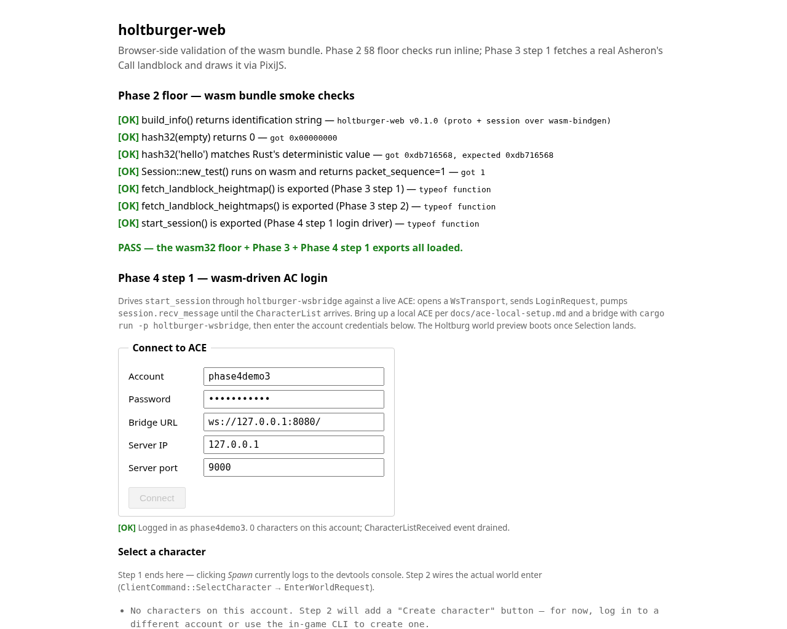

# Phase 4 — playable AC client (as-built)

> **Status:** Phase 4 step 1 landed (2026-05-04). The wasm bundle now
> drives the AC login → CharacterList handshake from the browser
> through `holtburger-wsbridge` to a live ACE: open the page, fill
> the login form, click Connect, and the page transitions to a
> Selection screen showing the account's characters (or "no
> characters on this account" when the list is empty). Same milestone
> Phase 1 hit on the native side (`holtburger-cli` reaches the
> Selection page) but now via the in-browser bundle. The renderer
> from Phase 3 boots as a backdrop once login resolves. See
> [`phase-4-step-1-handoff.md`](phase-4-step-1-handoff.md) for the
> framing brief; this file is the as-built reference.



The screenshot shows the Phase 4 step 1 deliverable: smoke checks all
green at the top, Phase 4 login form filled in (`phase4demo3` /
`phase4demo3` / `ws://127.0.0.1:8080/` / `127.0.0.1` / `9000`), the
green-status line `[OK] Logged in as phase4demo3. 0 characters on
this account; CharacterListReceived event drained.`, and the
"Select a character" header with the no-characters fallback message.

The list is empty because `phase4demo3` is a fresh auto-created ACE
account; populating characters is step 2 scope (the actual
`ClientCommand::SelectCharacter` → `EnterWorldRequest` → spawn flow).
The point of step 1's deliverable is the **page transition** —
proving the AC handshake reached `GameMessage::CharacterList` and
the wasm bundle drained the event to JS. An empty list is the same
proof as a populated one: the protocol negotiation completed, the
session is live, and the user is past the login gate.

---

## What step 1 ships

**One new wasm-bindgen export** at
`apps/holtburger-web/src/lib.rs:start_session` (the lifetime-aware
proxy class is `SessionHandle` in the same file):

```rust
#[wasm_bindgen]
pub async fn start_session(
    bridge_url: String,
    server_ip: String,
    server_port: u16,
    username: String,
    password: String,
) -> Result<SessionHandle, JsValue>;
```

Internally:

1. Open a `holtburger_transport_ws::WsTransport` against `bridge_url`
   for `server_ip` (the IP literal ACE answers on; the bridge tags
   inbound frames with it so the session's source-address allowlist
   matches).
2. Build `Session::new_with_transport(transport, server_addr)` (the
   Phase 2 §8 step 2 seam).
3. Send `LoginRequest(username, password)` via
   `session.send_login_request`.
4. Pump `session.recv_message()` until the server emits a
   `GameMessage::CharacterList`. Earlier control packets
   (CONNECT_REQUEST → CONNECT_RESPONSE) are handled inside the
   session's receive loop automatically.
5. Return a `SessionHandle` proxy holding the live session, the
   parsed character list, and one queued `kind=0` event so the JS
   side's first `poll_events()` call surfaces the
   CharacterListReceived signal.

**`SessionHandle` is a wasm-bindgen class** with three accessors:

- `poll_events(): ClientEvent[]` — drain queued events. Empty array
  is the steady state. Step 1 only ever queues one event (kind=0)
  at construction time; step 2 will keep the recv loop running and
  queue further `kind`s.
- `characterList(): CharacterSummary[]` — snapshot of the parsed
  CharacterList. Each summary carries `id` (the AC GUID), `name`,
  and `deleteTime` (non-zero = pending-delete grace period).
- `accountName: string` (getter) — server-echoed account name.

**`ClientEvent`** is a tagged-payload envelope. wasm-bindgen does
not directly serialize Rust enum variants with data, so the shape
is `{ kind: u32, stringPayload: Option<String>, u32Payload:
Option<u32> }`. Active values:

| `kind` | Meaning | `stringPayload` | `u32Payload` |
|---|---|---|---|
| 0 | CharacterListReceived | account name | character count |
| 1 | (reserved — Talk / chat) | — | — |
| 2 | (reserved — EntitySpawned) | — | — |
| 3 | (reserved — EntityDespawned) | — | — |
| 4 | (reserved — Disconnected) | — | — |

**`CharacterSummary` projects only the fields the Selection UI
displays.** AC's `CharacterEntry` carries only `guid`, `name`, and
`delete_time` — level / class / equipment are not in the
CharacterList packet itself; they arrive once the player picks a
character and the spawn flow runs (step 2 scope). The handoff
brief's sketch suggested level + class fields; those don't exist
in `CharacterListData` and were dropped here without re-litigation.

---

## What step 1 deliberately does NOT do

Per the brief:

- **No spawn / world enter.** The Selection screen's Spawn button
  logs to `console.log` and disables itself; step 2 wires
  `ClientCommand::SelectCharacter` → `EnterWorldRequest`.
- **No movement input.** WASD / click-to-move are step 3.
- **No DOM panels.** Chat, vitals, inventory render is step 4.
- **No retail-faithful Selection UI.** The character list is a
  basic `<ul>` for step 1 — replicating the in-game selection UI
  (portraits, character preview, slot ordering) is later polish.
- **No password security pass.** For the spike, credentials are
  sent over the WS in cleartext (the bridge is local). Production-
  ready login flow (TLS, password hashing, OAuth gate) is §7.5 in
  the design doc and out of scope here.
- **No timeout / retry on the login flow.** If ACE never responds
  the Promise stays pending — page reload bails the user out.
  Adding a deadline gate is a follow-on polish item.
- **No multi-character / multi-account state.** One session at a
  time; reload to switch accounts. The first session.send across
  the WsTransport binds the session to that account.

---

## Critical fix piggybacked: tokio time → gloo-timers on wasm32

Phase 2 §8 step 3 swapped `std::time::Instant` for `web_time::Instant`
across the session crate, which made `Session::new_with_transport`
runnable on wasm32. Phase 4 step 1 surfaced a second wasm32-specific
panic that step 3 didn't cover: `tokio::time::sleep` itself uses
`std::time::Instant::now()` internally (tokio's time-driver
implementation), which **panics on `wasm32-unknown-unknown` with
"time not implemented on this platform"**. The
`recv_ordered_packet` loop hits this every time the server's
CONNECT_REQUEST queues a CONNECT_RESPONSE with
`ACE_HANDSHAKE_RACE_DELAY_MS = 200ms` — i.e. on every login.

Fix: `holtburger-session`'s wasm32 dep now includes
`gloo-timers = { version = "0.3", features = ["futures"] }`, and
`session/receive.rs` swaps the wasm32 branch from
`tokio::time::sleep(...)` to
`gloo_timers::future::TimeoutFuture::new(ms)`. Native is unchanged
(still uses `tokio::time::sleep_until`). The deadline → millisecond
conversion goes through `web_time::Instant`'s
`.saturating_duration_since(...).as_millis()` so the relative-time
arithmetic stays sound across both targets.

The `tokio::select!` macro itself is fine on wasm32 — it just
polls multiple futures and doesn't pull in tokio's time driver
unless the futures it's polling do. With `TimeoutFuture` instead of
`tokio::time::sleep` the select arm becomes `Future<Output = ()>`
and races cleanly against the `recv_raw_packet_with_addr` arm.

This is a load-bearing fix for Phase 4 step 1 — without it,
`start_session` panics inside the wasm bundle the moment the
session tries to honour any pending control packet's deadline. It
also unblocks all future wasm-side session work; the same
codepath is hit by every retransmit, reliability-window, and
keepalive timer the session uses.

---

## JS-side login form + Selection display

The renderer-first boot in `apps/holtburger-web/index.html` is now
gated on a successful AC handshake. Body structure:

1. **Phase 2 floor smoke checks** at the top — unchanged, plus one
   new line for the `start_session` symbol-presence check.
2. **`<h2>Phase 4 step 1 — wasm-driven AC login</h2>`** with a
   description of what's happening.
3. **`<form id="login-form">`** with five inputs (account /
   password / bridge URL / server IP / server port) and a Connect
   button. Defaults: `ws://127.0.0.1:8080/` / `127.0.0.1` / `9000`.
4. **`<div id="login-status">`** — single status line that cycles
   through "Connecting…" / "[OK] Logged in as X. N characters…" /
   "[FAIL] Login failed: <error>".
5. **`<div id="selection" hidden>`** — Selection screen, unhidden
   after a successful login. Each character renders as
   `<li><strong>{name}</strong> {idHex} <button>Spawn (placeholder)</button></li>`.
   Clicking Spawn logs to console + disables the button (step 2
   wires the actual flow).
6. **`<h2>Phase 3 step 6 — 3×3 Holtburg neighbourhood…</h2>`** —
   the existing renderer, refactored into a `renderHoltburg()`
   function that's invoked after login resolves so the canvas
   stays as its placeholder background until the user is past the
   gate.

The login form handler (in the same `<script type="module">` block)
calls `start_session(...)` and on resolve drains the initial event
queue, populates the character `<ul>`, unhides the Selection, then
fires `renderHoltburg()` as a backdrop. On reject it shows the
error string in the status line and re-enables the Connect button.
A second submit while a session is live is a no-op; reload the page
to reconnect.

---

## Smoke checks (41 → 44)

`apps/holtburger-web/smoke_test.cjs` grew three checks:

- **Symbol-presence** for `start_session` (a `function`).
- **Symbol-presence** for `SessionHandle` class plus its
  `poll_events` and `characterList` prototype methods.
- **Error-path** — calling `start_session` against a closed bridge
  URL (`ws://127.0.0.1:1/`) rejects with a stringified error
  rather than panicking. In a Node environment without a
  `WebSocket` global the rejection comes from the inner
  `web_sys::WebSocket::new` call failing; with one (Node 21+ or a
  `ws` polyfill) it'd come from the OS-level connection refused.
  Either way the wasm boundary surfaces a JsValue error string,
  not a panic. Pinned message right now: `"WsTransport::connect:
  ws bad url: {}"` (the `{}` is the empty-object JS error from a
  missing `WebSocket`).

The live round-trip (`start_session` against a real ACE returning a
populated CharacterList) is browser-side only — synthesizing the AC
handshake in JS would need to port chunks of `holtburger-protocol`
(PacketHeader, fragment encoding, ISAAC checksum, GameMessage
serialization) and is well outside step 1's scope. The smoke test
prints a SKIP line pointing at `index.html` + a running ACE.

End state: `node smoke_test.cjs` reports **44/44 PASS** when the
fixture's at `dats/assets.hba` (`dat2hba --profile full`).

---

## Live-ACE manual validation

Per the brief's verification checklist:

1. Bring up ACE locally per
   [`docs/ace-local-setup.md`](ace-local-setup.md): MariaDB 11.8 +
   three DBs + .NET 10.0.203 + the upstream `~/ace-server/` clone,
   launched headless via
   `ACE_NONINTERACTIVE_CONSOLE=true ... < /dev/null`.
2. Start `holtburger-wsbridge` listening on `ws://127.0.0.1:8080/`:
   `cd external/holtburger/ && cargo run -p holtburger-wsbridge --release`.
3. Serve the wasm bundle:
   `cd external/holtburger/ && python3 -m http.server 8765`.
4. Open `http://127.0.0.1:8765/apps/holtburger-web/index.html` in a
   browser. Smoke checks should all PASS at the top.
5. Fill the login form with a fresh account name (ACE auto-creates
   on first login) and click Connect. Within ~1 second the page
   transitions to "Selection visible" and the status line reads
   `[OK] Logged in as <account>. N characters on this account…`.

The Playwright capture script at
`apps/holtburger-web/capture_phase4_step1.cjs` automates steps 4-5
for headless screenshot regeneration; it writes
`docs/images/phase-4-step-1-character-list.png`.

The 2026-05-04 capture used a fresh `phase4demo3` account on a
local ACE backed by a default fresh shard DB; the resulting list
is empty (no characters yet). To populate the list for a richer
screenshot, drive `holtburger-cli` against the same account between
the auto-create and the recapture (interactive Create Character
flow) — that's a step-2 polish item, not a step-1 blocker.

---

## Files touched

New:
- `docs/phase-4-renderer.md` — this file.
- `docs/images/phase-4-step-1-character-list.png` — deliverable
  screenshot.
- `apps/holtburger-web/capture_phase4_step1.cjs` — Playwright
  capture script.

Modified:
- `apps/holtburger-web/src/lib.rs` (+~250 lines): `ClientEvent`,
  `CharacterSummary`, `SessionHandle`, `start_session`.
- `apps/holtburger-web/index.html` (+~100 lines, refactor of
  ~80 existing): login form HTML + form handler that gates the
  renderer, renderer factored into `async function renderHoltburg`.
- `apps/holtburger-web/smoke_test.cjs` (+3 checks).
- `apps/holtburger-web/README.md` — adds `start_session` /
  `SessionHandle` to the wasm-bindgen surface inventory.
- `crates/holtburger-session/Cargo.toml`: adds `gloo-timers` to
  the wasm32-only deps.
- `crates/holtburger-session/src/session/receive.rs`: swaps
  `tokio::time::sleep` → `gloo_timers::future::TimeoutFuture` on
  wasm32.
- `docs/phase-3-renderer.md`: status banner now mentions Phase 4
  step 1.
- `docs/phase-2-wasm-spike.md`: status banner now mentions Phase 4
  step 1.
- `docs/emit-dynamic-site.md` §8 Phase 4 step ledger: step 1
  flipped from ⏳ to ✅.

---

## What's NOT in step 1 (scope deferred)

- **Step 2 — `ClientViewEvent` → PIXI entity buffer.** Once a
  character is selected and spawned, AC's server starts pushing
  world state (entity positions, animations, chat). Step 2 wires
  the Session's event stream into the renderer's per-frame loop
  and reuses Phase 3 step 6's per-model render cache for entity
  sprites.
- **Step 3 — input → AC movement packets.** WASD / click-to-target
  → `holtburger-core`'s input surface → AC
  `CharacterPositionUpdate` packets. Closes the gameplay loop.
- **Step 4 — DOM panels.** Chat, vitals, inventory rendered next
  to the PIXI canvas. Parallel to step 2/3.
- **Phase 3 follow-ons** — atmospherics, terrain blending, multi-
  landblock streaming, renderer-profile bake, coordSystem
  assertion. Independent of Phase 4; pick by user priority.
