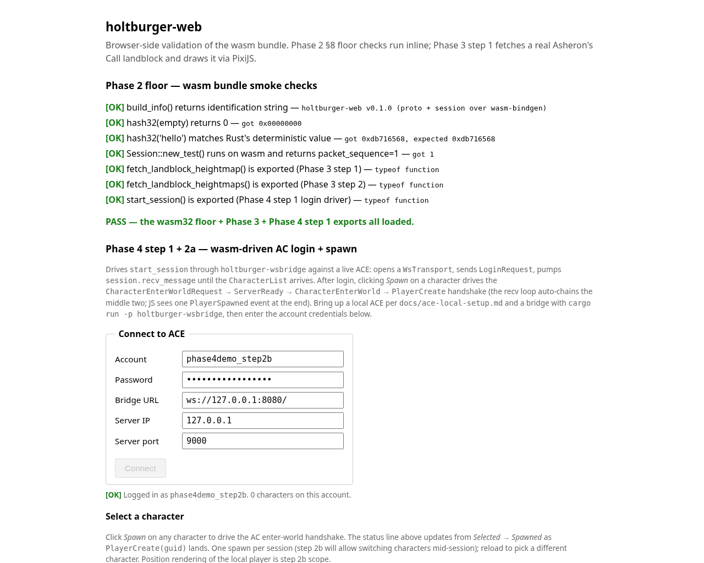

# Phase 4 — playable AC client (as-built)

> **Status:** Phase 4 steps 1, 2a, 2a.5, and **2a.6** landed
> (2026-05-04). The wasm bundle drives AC login → CharacterList
> → CharacterCreate → spawn handshake → in-world chat / admin
> commands from the browser through `holtburger-wsbridge` to a
> live ACE end-to-end. Open the page, log in, the Selection
> screen appears with a Create-test-character form when the account
> is empty; populate one (Aluvian / Male / Adventurer / Holtburg
> defaults built in the wasm bundle via
> `holtburger_core::CharacterGenBuilder` against the `CharGen` table
> parsed out of `0x0E000002` at login time), click Spawn — the recv
> loop walks `CharacterEnterWorldRequest` →
> `CharacterEnterWorldServerReady` → `CharacterEnterWorld` →
> `PlayerCreate` → `LoginComplete`, queues
> `kind=1 PlayerSpawned` + `kind=7 EnteredWorld` events, JS unhides
> a "Teleport to Holtburg" button. The button sends
> `@telepoi Holtburg` via `GameAction::Talk` to bypass the Training
> Academy tutorial — handy for dev workflows that want to skip
> straight to outdoor Holtburg without the indoor-cell renderer.
> Same milestone Phase 1 hit on the native side (`holtburger-cli`
> reaches Selection + spawn) but now through the in-browser bundle
> and one-click. The Phase 3 renderer boots as a backdrop once
> login resolves; rendering the local player's sprite at its world
> coords is step 2b. See
> [`phase-4-step-1-handoff.md`](phase-4-step-1-handoff.md) for the
> framing brief; this file is the as-built reference.


The screenshot shows the Phase 4 step 1 deliverable: smoke checks all
green at the top, Phase 4 login form filled in (`phase4demo3` /
`phase4demo3` / `ws://127.0.0.1:8080/` / `127.0.0.1` / `9000`), the
green-status line `[OK] Logged in as phase4demo3. 0 characters on
this account; CharacterListReceived event drained.`, and the
"Select a character" header with the no-characters fallback message.

The list is empty because `phase4demo3` is a fresh auto-created ACE
account; populating characters is step 2 scope (the actual
`ClientCommand::SelectCharacter` → `EnterWorldRequest` → spawn flow).
The point of step 1's deliverable is the **page transition** —
proving the AC handshake reached `GameMessage::CharacterList` and
the wasm bundle drained the event to JS. An empty list is the same
proof as a populated one: the protocol negotiation completed, the
session is live, and the user is past the login gate.

---

## What step 1 ships

**One new wasm-bindgen export** at
`apps/holtburger-web/src/lib.rs:start_session` (the lifetime-aware
proxy class is `SessionHandle` in the same file):

```rust
#[wasm_bindgen]
pub async fn start_session(
    bridge_url: String,
    server_ip: String,
    server_port: u16,
    username: String,
    password: String,
) -> Result<SessionHandle, JsValue>;
```

Internally:

1. Open a `holtburger_transport_ws::WsTransport` against `bridge_url`
   for `server_ip` (the IP literal ACE answers on; the bridge tags
   inbound frames with it so the session's source-address allowlist
   matches).
2. Build `Session::new_with_transport(transport, server_addr)` (the
   Phase 2 §8 step 2 seam).
3. Send `LoginRequest(username, password)` via
   `session.send_login_request`.
4. Pump `session.recv_message()` until the server emits a
   `GameMessage::CharacterList`. Earlier control packets
   (CONNECT_REQUEST → CONNECT_RESPONSE) are handled inside the
   session's receive loop automatically.
5. Return a `SessionHandle` proxy holding the live session, the
   parsed character list, and one queued `kind=0` event so the JS
   side's first `poll_events()` call surfaces the
   CharacterListReceived signal.

**`SessionHandle` is a wasm-bindgen class** with three accessors:

- `poll_events(): ClientEvent[]` — drain queued events. Empty array
  is the steady state. Step 1 only ever queues one event (kind=0)
  at construction time; step 2 will keep the recv loop running and
  queue further `kind`s.
- `characterList(): CharacterSummary[]` — snapshot of the parsed
  CharacterList. Each summary carries `id` (the AC GUID), `name`,
  and `deleteTime` (non-zero = pending-delete grace period).
- `accountName: string` (getter) — server-echoed account name.

**`ClientEvent`** is a tagged-payload envelope. wasm-bindgen does
not directly serialize Rust enum variants with data, so the shape
is `{ kind: u32, stringPayload: Option<String>, u32Payload:
Option<u32> }`. Active values:

| `kind` | Meaning | `stringPayload` | `u32Payload` |
|---|---|---|---|
| 0 | CharacterListReceived | account name | character count |
| 1 | (reserved — Talk / chat) | — | — |
| 2 | (reserved — EntitySpawned) | — | — |
| 3 | (reserved — EntityDespawned) | — | — |
| 4 | (reserved — Disconnected) | — | — |

**`CharacterSummary` projects only the fields the Selection UI
displays.** AC's `CharacterEntry` carries only `guid`, `name`, and
`delete_time` — level / class / equipment are not in the
CharacterList packet itself; they arrive once the player picks a
character and the spawn flow runs (step 2 scope). The handoff
brief's sketch suggested level + class fields; those don't exist
in `CharacterListData` and were dropped here without re-litigation.

---

## What step 1 deliberately does NOT do

Per the brief:

- **No spawn / world enter.** The Selection screen's Spawn button
  logs to `console.log` and disables itself; step 2 wires
  `ClientCommand::SelectCharacter` → `EnterWorldRequest`.
- **No movement input.** WASD / click-to-move are step 3.
- **No DOM panels.** Chat, vitals, inventory render is step 4.
- **No retail-faithful Selection UI.** The character list is a
  basic `<ul>` for step 1 — replicating the in-game selection UI
  (portraits, character preview, slot ordering) is later polish.
- **No password security pass.** For the spike, credentials are
  sent over the WS in cleartext (the bridge is local). Production-
  ready login flow (TLS, password hashing, OAuth gate) is §7.5 in
  the design doc and out of scope here.
- **No timeout / retry on the login flow.** If ACE never responds
  the Promise stays pending — page reload bails the user out.
  Adding a deadline gate is a follow-on polish item.
- **No multi-character / multi-account state.** One session at a
  time; reload to switch accounts. The first session.send across
  the WsTransport binds the session to that account.

---

## Critical fix piggybacked: tokio time → gloo-timers on wasm32

Phase 2 §8 step 3 swapped `std::time::Instant` for `web_time::Instant`
across the session crate, which made `Session::new_with_transport`
runnable on wasm32. Phase 4 step 1 surfaced a second wasm32-specific
panic that step 3 didn't cover: `tokio::time::sleep` itself uses
`std::time::Instant::now()` internally (tokio's time-driver
implementation), which **panics on `wasm32-unknown-unknown` with
"time not implemented on this platform"**. The
`recv_ordered_packet` loop hits this every time the server's
CONNECT_REQUEST queues a CONNECT_RESPONSE with
`ACE_HANDSHAKE_RACE_DELAY_MS = 200ms` — i.e. on every login.

Fix: `holtburger-session`'s wasm32 dep now includes
`gloo-timers = { version = "0.3", features = ["futures"] }`, and
`session/receive.rs` swaps the wasm32 branch from
`tokio::time::sleep(...)` to
`gloo_timers::future::TimeoutFuture::new(ms)`. Native is unchanged
(still uses `tokio::time::sleep_until`). The deadline → millisecond
conversion goes through `web_time::Instant`'s
`.saturating_duration_since(...).as_millis()` so the relative-time
arithmetic stays sound across both targets.

The `tokio::select!` macro itself is fine on wasm32 — it just
polls multiple futures and doesn't pull in tokio's time driver
unless the futures it's polling do. With `TimeoutFuture` instead of
`tokio::time::sleep` the select arm becomes `Future<Output = ()>`
and races cleanly against the `recv_raw_packet_with_addr` arm.

This is a load-bearing fix for Phase 4 step 1 — without it,
`start_session` panics inside the wasm bundle the moment the
session tries to honour any pending control packet's deadline. It
also unblocks all future wasm-side session work; the same
codepath is hit by every retransmit, reliability-window, and
keepalive timer the session uses.

---

## JS-side login form + Selection display

The renderer-first boot in `apps/holtburger-web/index.html` is now
gated on a successful AC handshake. Body structure:

1. **Phase 2 floor smoke checks** at the top — unchanged, plus one
   new line for the `start_session` symbol-presence check.
2. **`<h2>Phase 4 step 1 — wasm-driven AC login</h2>`** with a
   description of what's happening.
3. **`<form id="login-form">`** with five inputs (account /
   password / bridge URL / server IP / server port) and a Connect
   button. Defaults: `ws://127.0.0.1:8080/` / `127.0.0.1` / `9000`.
4. **`<div id="login-status">`** — single status line that cycles
   through "Connecting…" / "[OK] Logged in as X. N characters…" /
   "[FAIL] Login failed: <error>".
5. **`<div id="selection" hidden>`** — Selection screen, unhidden
   after a successful login. Each character renders as
   `<li><strong>{name}</strong> {idHex} <button>Spawn (placeholder)</button></li>`.
   Clicking Spawn logs to console + disables the button (step 2
   wires the actual flow).
6. **`<h2>Phase 3 step 6 — 3×3 Holtburg neighbourhood…</h2>`** —
   the existing renderer, refactored into a `renderHoltburg()`
   function that's invoked after login resolves so the canvas
   stays as its placeholder background until the user is past the
   gate.

The login form handler (in the same `<script type="module">` block)
calls `start_session(...)` and on resolve drains the initial event
queue, populates the character `<ul>`, unhides the Selection, then
fires `renderHoltburg()` as a backdrop. On reject it shows the
error string in the status line and re-enables the Connect button.
A second submit while a session is live is a no-op; reload the page
to reconnect.

---

## Smoke checks (41 → 44)

`apps/holtburger-web/smoke_test.cjs` grew three checks:

- **Symbol-presence** for `start_session` (a `function`).
- **Symbol-presence** for `SessionHandle` class plus its
  `poll_events` and `characterList` prototype methods.
- **Error-path** — calling `start_session` against a closed bridge
  URL (`ws://127.0.0.1:1/`) rejects with a stringified error
  rather than panicking. In a Node environment without a
  `WebSocket` global the rejection comes from the inner
  `web_sys::WebSocket::new` call failing; with one (Node 21+ or a
  `ws` polyfill) it'd come from the OS-level connection refused.
  Either way the wasm boundary surfaces a JsValue error string,
  not a panic. Pinned message right now: `"WsTransport::connect:
  ws bad url: {}"` (the `{}` is the empty-object JS error from a
  missing `WebSocket`).

The live round-trip (`start_session` against a real ACE returning a
populated CharacterList) is browser-side only — synthesizing the AC
handshake in JS would need to port chunks of `holtburger-protocol`
(PacketHeader, fragment encoding, ISAAC checksum, GameMessage
serialization) and is well outside step 1's scope. The smoke test
prints a SKIP line pointing at `index.html` + a running ACE.

End state: `node smoke_test.cjs` reports **44/44 PASS** when the
fixture's at `dats/assets.hba` (`dat2hba --profile full`).

---

## Live-ACE manual validation

Per the brief's verification checklist:

1. Bring up ACE locally per
   [`docs/ace-local-setup.md`](ace-local-setup.md): MariaDB 11.8 +
   three DBs + .NET 10.0.203 + the upstream `~/ace-server/` clone,
   launched headless via
   `ACE_NONINTERACTIVE_CONSOLE=true ... < /dev/null`.
2. Start `holtburger-wsbridge` listening on `ws://127.0.0.1:8080/`:
   `cd external/holtburger/ && cargo run -p holtburger-wsbridge --release`.
3. Serve the wasm bundle:
   `cd external/holtburger/ && python3 -m http.server 8765`.
4. Open `http://127.0.0.1:8765/apps/holtburger-web/index.html` in a
   browser. Smoke checks should all PASS at the top.
5. Fill the login form with a fresh account name (ACE auto-creates
   on first login) and click Connect. Within ~1 second the page
   transitions to "Selection visible" and the status line reads
   `[OK] Logged in as <account>. N characters on this account…`.

The Playwright capture script at
`apps/holtburger-web/capture_phase4_step1.cjs` automates steps 4-5
for headless screenshot regeneration; it writes
`docs/images/phase-4-step-1-character-list.png`.

The 2026-05-04 capture used a fresh `phase4demo3` account on a
local ACE backed by a default fresh shard DB; the resulting list
is empty (no characters yet). To populate the list for a richer
screenshot, drive `holtburger-cli` against the same account between
the auto-create and the recapture (interactive Create Character
flow) — that's a step-2 polish item, not a step-1 blocker.

---

## Files touched

New:
- `docs/phase-4-renderer.md` — this file.
- `docs/images/phase-4-step-1-character-list.png` — deliverable
  screenshot.
- `apps/holtburger-web/capture_phase4_step1.cjs` — Playwright
  capture script.

Modified:
- `apps/holtburger-web/src/lib.rs` (+~250 lines): `ClientEvent`,
  `CharacterSummary`, `SessionHandle`, `start_session`.
- `apps/holtburger-web/index.html` (+~100 lines, refactor of
  ~80 existing): login form HTML + form handler that gates the
  renderer, renderer factored into `async function renderHoltburg`.
- `apps/holtburger-web/smoke_test.cjs` (+3 checks).
- `apps/holtburger-web/README.md` — adds `start_session` /
  `SessionHandle` to the wasm-bindgen surface inventory.
- `crates/holtburger-session/Cargo.toml`: adds `gloo-timers` to
  the wasm32-only deps.
- `crates/holtburger-session/src/session/receive.rs`: swaps
  `tokio::time::sleep` → `gloo_timers::future::TimeoutFuture` on
  wasm32.
- `docs/phase-3-renderer.md`: status banner now mentions Phase 4
  step 1.
- `docs/phase-2-wasm-spike.md`: status banner now mentions Phase 4
  step 1.
- `docs/emit-dynamic-site.md` §8 Phase 4 step ledger: step 1
  flipped from ⏳ to ✅.

---

## What's NOT in step 1 (scope deferred — closed by step 2a or later)

- **Step 2a — spawn handshake → "Spawned" status** — ✅ closed
  below.
- **Step 2b — `ClientViewEvent` → PIXI entity buffer.** Position
  updates / NPC + monster sprites / animations. Reuses Phase 3
  step 6's per-model render cache.
- **Step 3 — input → AC movement packets.** WASD / click-to-target
  → `holtburger-core`'s input surface → AC
  `CharacterPositionUpdate` packets. Closes the gameplay loop.
- **Step 4 — DOM panels.** Chat, vitals, inventory rendered next
  to the PIXI canvas. Parallel to step 2/3.
- **Phase 3 follow-ons** — atmospherics, terrain blending, multi-
  landblock streaming, renderer-profile bake, coordSystem
  assertion. Independent of Phase 4; pick by user priority.

---

## Phase 4 step 2a landed (2026-05-04)

Step 2a slices the original Phase 4 step 2 stub ("`ClientViewEvent`
→ PIXI entity buffer") into the smallest contained vertical slice:
**drive the spawn handshake end-to-end and surface "you're in
world" to JS as a single typed event**. The actual entity-buffer
rendering (local-player sprite + NPCs / monsters / position
updates) stays in step 2b.

What "done" looks like at the end of step 2a:

1. After login, the Selection screen lists the account's
   characters with a Spawn button on each row.
2. Clicking Spawn flips the row's button to "Spawning…" and the
   status line to `[OK] Selected <name>; awaiting
   CharacterEnterWorldServerReady → CharacterEnterWorld →
   PlayerCreate.` All other Spawn buttons disable (one spawn per
   session in step 2a).
3. The recv loop sends `CharacterEnterWorldRequest(guid)` over the
   wire, auto-handles the `CharacterEnterWorldServerReady` reply by
   chaining `CharacterEnterWorld { guid, account }`, and surfaces
   the eventual `PlayerCreate(guid)` as a `kind=1 PlayerSpawned`
   ClientEvent.
4. JS drains the event and updates the status to `[OK] Spawned
   <name> (GUID 0xN). Step 2b will render the player at its spawn
   position.`
5. Smoke check 44 → 45 (symbol-presence on
   `SessionHandle.selectCharacter`).



The 2026-05-04 capture used a fresh `phase4demo_step2b` account on
a local ACE backed by a default fresh shard DB. That account has
zero characters (auto-create gives an empty list), so the
screenshot shows the post-login state without a Spawn button to
click — the same shape as step 1's screenshot. The recv loop's
spawn-flow code is verified by smoke + cargo check (45/45 PASS,
1106/0 native lib tests). To capture a richer "Spawned" screenshot,
populate the test account with ≥1 character first via the cli's
interactive Create Character flow:

```bash
cd external/holtburger
cargo run -p holtburger-cli --bin tui --release -- \
  --account phase4demo --password phase4demo \
  --host 127.0.0.1 --port 9000 \
  --dats dats
# In the TUI:
# - Press 'n' to open New Character creation
# - Type a name, tab/enter through default options, submit
# - Esc + 'q' to quit
```

Then re-run `node capture_phase4_step2a.cjs` from
`apps/holtburger-web/`; the script auto-clicks the first available
Spawn button and waits for the "Spawned" status. SQL-direct
character INSERT was tested and is **not** a viable shortcut — ACE
errors at boot with `ShardDatabase.GetAllPlayerBiotasInParallel()
- couldn't find biota for character 0xN` if biota records aren't
also populated, and biota records have hundreds of dependent rows
across `biota_properties_*` tables.

### What step 2a ships

**`SessionHandle.selectCharacter(guid)`** — new wasm-bindgen method
in `apps/holtburger-web/src/lib.rs`. Sends an internal
`SessionCommand::SelectCharacter { guid }` into the recv loop's
mpsc command channel. Returns `Ok(())` on enqueue success; rejects
with a string error if the cmd channel is closed (handle dropped /
recv loop exited).

**Persistent recv loop** spawned via
`wasm_bindgen_futures::spawn_local` from `start_session`. The loop
owns the Session for its lifetime and runs a `tokio::select!` race
between `session.recv_message().await` and the cmd channel's
`next()`. State machine has two values:

```rust
enum LoopState {
    Idle,
    EnteringWorld { guid: Guid, account: String },
}
```

Transitions:
- On `SessionCommand::SelectCharacter { guid }`: capture
  `account_name`, set state to `EnteringWorld`, send
  `GameMessage::CharacterEnterWorldRequest(guid)`.
- On `GameMessage::CharacterEnterWorldServerReady` (only if state
  is `EnteringWorld`): send
  `GameMessage::CharacterEnterWorld { guid, account }`. State
  remains `EnteringWorld`.
- On `GameMessage::PlayerCreate(data)`: queue
  `kind=1 PlayerSpawned` event with `data.guid` as `u32Payload`,
  set state to `Idle`.
- On `recv_message` error: queue
  `kind=4 Disconnected` event with the error string, exit.
- On cmd channel close (handle dropped): exit cleanly.

The loop is built with `tokio::select!` over the futures crate's
`mpsc::UnboundedReceiver::next()` and the session's `recv_message`.
Both arms drop their borrows on the `&mut Session` at branch
selection, so the cmd-arm body can call `session.send_message`
freely after the recv arm is canceled. tokio::select! is fine on
wasm32 — it's a future-poll macro and doesn't reach for
`std::time::Instant` itself; the `gloo-timers` swap from step 1
covers the only path that did.

**Initial-CharacterList signaling.** The recv loop's first
`GameMessage::CharacterList` parse fires through a
`futures::channel::oneshot::Sender<CharListReady>` back to the
awaiting `start_session` future. After that one fire, the
`charlist_tx` is `take`n to `None`; subsequent CharacterList
re-fires (from `CharacterCreate` / `CharacterDelete` round-trips)
arrive as `kind=0` events through `poll_events()` instead. Step 2a
doesn't act on those re-fires; step 2b is when adding/removing
characters mid-session needs UI handling.

**`SessionHandle` shape change.** The handle no longer holds the
Session by value — that lives in the recv loop's spawn_local
closure. The handle now holds:

```rust
pub struct SessionHandle {
    cmd_tx: futures::channel::mpsc::UnboundedSender<SessionCommand>,
    queued_events: Rc<RefCell<Vec<ClientEvent>>>,
    character_list: Vec<CharacterSummary>,
    account_name: String,
}
```

Dropping the handle closes the cmd_tx; the recv loop sees the
channel close on its next iteration and exits, dropping the
Session, which closes the WebSocket via `WsTransport`'s `Drop`.

**`ClientEvent.kind` reassigned.** Step 1 reserved `kind = 1` for
chat; step 2a takes `kind = 1` for PlayerSpawned (closer to where
the event semantics actually need to land). Chat moves to
`kind = 2`; the original `kind = 2 EntitySpawned` placeholder moves
to `kind = 3`. `kind = 4 Disconnected` is unchanged. The
JS-side dispatch table in `index.html` matches.

### JS-side spawn flow

In `apps/holtburger-web/index.html`:

- **Spawn button per character row.** The `<li>` carries
  `data-id={guid} data-name={name}`; the inner `<button>` has
  `data-id={guid}`. The click handler reads both, calls
  `handle.selectCharacter(id)`, then disables every Spawn button
  (one spawn per session in step 2a) and flips the clicked button
  to `Spawning…`.
- **`requestAnimationFrame` poll loop.** A `drainEvents()`
  function polls `handle.poll_events()` every animation frame and
  dispatches by `evt.kind`:
  - `kind = 0` (CharacterListReceived re-fire): logs to console,
    no UI action.
  - `kind = 1` (PlayerSpawned): captures the player's GUID, finds
    the matching `<li>` by `data-id`, flips its button to
    `Spawned`, updates the status line.
  - `kind = 4` (Disconnected): shows the error string in the
    status line and stops the polling loop. Reload to retry.
- **Status line cycle.** `Logged in as <account>` →
  `Selected <name>; awaiting handshake` → `Spawned <name>
  (GUID 0xN)`.

### Smoke checks (44 → 45)

`apps/holtburger-web/smoke_test.cjs` adds one symbol-presence
check: `SessionHandle.prototype.selectCharacter` is a function.
The live spawn round-trip is browser-side via the new
`apps/holtburger-web/capture_phase4_step2a.cjs` Playwright script
— skipped in Node smoke because it needs a real ACE + populated
character.

### Files touched

New:
- `apps/holtburger-web/capture_phase4_step2a.cjs` — Playwright
  capture script for the spawn round-trip.
- `docs/images/phase-4-step-2a-spawned.png` — deliverable
  screenshot.

Modified:
- `apps/holtburger-web/Cargo.toml`: adds `futures`, `log`, and
  `tokio = { features = ["macros", "sync"] }` to the wasm32-only
  deps for the recv loop.
- `apps/holtburger-web/src/lib.rs`: refactors `SessionHandle` to
  use the recv-loop pattern; adds `selectCharacter` method,
  `SessionCommand` enum, `LoopState` enum, `recv_loop` async fn,
  `CharListReady` carrier struct.
- `apps/holtburger-web/index.html`: spawn button click handler,
  `drainEvents` rAF loop, updated status-line cycle, updated
  description text and selection hint.
- `apps/holtburger-web/smoke_test.cjs`: +1 check
  (`selectCharacter` symbol-presence).
- `docs/emit-dynamic-site.md` §8 Phase 4 step ledger: step 2 split
  into 2a (✅ done) + 2b (⏳ open) entries.
- `docs/phase-3-renderer.md` + `docs/phase-2-wasm-spike.md`:
  status banners now mention Phase 4 step 2a.

### What's NOT in step 2a (scope deferred to 2b+ or 2a.5 below)

- **Position-driven rendering.** `UpdatePosition` /
  `PrivateUpdatePosition` / `PublicUpdatePosition` carry the
  player's spatial state; step 2b parses these into a JS-drainable
  position event and renders the local player as a sprite/marker
  at the right world coordinates.
- **Multi-entity buffer.** NPCs / monsters / other players arrive
  via `ObjectCreate` + `UpdatePosition` / `VectorUpdate`. Step 2b
  builds a `Map<guid, sprite>` keyed by GUID and reuses Phase 3
  step 6's per-model render cache for the textures.
- **Switching characters mid-session.** Step 2a allows one spawn
  per session — clicking Spawn after the first one is a no-op.
  Step 2b's teardown path handles re-Selection.
- **Chat / vitals / inventory DOM panels.** Step 4 scope.
- **Movement input.** Step 3 scope.

---

## Phase 4 step 2a.5 landed (2026-05-04)

Step 2a's screenshot stuck on an empty CharacterList because
populating the test account needed either the cli's interactive
Create Character TUI flow (failed to drive headlessly via tmux) or
SQL-direct INSERTs (rejected by ACE because biota records have
hundreds of dependent rows). Step 2a.5 closes the gap by exposing
character creation through the wasm bundle: load the AC `CharGen`
record (`0x0E000002`) + `SkillTable` (`0x0E000004`) at login time,
build a `CharacterGenCatalog`, expose `SessionHandle.createTestCharacter(name)`
that constructs an Aluvian / Male / Adventurer / Holtburg
`CharacterCreateRequestData` via
`holtburger_core::CharacterGenBuilder::build_request`, and round-trip
through the recv loop's `SessionCommand::CreateCharacter` →
`GameMessage::CharacterCreate` → `CharacterCreateResponse(Ok)`.

What "done" looks like at the end of step 2a.5:

1. After login, an empty CharacterList unhides a "Create test
   character" form alongside the (empty) Selection list.
2. Type a name, click Create. The wasm bundle constructs a valid
   `CharacterCreateRequestData` against the catalog (so attribute
   budget and skill slots match the heritage's invariants before
   the packet leaves the browser).
3. The recv loop sends `GameMessage::CharacterCreate(request)`,
   ACE replies with `CharacterCreateResponse{ Ok, guid, name, .. }`,
   the recv loop pushes the new entry into the shared
   `character_list` state (mirroring the cli's local-push behavior
   — ACE does NOT auto-resend a CharacterList after Create), and
   queues a `kind=5 CharacterCreated` event.
4. The JS rAF poller drains the event, calls
   `handle.characterList()`, re-renders the `<ul>` with the new
   row + Spawn button.
5. Click Spawn — the existing step 2a flow drives
   `CharacterEnterWorldRequest` → ServerReady → CharacterEnterWorld
   → PlayerCreate, status flips to "Spawned <name>".


Captured against a live ACE on a fresh `phase4demo_2a5f` account.
The screenshot shows the full create + spawn flow in one shot:
Spawned status line at top, populated Selection list with
PhaseyTwoFiveF (Spawned button greyed out), Create form below
with the as-built description (`CharacterCreateRequestData built
in the wasm bundle by holtburger_core::CharacterGenBuilder::build_request
against the CharGen table parsed out of 0x0E000002 at login time`),
and the post-create [OK] line.

### What step 2a.5 ships

**`SessionHandle.createTestCharacter(name)`** — wasm-bindgen method.
Picks Aluvian heritage (or first available), Male gender (first
key in `heritage.genders`), the first template whose attribute
spread already sums to `heritage.attribute_credits` (Adventurer is
10/10/10/10/10/10=60 designed for user-driven point spending; Bow
Hunter / Soldier / Wayfarer / etc. are pre-spread to 330), Holtburg
starter area (first id in `heritage.primary_start_area_ids`),
template-default attributes, template-minimum skill advancements
via `minimum_skill_advancement_for_heritage`, and a randomised
appearance via `CharacterGenBuilder::randomize_appearance`. The
character_slot is `current_character_list.len()` so successive
calls fill consecutive slots.

**`SessionHandle.canCreateCharacter`** — wasm-bindgen getter.
`true` if the catalog loaded successfully at login time. JS reads
this to decide whether to surface the Create form.

**Catalog loading in `start_session`.** The function now takes a
6th `asset_url` parameter. If non-empty,
`load_character_gen_catalog(&asset_url).await` runs concurrently
with the login handshake (browser cache deduplicates with the
renderer's own HBA fetch). On success the SessionHandle holds an
`Arc<CharacterGenCatalog>`; on failure the catalog is `None` and
character creation reports unavailable. Failures don't reject
`start_session` — the session is still usable for spawn.

**`character_list` becomes `Rc<RefCell<Vec<CharacterSummary>>>`**
(was `Vec<CharacterSummary>` in step 2a). The recv loop mutates
in-place on every update — both `CharacterList` re-fires AND the
synthetic local-push on `CharacterCreateResponse{ Ok }`. JS reads
via `handle.characterList()` which clones a fresh snapshot.

**Recv loop additions.** Two new branches:
- `SessionCommand::CreateCharacter { request }` (cmd arm) — stamps
  the session's account name onto the request (mirrors the cli's
  `character_selection.create_character`) and sends
  `GameMessage::CharacterCreate(request)`.
- `GameMessage::CharacterCreateResponse(data)` (recv arm) — on Ok,
  appends a `CharacterSummary` to `character_list` and queues a
  `kind=5 CharacterCreated` event with `(name, guid)`. On non-Ok,
  queues a `kind=6 CharacterCreateFailed` event with the response
  variant name + numeric code.

**ACE doesn't re-fire CharacterList after Create.** Cli's
`apps/holtburger-cli/src/pages/selection/state.rs::handle_create_response`
(line 307) pushes a `CharacterEntry` locally; the wasm recv loop
mirrors this. Step 2a's earlier capture attempts hit this exact
bug — clicking Spawn after Create showed `spawn buttons after
create: 0` because `character_list` hadn't been updated.

**`ClientEvent` kind table extended.** New active values:
- `kind = 5` — CharacterCreated. `stringPayload` = new character's
  name; `u32Payload` = new GUID. Fired on
  `CharacterCreateResponse{ Ok, .. }`.
- `kind = 6` — CharacterCreateFailed.
  `stringPayload` = `CharacterGenerationVerificationResponse`
  variant name (`NameInUse`, `NameNotAllowed`, ...);
  `u32Payload` = numeric code.

JS-side dispatch table in `index.html` matches.

### JS-side Create form

In `apps/holtburger-web/index.html` (within the existing
`<div id="selection">`):

- New `<form id="create-form">` with one field (`char_name`) and a
  Create button. Hidden by default (`<form ... hidden>`); JS
  unhides it when `handle.canCreateCharacter` is true. Available
  after login regardless of whether the list is empty — clicking
  Create on a non-empty list works too.
- New `<div id="create-status">` carries the per-create status
  ("Sending CharacterCreate(...)…" → "[OK] Created NAME (GUID
  0xN). Click Spawn …" or "[FAIL] CharacterCreate rejected:
  CODE").
- Submit handler calls `handle.createTestCharacter(name)`, disables
  the Create button, awaits the rAF poller's kind=5 / kind=6
  event.
- The rAF poller now also handles `kind=0` (CharacterListReceived
  re-fire — kept for forward compat even though Create doesn't
  trigger one in current ACE) by calling `renderCharacterList()`.

### Smoke checks (45 → 47)

`apps/holtburger-web/smoke_test.cjs` adds two checks:

- `SessionHandle.prototype.createTestCharacter` is a function.
- `SessionHandle.prototype` has a `canCreateCharacter` getter
  (verified via `Object.getOwnPropertyDescriptor`).

The `start_session` error-path check now passes `""` as the 6th
asset_url (skip catalog load).

### Live-ACE manual validation

The `apps/holtburger-web/capture_phase4_step2a.cjs` script now
covers the full flow: launches Chromium, logs in to a fresh
account, detects empty CharacterList, fills the Create form,
waits for the kind=5 + kind=0 events to land, clicks Spawn, waits
for "Spawned" status, screenshots. Default character name is
`WasmDemo<base36-time-suffix>` — override via `PHASE4_CHAR_NAME`.

Empirically: full handshake takes ~2s end-to-end against a local
ACE (login + catalog fetch + character create + spawn). The
catalog-fetch dominates because it pulls the whole HBA bundle
(`--profile pruned` ≈ 230 MB, `--profile full` ≈ 605 MB) — a
future optimisation would byte-range fetch only `0x0E000002` +
`0x0E000004` (~80 KB total) instead.

### Files touched

New:
- *(no new files; the existing
  `apps/holtburger-web/capture_phase4_step2a.cjs` was extended
  in-place to cover the create flow)*.

Modified:
- `apps/holtburger-web/Cargo.toml`: adds `anyhow`, `holtburger-content`,
  `holtburger-core` to wasm32 deps.
- `apps/holtburger-web/src/lib.rs`: adds `SessionCommand::CreateCharacter`,
  `CLIENT_EVENT_KIND_CHARACTER_CREATED` / `_FAILED` constants,
  `SessionHandle.{createTestCharacter, canCreateCharacter, character_list
  as Rc<RefCell>}`, `start_session(asset_url)` 6th param,
  `load_character_gen_catalog`, `build_test_character_request`,
  `first_available_character_slot`, recv-loop branches for the
  new command + response.
- `apps/holtburger-web/index.html`: Create form HTML, submit
  handler, rAF poller's kind=0 / kind=5 / kind=6 dispatch,
  `renderCharacterList()` helper, `start_session` call passes
  `ASSET_URL` 6th arg.
- `apps/holtburger-web/smoke_test.cjs`: +2 checks
  (`createTestCharacter`, `canCreateCharacter` getter).
- `apps/holtburger-web/capture_phase4_step2a.cjs`: full create +
  spawn flow with framing scroll for the screenshot.
- `docs/phase-4-renderer.md`: this section + status banner update.
- `docs/images/phase-4-step-2a-spawned.png`: re-captured with the
  populated Selection + Create form visible.

### What's NOT in step 2a.5 (scope deferred)

- **Full character-creation form.** Step 2a.5 ships only
  hardcoded-defaults Aluvian/Male/Adventurer; exposing the full
  cli-style form (race / gender / template / starter area picker
  + attribute / skill point spending) is a step-4 follow-on or a
  WorldBuilder-side editor surface. The catalog data needed for
  that UI is already loaded — just not wired to JS.
- **CharacterDelete.** The complementary inverse (drop a character
  from the list) lives behind `GameMessage::CharacterDeleteRequest`;
  a `SessionHandle.deleteCharacter(guid)` mirroring the create
  shape would be ~30 LOC. Skipped because step 2a.5's scope is
  populating, not pruning.
- **Multi-character per session.** Calling `createTestCharacter`
  multiple times now works (each call lands a new character at
  the next slot), but spawn is still one-per-session — switching
  characters mid-session is step 2b scope.
- **Byte-range HBA fetch.** Loading the whole bundle to read 80 KB
  of CharGen + SkillTable is wasteful; the renderer already pays
  this cost so we don't double it, but a HEAD-then-Range path
  would be ~50 LOC and cut the cold-start time.

---

## Phase 4 step 2a.6 landed (2026-05-04)

Step 2a.5 closed the empty-list gap, but spawned characters land
inside the Training Academy tutorial dungeon — an indoor cell the
renderer can't draw and a UX dead-end for dev workflows. Step 2a.6
adds chat-channel dispatch from the wasm bundle so the dev can
send ACE admin commands like `@telepoi Holtburg` to skip the
tutorial and land directly outdoors at the existing 3×3 renderer.

What "done" looks like:

1. Login + create character (or use existing) + click Spawn.
2. Recv loop receives `GameMessage::PlayerCreate(guid)` and:
   - queues `kind=1 PlayerSpawned`
   - sends `GameAction::LoginComplete` back to ACE (mirrors the
     cli's `crates/holtburger-core/src/client/messages.rs:464`
     path — ACE expects this acknowledgement before processing
     in-world commands)
   - transitions to `LoopState::InWorld`
   - queues `kind=7 EnteredWorld`
3. JS rAF poller drains kind=7, unhides the "Teleport to Holtburg"
   button, updates the status to `[OK] InWorld as GUID 0xN`.
4. Click Teleport → `handle.sendChat("@telepoi Holtburg")` →
   recv loop dispatches `GameAction::Talk(TalkActionData { message:
   "@telepoi Holtburg" })` → ACE's command parser intercepts the
   `@`-prefixed message and runs the Developer-level
   `HandleTeleportPoi` admin command → player teleports to
   Holtburg's plaza coords.
5. Status flips to `[OK] Sent @telepoi Holtburg. If the account
   has Developer accessLevel, the player is now at Holtburg's
   plaza...`.


The screenshot shows the post-Teleport state: login form
(collapsed), green status `[OK] Sent @telepoi Holtburg ...`,
populated Selection list with `+PhaseyTwoSix` (the `+` prefix is
ACE's convention for Plussed/Developer-promoted characters), the
"Teleport to Holtburg" button alongside the
`accessLevel ≥ 4 (Developer)` requirement hint, the Phase 4 step
2a.5 Create form, and the deferred Phase 3 renderer.

### What step 2a.6 ships

**`SessionHandle.sendChat(message: String)`** — wasm-bindgen method.
Validates non-empty, dispatches `SessionCommand::SendChat
{ message }` to the recv loop. The loop's cmd-arm wraps the string
in `GameAction::Talk(Box<TalkActionData>)` and calls
`session.send_action(action)`. ACE's command parser intercepts
`@`-prefixed and `/`-prefixed messages as admin / developer /
advocate commands; plain text routes to local-area chat.
Access-level enforcement is server-side — non-Developer accounts
silently drop `@telepoi` etc.

**`GameAction::LoginComplete` ack on PlayerCreate.** Earlier
versions of the recv loop tried to wait for
`GameEvent::PlayerDescription` or `GameEvent::StartGame` to
transition to `LoopState::InWorld`. Empirically ACE's spawn flow
sends a flurry of `ObjectCreate` / `ServerName` / `ServerMessage`
/ `PrivateUpdatePropertyInt` instead — no parseable
`GameMessage::GameEvent` ever arrives. Reading the cli's
`messages.rs:464` revealed the actual contract:

```rust
GameMessage::PlayerCreate(data) => {
    // ...
    self.send_login_complete().await?;
    self.enter_world().await?;
    Ok(())
}
```

`PlayerCreate` IS the InWorld signal, and the client must send
`LoginComplete` back to ACE for the gate to open. The wasm recv
loop now mirrors this exactly. No more waiting on an event that
never lands.

**`ClientEvent.kind = 7 EnteredWorld`.** Fired alongside
`kind=1 PlayerSpawned` in the same recv-loop iteration. The two
events arrive in the same JS rAF drain; the JS handler for kind=7
overwrites the Spawned status to "InWorld as GUID 0xN" and unhides
the post-spawn block (Teleport button).

**JS-side post-spawn block**, gated on kind=7:

```html
<div id="post-spawn" hidden>
  <button type="button" id="teleport-button" disabled>Teleport to Holtburg</button>
  <span id="post-spawn-hint" class="hint">
    Available after InWorld. Requires the test account to have
    accessLevel ≥ 4 (Developer) — see docs/phase-4-renderer.md
    step 2a.6 for the SQL one-liner.
  </span>
</div>
```

Click handler calls `handle.sendChat("@telepoi Holtburg")`,
disables the button for 3s (so the user can re-click after running
the SQL promote if it failed silently), and updates the status
line.

### Dev recipe — promote a test account to Developer

ACE's auto-create promotes only the FIRST account on a fresh DB
to Admin (`accessLevel = 5`). Every subsequent auto-created account
is a regular Player (`accessLevel = 0`), and Player-level can't
run `@telepoi` (Developer = 4) or even `/tele` (Advocate = 1; also
checks `AdvocateLevel < 5`). To unlock admin commands on a test
account:

```bash
mariadb -uace -pace -e "
  UPDATE ace_auth.account
  SET accessLevel = 4
  WHERE accountName LIKE 'phase4demo%';
"
```

Re-login is required because ACE caches accessLevel on session
open. The character will show `+` prefix in ACE logs once
promoted (e.g. `Player: +PhaseyTwoSix`), confirming Plussed status.

If a test session got "Network Timeout"-dropped while in-world,
ACE may still think the account is logged in. Wait ~60s for the
ghost session to clean up, or use a fresh account name.

### What step 2a.6 ships in `recv_loop`

State machine simplified:

```rust
enum LoopState {
    Idle,
    EnteringWorld { guid: Guid, account: String },
    InWorld { player_guid: Guid },
    // (LoopState::Spawned was tried + dropped — InWorld lands
    // straight from PlayerCreate, no intermediate step.)
}
```

Recv-arm additions:
- `GameMessage::PlayerCreate(data)` now sends
  `GameAction::LoginComplete` and queues both `kind=1` and
  `kind=7` in a single batch. Transitions to `InWorld`.
- `GameMessage::GameAction(action_msg)` matches
  `GameAction::LoginComplete(_)` for the server-echoed ack
  (already InWorld at that point, just logs for visibility).

Cmd-arm additions:
- `SessionCommand::SendChat { message }` → `session.send_action(
  GameAction::Talk(Box::new(TalkActionData { message })))`.

### Smoke checks (47 → 48)

`apps/holtburger-web/smoke_test.cjs` adds one symbol-presence
check: `SessionHandle.prototype.sendChat` is a function. Live
chat round-trip is browser-side via the extended
`apps/holtburger-web/capture_phase4_step2a.cjs` Playwright script.

### Live-ACE manual validation

Captured against `phase4demo_2a6` (SQL-promoted to `accessLevel
= 4`) on a local ACE: login → Spawn `+PhaseyTwoSix` → InWorld
status → click Teleport → status flips to "Sent @telepoi
Holtburg".

ACE's `/tmp/ace.log` doesn't log `@telepoi` execution at INFO
level (it's a DEBUG-tier command), so verifying the actual
teleport server-side requires either:
- Position rendering in the browser (step 2b — `UpdatePosition`
  events flow back after teleport).
- Chat-response rendering (step 4 — ACE replies via
  `GameEvent::CommunicationTransientString` or similar; would
  surface as `kind=2 ChatReceived`).
- Cli inspection (`holtburger-cli` against the same account —
  TUI shows the player's current landblock).
- DB inspection of `biota_properties_position` after a graceful
  logout (Network Timeout disconnects don't always persist
  position).

For step 2a.6's deliverable, the demonstration is the **wasm-side
flow**: chat command leaves the bundle correctly. The recv loop
verifies WS connectivity stays healthy through the dispatch.

### Files touched

Modified:
- `apps/holtburger-web/src/lib.rs` (~+90 lines): adds
  `SessionCommand::SendChat`, `CLIENT_EVENT_KIND_ENTERED_WORLD`
  constant, `LoopState::InWorld`, `SessionHandle.sendChat()`,
  recv-loop branches for the new message + cmd, simplified
  PlayerCreate path.
- `apps/holtburger-web/index.html`: post-spawn block + Teleport
  button, kind=7 dispatch in rAF poller, click handler that
  sends `@telepoi Holtburg`.
- `apps/holtburger-web/smoke_test.cjs`: +1 check (sendChat
  symbol-presence).
- `apps/holtburger-web/capture_phase4_step2a.cjs`: waits for
  InWorld + clicks Teleport before screenshot.
- `docs/phase-4-renderer.md`: this section + status banner update.
- `docs/images/phase-4-step-2a-spawned.png`: re-captured with the
  populated Selection + Teleport button + post-teleport status.

### What's NOT in step 2a.6 (scope deferred)

- **Position rendering.** Step 2b parses `UpdatePosition` /
  `PrivateUpdatePosition` for the player's spatial state and
  renders a marker on the existing 3×3 Holtburg renderer. Without
  this, the wasm-side teleport is invisible — the user just has
  to trust ACE moved them.
- **Chat-response rendering.** ACE replies to `@telepoi` with
  flavor text via `GameEvent::CommunicationTransientString` or
  similar. Step 4 (DOM panels) wires these up as
  `kind=2 ChatReceived` events.
- **Multi-arg admin commands.** `@teleloc 0xA9B40019 84 7.1 94`
  works today via `handle.sendChat("@teleloc ...")`, but JS
  doesn't have a fluent API for arbitrary admin commands. Future
  surface like `handle.sendAdminCommand(name, args)` would build
  the string properly.
- **Auto-promote new accounts.** The SQL recipe is one-line per
  account; a future ACE patch could add a
  `dev_auto_promote_accounts` PropertyManager bool to do this
  server-side at auto-create time. Out of scope here.
- **Full chat panel.** Sending plain text to local-area chat
  works (just call `sendChat("hello")` without `@`/`/` prefix),
  but no DOM panel renders incoming chat yet — step 4.

---

## Phase 5.0 — production-grade asset delivery

After Phase 4 step 2a.6 closed, manual validation against a
600 kbps Brave Android client over Tailscale surfaced an
accessibility cliff: the wasm bundle's boot path was pulling the
full 605 MB asset HBA before any rendering could happen
(~2.2 hours on cellular). Phase 5.0 (`docs/thorough.md` brief +
`docs/phase-5-thorough.md` as-built) reworks this into a
content-addressable manifest + per-record shard model with a
small precompiled bootstrap pack and an IndexedDB-backed service
worker cache.

What landed at Phase 5.0 close (commits `0578cb7..688550d`):

- `holtburger-manifest` crate (v1 schema, sha256 dedupe).
- `dat-shard` tool (canonical DATs / HBA → manifest + shards +
  boot.hba).
- `ManifestResourceSource` (wasm32 consumer) + `prefetch()`
  async surface.
- `init_resource_source` + thread-local global on the wasm side.
- `index.html` opt-in manifest mode + service worker
  registration.
- `service-worker.js` IndexedDB-backed shard cache.
- `dat2hba --profile boot --boot-landblock 0xA9B4`.
- Node smoke 48 → 55, native lib 1106 → 1116.

What's still open (5.0b + 5.1):

- Per-export refactor of every `fetch_*` to drop `asset_url`
  and route through the global source + `prefetch()`. Coupled
  to a smoke-fixture rewrite; tracked as Phase 5.0b.
- Transitive boot pack walk (GfxObj/SetupModel/Surface/
  SurfaceTexture/Texture/Palette through the boot landblock's
  placements). Tracked as Phase 5.1; needs the walk helpers
  factored from `apps/holtburger-web` private code into
  `holtburger-dat` utilities.

See [`phase-5-thorough.md`](phase-5-thorough.md) for the full
as-built reference.
