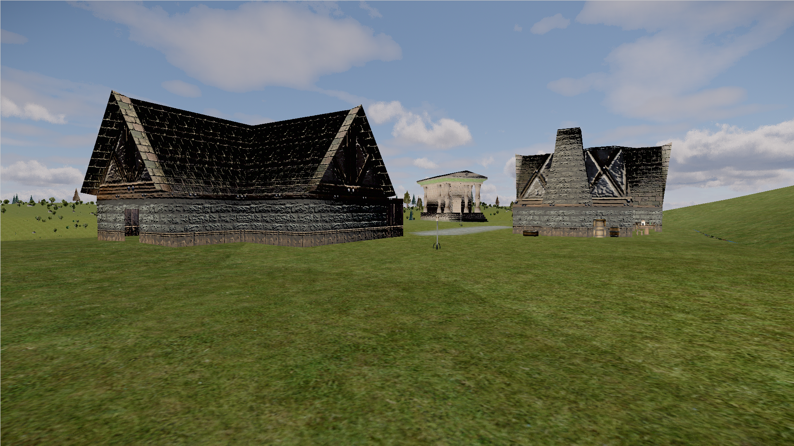
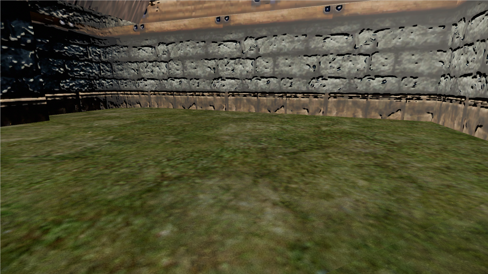
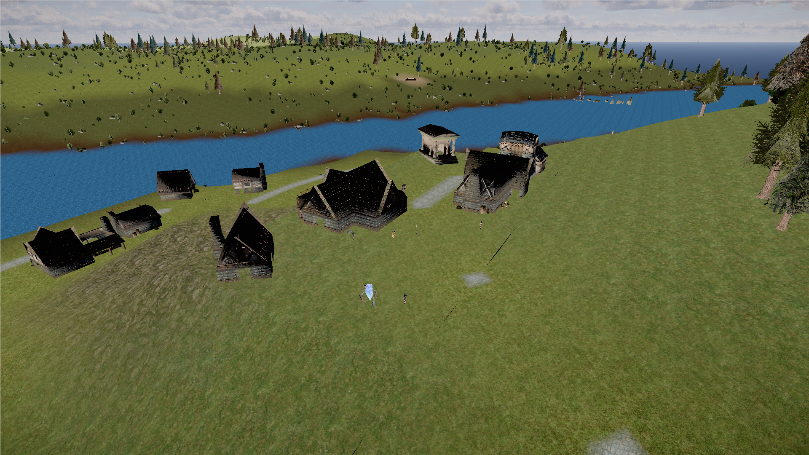
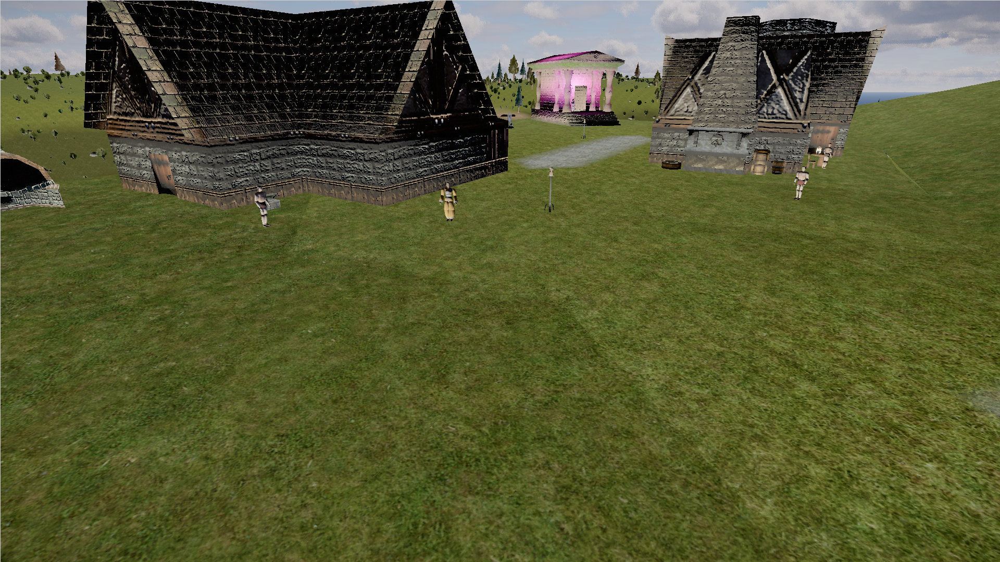
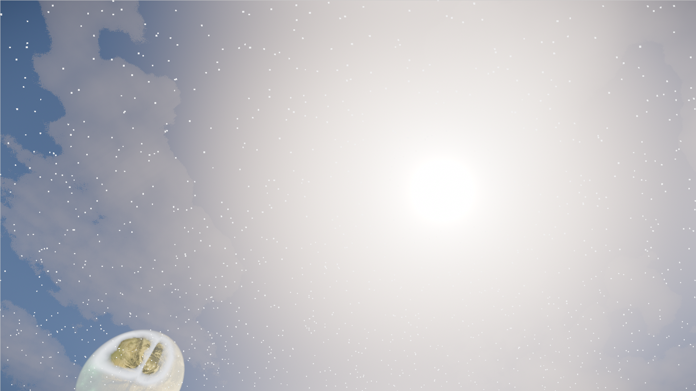

# Shader-compile-trim — "before" eye-test screenshots (2026-06-22)

Headless captures from the **real GTX-1070 (ANGLE/D3D11)**, `quality=high`, `clouds=on`, Holtburg,
to show the **visual stakes of each trim** in the plan before any of it is shipped. Full analysis +
ranked levers: [`../RESULTS-shader-compile-trim-72programs-2026-06-22.md`](../RESULTS-shader-compile-trim-72programs-2026-06-22.md).

> The cold first-load draw-distance stall is ~100 s of synchronous D3D11 shader-program linking.
> ~59.6 s of it is the **lit-surface family**, whose fragment shader fully unrolls the physical BRDF
> over the **fixed light pool (6 dir + 32 point + 8 spot = 46 lights)**. The #1 lever shrinks that
> pool; the rest cheapen or merge surface programs. Each is a fidelity tradeoff — these shots are so
> we can judge each one remotely before touching it.

---

## #1 — Light-pool size 32pt/8sp → 8pt/2sp  (the headline lever, **−76 % surface link time**)

The lever already has a runtime flag (`?lightPoolSize` / `?lightPoolSpot`). Same Holtburg buildings,
same camera, **two cold loads**: current default vs. trimmed. If these look the same, the lever is
safe for the common case.

**Before — 32 point / 8 spot (current default):**

**After — 8 point / 2 spot (trimmed):**

**Result: visually identical.** Daytime Holtburg is lit by the sun (directional) + ambient/hemisphere,
so the *point*-light count doesn't matter here — exactly why the surface programs can shed ~1554
fragment lines for free. (The slight sky/moon difference is time-of-day drift between the two
separate logins, not a lighting change.) **The remaining risk is only in dense dynamic-light scenes**
— e.g. a room full of candle/brazier point lights, or stacked spell glows, where the 9th+ nearest
light would drop. That's the worst case to eye-test before flipping the default; the common case
above is unaffected.

---

## #4 — POM (parallax occlusion) step count 64/16 → 24/8

Close grazing view of a masonry wall. The **3-D depth in the stone blocks** is parallax occlusion
mapping. Lowering the ray-march step caps (currently far above the active high-preset 24/12) would
slightly soften that depth at extreme grazing angles on close surfaces like this. Anywhere past
~10 m POM is already disabled, so most of the world is unaffected.

---

## logDepth + #11 terrain — distance & ground

Overview across the settlement to the water, far terrain, forest, and ocean. This is where
**`logarithmicDepthBuffer`** earns its keep — z-precision over the long draw distance (no z-fighting
on the distant terrain/buildings). Removing log-depth (a *high-risk* last-resort lever) would be
judged here and on indoor floors. It's also the terrain shot: water body, terrain blending, and the
road/path (**#11** `#ifdef`-strips default-off terrain paths — should be visually identical).

Ground-level: the dirt path/road, grass terrain, NPCs, and the pink lifestone glow (a *dynamic point
light* — and note it was still identical in the #1 A/B above, with only 8 point lights).

---

## Clouds — `?clouds=on` (off by default today, but "could be default one day")

Sun, moon, and procedural clouds. Clouds are **gated off on the default cold path**, so their ~38.9 s
of shader link (incl. a ~26 s first-link driver-warmup program) is **not** in today's budget — but
if clouds ever default on, that becomes the single biggest lever, fixed by shipping **pre-baked
`.bin` noise textures** instead of the procedural-noise bake programs (identical clouds, no link
cost). Kept live in the plan for exactly that reason.

---

## Items with NO visual change (no screenshot — output is pixel-identical)

These are pure compile-cost refactors; the "eye-test" for them is just *confirm nothing changed + 0
console errors*:

- **#2** hoist the `lightClampRetail` half-Lambert/clamp out of the per-light unroll into one
  post-accumulation helper (same math, fewer lines).
- **#5** always-install CSM and gate it behind a `uCsmEnabled` uniform (merges shadow variants).
- **#6** make the floor/depth-bias a `uFloorDepthBias` uniform instead of forking the program.
- **#9** strip inert `USE_SHADOWMAP`/`USE_LIGHT_PROBES` defines off unlit/depth/particle materials.

---

*Captured by `shader-eyetest-shots.cjs` (camera frozen via `cameraSwitcher.tick` re-lock; vantages
computed from the player anchor + building centroid). 1920×1080, headless, real GPU.*
