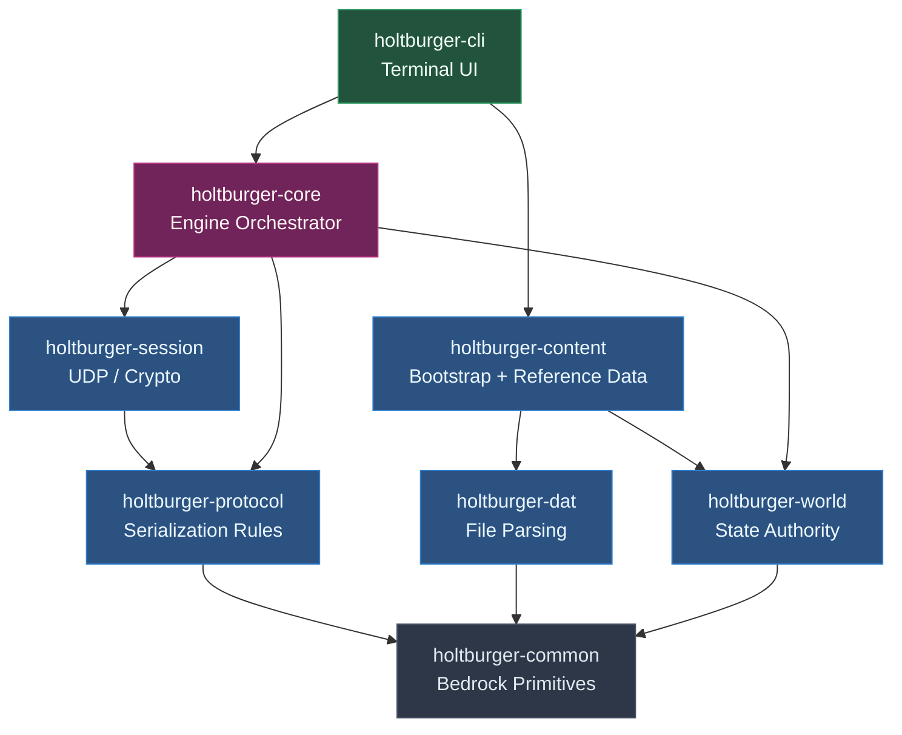
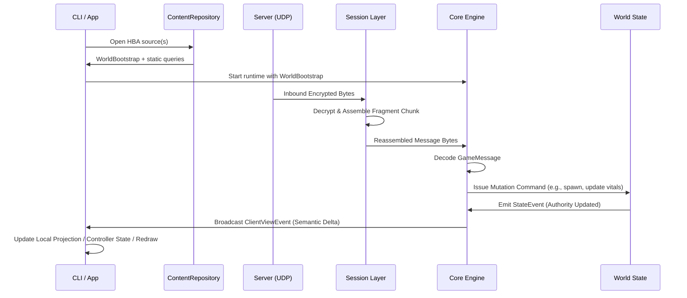

# Holtburger Architecture Overview 🍔

Welcome to the root architecture guide for the Holtburger project. This document explains how the workspace crates fit together to form a cohesive Asheron's Call client stack today, while still leaving room for a future full 3D client.

## Architectural Philosophy

Holtburger is designed around **deliberate crate boundaries**. The wire protocol stays separate from world authority, the world model stays separate from transport, and the frontend talks to the engine through commands, queries, and semantic event streams instead of reaching into hidden engine state.

By separating concerns into discrete library crates, we achieve:
1. **Coherent ownership**: `session` owns transport, `content` owns runtime content discovery and bootstrap assembly, `world` owns authoritative gameplay state plus canonical runtime body state, and `core` owns orchestration plus reusable client behavior.
2. **Performance**: Heavy tasks such as UDP chunk reassembly, DAT access, and world mutation stay off the rendering path.
3. **Ergonomics**: Frontends consume `ClientViewEvent`s plus frontend-owned content queries, so they can keep local projection state without needing shared mutable access to engine internals.

---

## Crate Dependency Graph

---

## The Crates

### 1. The Bedrock: [`holtburger-common`](crates/holtburger-common/ARCHITECTURE.md)
The foundational layer. It contains pure, stateless primitives that every other crate relies on. It enforces the rule of having no upstream workspace dependencies.
- **Provides**: Vectors, Quaternions, global `Guid` representations, Property Enums, and Protocol Serialization Traits.

### 2. The Language: [`holtburger-protocol`](crates/holtburger-protocol/ARCHITECTURE.md)
Contains zero-logic data structures and deterministic serialization rules corresponding 1:1 with the Asheron's Call protocol (based directly on ACE Server ground truth).
- **Provides**: `GameOpcode`, packet representations, and binary `pack/unpack` implementations.

### 3. The Library: [`holtburger-dat`](crates/holtburger-dat/ARCHITECTURE.md)
Responsible for reading, mounting, and querying static local Asheron's Call data files (`.dat`). 
- **Provides**: Fast, memory-mapped queries for structural templates (Weenies), 3D models, and multi-layered Landblocks.

### 4. The Content Seam: [`holtburger-content`](crates/holtburger-content/ARCHITECTURE.md)
Owns runtime content discovery and typed asset access over mounted HBA sources.
- **Provides**: `ContentRepository`, HBA discovery and mount policy, and asset-derived models such as `CharacterGenReference`.

### 5. The Transport: [`holtburger-session`](crates/holtburger-session/ARCHITECTURE.md)
Encapsulates pure networking logic. It handles the lowest levels of transport without knowing anything about the game world.
- **Provides**: UDP fragment reassembly, packet sequencing, ISAAC-keyed packet checksums (initialized from a `ConnectRequest` handshake), and socket loops.

### 6. The Authority: [`holtburger-world`](crates/holtburger-world/ARCHITECTURE.md)
The authoritative in-memory world model for the client. It tracks hydrated entities, player state, spatial placement, retention/liveness rules, trade or vendor state, and world-domain helpers that other crates can query without re-deriving gameplay semantics. It also owns the canonical runtime `SpatialBody` sidecars and their sampling policy; projected samples are derived from world-owned runtime state rather than advanced in parallel elsewhere.
- **Provides**: `WorldState`, `PlayerState`, entity hydration, canonical runtime body state, spatial and retention helpers, trade or vendor state, and world query surfaces.

### 7. The Brain: [`holtburger-core`](crates/holtburger-core/ARCHITECTURE.md)
The primary engine orchestrator. It ties networking (`session`) and authority (`world`) together, executes movement and interaction primitives, and projects raw protocol plus world changes into frontend-safe semantic events. `ClientRuntimeBuilder` now owns the runtime asset-loading step by reading the specific assets it needs from `ContentRepository`. Its runtime-body delivery surfaces publish mirrored read models over world-owned runtime state, not a second owner of runtime advancement.
- **Provides**: Handshake coordination, primitive movement execution and prediction, protocol-to-world orchestration, optional reusable controllers, and `ClientViewEvent` streams for applications to consume.

### 8. The Frontend: [`holtburger-cli`](apps/holtburger-cli/ARCHITECTURE.md)
The current interactive frontend. It is a terminal UI built on ratatui that consumes `ClientViewEvent`s, owns frontend-specific control policy such as when to drive optional navigation or combat helpers, and currently keeps mirrored read caches for presentation and app-thread decisions. The core runtime runs separately and feeds the frontend through events and commands; the TUI owns the local projection, not the authority. It also retains frontend-owned lookup caches derived from content or runtime state. Those caches are frontend-owned views only; they must not become a second runtime body authority.
- **Provides**: Real-time ratatui screens, input mapping, mirrored read caches and modal state, frontend orchestration around shared core controllers, and frontend-owned content queries.

---

## System Data Flow

The architecture avoids a single frontend-owned monolith by keeping content discovery in `content`, authority in `world`, orchestration in `core`, and presentation or control policy in the app. Here is the runtime startup and packet flow:

1. **Content (`content`)** discovers HBA sources, assembles `WorldBootstrap`, and exposes static lookup-oriented data to the frontend.
2. **Networking (`session`)** tracks sequence numbers and decrypts data.
3. **Engine (`core`)** decodes `GameMessage`, coordinates protocol handling, movement execution, and world mutation requests.
4. **Authority (`world`)** applies the mutation, preserves world invariants, and tells the engine what observably changed.
5. **App (`cli`)** receives semantic deltas, updates mirrored read caches, and may query frontend-owned content or feed optional shared controllers with world-derived inputs before issuing new commands.
