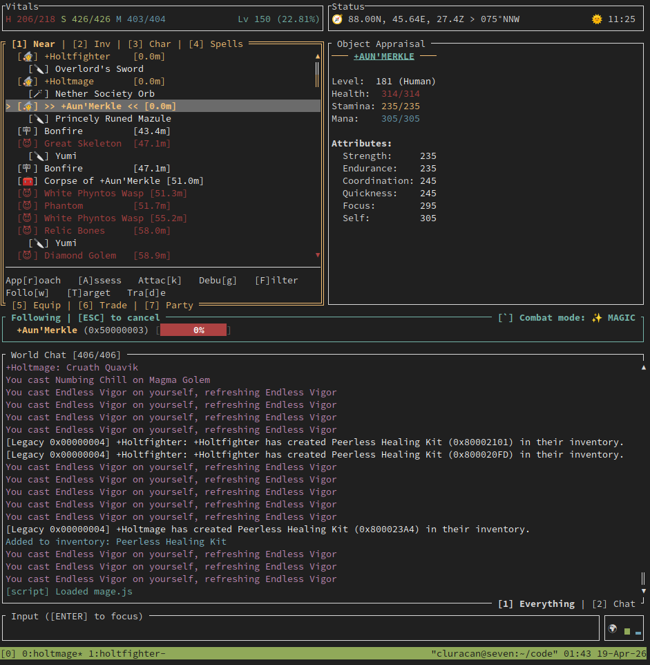

# Holtburger 🍔

Holtburger is a modern, cross-platform, exploratory Asheron's Call client ecosystem written in Rust. It aims to provide a modular, high-performance foundation for a new generation of clients and bots. The TUI client already covers a meaningful set of gameplay, automation, and data-projection workflows, and the stack keeps expanding.

> [!IMPORTANT]
> Holtburger is being developed against the ACE server implementation, not GDLE. It will likely be very unstable on GDLE servers.



## The Ecosystem

For a detailed breakdown of how these components interact, check out the [Architecture Overview](ARCHITECTURE.md).

Holtburger is comprised of several specialized crates:

- **[`holtburger-common`](crates/holtburger-common)**: The bedrock layer. Shared types, utilities, and constants used across the entire workspace.
- **[`holtburger-protocol`](crates/holtburger-protocol)**: The language of the world. Handles the deterministic serialization and deserialization of Asheron's Call packets, opcodes, and complex game messages.
- **[`holtburger-dat`](crates/holtburger-dat)**: A specialized library for parsing and querying Asheron's Call `.dat`, `.hba`, and other binary asset formats.
- **[`holtburger-content`](crates/holtburger-content)**: The content pipeline seam. Owns HBA discovery, mount policy, and typed asset access over mounted content sources.
- **[`holtburger-session`](crates/holtburger-session)**: The pure networking layer. Handles UDP fragment reassembly, packet sequencing, and stream encryption.
- **[`holtburger-world`](crates/holtburger-world)**: The state authority. Tracks the live data graph of the 3D world, entity locations, and physics in memory.
- **[`holtburger-core`](crates/holtburger-core)**: The primary engine orchestrator. Manages client state, translates network messages into authoritative states, and broadcasts UI-safe delta streams.
- **[`holtburger-scripting`](crates/holtburger-scripting)**: The scripting runtime. Owns the Deno-based host, shared script boundary types, and the frontend-owned projection seam used by automation. See the [Scripting Guide](crates/holtburger-scripting/SCRIPTING_GUIDE.md) for a quickstart and API reference.
- **[`holtburger-cli`](apps/holtburger-cli)**: A Terminal User Interface (TUI) client built on the Holtburger stack, designed for interaction, automation, and power users.
- **[`holtburger-tools`](apps/holtburger-tools)**: A collection of auxiliary command-line utilities for data extraction and protocol analysis.

## Current Capabilities vs Retail Client

Because Holtburger is a terminal-first client, its current feature set emphasizes protocol accuracy, authoritative world tracking, and functional gameplay systems rather than graphical rendering. Here is a high-level matrix of what is implemented today compared to the classic retail 3D experience:

| Feature | Retail Client | Holtburger TUI | Notes |
| :--- | :---: | :---: | :--- |
| **3D Graphics & Sound** | 🟢 | 🔴 | Intentional limitation. TUI relies on text and data projection. |
| **Login & Auth** | 🟢 | 🟢 | Full multi-stage GLS and world server handshake. |
| **Character Selection** | 🟢 | 🟢 | Login via terminal UI or CLI arguments. |
| **Character Creation** | 🟢 | 🟢 | Full character management flow-- Essential creation properties (minus appearance choices), delete, restore. |
| **Spatial Radar** | 🟢 | 🟢 | Live positional tracking of nearby entities. |
| **Movement & Physics** | 🟢 | 🟡 | Turn-to, locomotion primitives, sticky pursuit, approach/follow, and server-driven reposition handling work. Full 3D collision-aware navigation is still future-client territory. |
| **Chat & Messaging** | 🟢 | 🟢 | Full parsing of chat channels, server messages, and emotes. |
| **Leveling and Progression** | 🟢 | 🟢 | Comprehensive attribute and skill management with XP/Luminance tracking. |
| **Inventory & Equipping** | 🟢 | 🟢 | Move, stack, split, drop, and equip items. |
| **Vendors & Trade** | 🟢 | 🟢 | Full merchant interaction including alternate currencies. |
| **Crafting** | 🟢 | 🟢 | Item combine flows, success prompts, and salvage preview/execution are implemented. |
| **Magic System** | 🟢 | 🟢 | Spell catalog loading, spellbook/enchantment tracking, and targeted or untargeted casting are implemented. In the TUI, this is effectively the ceiling without scripting or a richer frontend. |
| **Melee & Missile Combat** | 🟢 | 🟢 | Manual targeted melee and missile attacks work, and the TUI can drive shared combat-facing and sticky-melee helpers. This is the practical ceiling for the terminal client unless scripting is introduced. |
| **Social Gameplay** | 🟢 | 🟡 | Basic fellowship + allegiance interactions. TUI party HUD. |
| **Scripting / Automation** | 🟡 | 🟢 | JavaScript scripting runtime built on Deno Core and the `holtburger-scripting` crate. |

## Roadmap

Holtburger is being built in phases, and the current TUI client is intentionally serving two roles at once:

- It is the first usable client for the stack today.
- It is the proving ground for the shared protocol, session, world, and core layers that a future 3D client will rely on.

The long-term goal is not to stop at a terminal client. The TUI is how we validate the full client stack quickly, iterate on gameplay and automation semantics, and de-risk the architecture before investing in a richer frontend.

Current focus: Phase 2 and 3.

### Phase 1: TUI and Stack Buildout

The current phase is feature buildout. The goal here is to keep expanding protocol coverage and client behavior until the stack supports as much practical retail-client parity as makes sense in a terminal UI.

That includes work such as:

- login and character flows
- world-state fidelity and movement behavior
- inventory, vendors, crafting, and magic systems
- combat helpers and automation-oriented control surfaces
- shared client abstractions that will still make sense for a future 3D frontend

### Phase 2: Scripting Runtime

This is the current phase of work. The runtime already exists as the `holtburger-scripting` crate; the remaining work is expanding host APIs, tightening integration with the CLI, and smoothing the authoring workflow.

That should turn the TUI into a lightweight alternative to hosting bots while still sitting on the same shared client foundation. It also creates a much better environment for automation, experimentation, and custom workflows before the 3D client arrives.

### Phase 3: Consolidation

Once the TUI and shared stack are sufficiently built out, the focus shifts to consolidation:

- refactors and cleanup
- hardening APIs and crate boundaries
- reducing duplication and patchwork logic
- improving maintainability, testability, and architectural clarity

This phase matters because the TUI is not the end state, but the underlying stack needs to be clean and stable enough to support multiple frontends without dragging terminal-specific assumptions forward.

### Phase 4: 3D Client

With the stack proven out and scripting in place, work can begin on a full 3D client as a fast follow. The current expectation is a Tauri-based client with a classic visual style, backed by a modern, scriptable, and more extensible UI model.

The TUI is therefore not a side project or disposable prototype. It is the shortest path to validating the complete client architecture, and it should continue to produce useful standalone value even after the 3D client exists.

## Disclaimers

Holtburger is **highly experimental**. APIs are unstable and subject to frequent breaking changes. Much of this code is heavily developed with the assistance of AI coding agents, so don't treat its implementation as authoritative.

## Installation and First Run

Nightly builds and archives for Windows, Mac, and Linux are available on the [Releases](https://github.com/merklejerk/holtburger/releases) page. All bundles ship with a minimal (`micro`) assets file, `assets.hba`, so they're ready to run immediately.

The TUI client is a command-line application, so you must launch it from a terminal. On Windows, use a modern terminal emulator such as Windows Terminal; the legacy Command Prompt and classic PowerShell console cannot render it.

### Windows Install

1. Download the Windows archive.
2. Extract it.
3. Open a terminal and launch the executable from the extracted folder:

```powershell
holtburger-cli.exe --help
```

Custom scripts can be stored in `EXTRACT_DIR/scripts/` (must be writeable).

### MacOS Install

1. Download the MacOS archive.
2. Extract it.
3. Open a terminal and launch the binary from the extracted folder:

```bash
# see help
./holtburger-cli --help
# connect
./holtburger-cli -s SERVER_ADDRESS:PORT -a ACCOUNT_NAME -P PASSWORD
```

Custom scripts can be stored in `EXTRACT_DIR/scripts/` (must be writeable).

### Linux Flatpak (recommended)

Download the flatpak from releases then run `flatpak install ./holtburger-cli.flatpak`.

```bash
# see help
flatpak run io.github.merklejerk.holtburger-cli --help
# connect
flatpak run io.github.merklejerk.holtburger-cli -s SERVER_ADDRESS:PORT -a ACCOUNT_NAME -P PASSWORD
```

By default the Flatpak bundle sets `SCRIPT_DIR` to the writable per-app data tree inside the sandbox (`/var/data/holtburger/scripts`, which Flatpak maps to `~/.var/app/$FLATPAK_ID/data/holtburger/scripts` on the host). You can store custom scripts there.

### Linux Tarball

1. Download the Linux archive.
2. Extract it.
3. Open a terminal and launch the binary from the extracted folder:

```bash
# see help
./holtburger-cli --help
# connect
./holtburger-cli -s SERVER_ADDRESS:PORT -a ACCOUNT_NAME -P PASSWORD
```

Custom scripts can be stored in `EXTRACT_DIR/scripts/` (must be writeable).

### Source / Local Development

Building from source is mainly for local development.

**Prerequisite:** [Rust](https://www.rust-lang.org/tools/install) (latest stable or nightly)

```bash
git clone https://github.com/merklejerk/holtburger.git
cd holtburger
cargo build --release
```

For day-to-day development, launch the TUI through Cargo from a terminal:

```bash
# see help
cargo run --bin tui -- --help
# connect
cargo run --bin tui -- -s SERVER_ADDRESS:PORT -a ACCOUNT_NAME -P PASSWORD
```

The source tree uses `./scripts/` as the local script directory by default. Local scripts, script data, and per-script config live under that writable directory unless you override `SCRIPT_DIR`.

Script storage:

- Default local script directory: `./scripts/`
- Custom scripts: `<SCRIPT_DIR>/<BASENAME>.js`
- Script data: `<SCRIPT_DIR>/<BASENAME>.data.json`
- Script config: `<SCRIPT_DIR>/.config/<BASENAME>.config.json`

Unlike the release builds and Flatpak, source builds do **not** bundle client data automatically. See [Data File Configuration](#data-file-configuration).

## Running the TUI Client

Use the launch command that matches how you installed Holtburger:

- Release archive: `./holtburger-cli [ARGS]`
- Flatpak: `flatpak run io.github.merklejerk.holtburger-cli [ARGS]`
- Local development: `cargo run --bin tui -- [ARGS]`

The Windows-specific terminal guidance above still applies when launching any of those binaries.

> [!TIP]
> If you get an error about missing `VCRuntime140.dll`, install the [VC Runtime](https://aka.ms/vc14/vc_redist.x64.exe). You may also need to allow the executable through Windows Defender by running it once, choosing "More info", and then selecting "Run anyway".

## Durable Bot Runs

If you want Holtburger to keep running as a bot, launch it under something that can restart the process after a disconnect.

Use `-Q` when the restart policy is exit-based. In that setup, `-Q` turns a disconnect into a process exit, which is what the supervisor needs to trigger a restart.

On Linux, `systemd` is the cleanest option because it can supervise the process and restart it automatically:

```bash
systemd-run --user --unit=holtburger-bot \
    --property=Restart=always \
    --property=RestartSec=5s \
    --working-directory="$PWD" \
    ./holtburger-cli -Q -s SERVER_ADDRESS:PORT -a ACCOUNT_NAME -P PASSWORD
```

If you want a lightweight fallback without a full service unit, a shell loop also works:

```bash
while true; do
    ./holtburger-cli -Q -s SERVER_ADDRESS:PORT -a ACCOUNT_NAME -P PASSWORD
    sleep 5
done
```

## Data File Configuration

The TUI client requires a namespaced HBA bundle that carries retail data under `eor/portal` and the derived runtime asset under `holtburger/core`. Optional richer world data may also be present under `eor/cell`.

- Release archives already include the bundled `assets.hba` archive for the current runtime path.
- Flatpak builds also include that bundled `assets.hba`.
- Source builds and local development setups require you to provide the archive yourself.

If you are setting up local data, you have two practical options:

1. Download the latest HBA bundle from the [Releases](https://github.com/merklejerk/holtburger/releases) page and extract it into `./dats/` so `assets.hba` is present.
2. Repack retail DAT files such as `client_portal.dat` and `client_cell_1.dat` into a namespaced HBA v2 bundle with `dat2hba`.

### Repacking DATs Into HBA v2

Runtime bootstrap is HBA-only now. The supported path for retail DAT inputs is to emit a combined namespaced archive instead of pointing the client at raw `.dat` files directly:

```bash
cargo run -p holtburger-tools --bin dat2hba -- \
    --profile micro \
    eor/portal=client_portal.dat \
    eor/cell=client_cell_1.dat \
    dats/assets.hba
```

`dat2hba` defaults to `--profile full`. Use `--profile micro` if you want the release-oriented minimal bundle; it contains the required portal tables plus the derived `holtburger/core:MotionKinematics` asset.

At runtime, the frontend constructs a `holtburger-content::ContentRepository` from that HBA source, requests a parsed `WorldBootstrap` for `holtburger-core`, and may retain the repository for static reference-data lookups.

**Search Priority:**
1.  `--dats <PATH>` command-line argument.
2.  `HOLTBURGER_DATS` environment variable.
3.  Local `./dats/` directory relative to the binary.
4.  Standard OS Data Directory:
    *   **Linux**: `~/.local/share/holtburger/dats/`
    *   **MacOS**: `~/Library/Application Support/io.github.merklejerk.holtburger/dats/`
    *   **Windows**: `%APPDATA%\merklejerk\holtburger\data\dats\`

> **Note:** Official DAT files no longer need to be renamed when passed to tooling. Runtime startup no longer scans raw DAT files; use `dat2hba` to produce a namespaced `assets.hba` bundle first.

## License

Holtburger is licensed under the [GNU Affero General Public License v3.0](LICENSE.md).
