# HUD overhaul — retail comparison and what changed (2026-10-05)

Owner brief: *"do a complete hud comparison and make holtburger-web have as good or
better HUD and UI, all HUD panels should be addressed … responsive UI is important …
people are going to be used to the old UI … you can take some liberties with the map."*

Design rule used throughout: **familiar to a retail player at a glance** (retail DAT
sprites, retail anchoring, retail behaviour), **cleaner and more responsive than retail**
(scales to any window, no overlapping text, hover/focus states, sensible empty states).
The Empyrean vitals orbs were left alone — they were already the quality bar.

Each panel below has a `img/<panel>.png` triptych: **retail** (rendered straight from
`client_local_English.dat` with `WorldBuilder.Terminal ui-layout-render`) · **before** ·
**after** (both live holtburger-web at 1600×900, `?nullRender=1`, so the world is black).

## How the comparison was made (reproducible)

- Retail: `{"command":"ui-layout-render","datPath":"~/ac_base_dats/client_local_English.dat","layoutId":"0x210000XX","outPath":…,"manifestPath":…}`
  for every `Root*_Field` / `RootFloaty*_Field` layout (101 in the DAT; ~50 rendered).
  The manifests give every element's name, rect and the sprite ids it draws — that is
  how the kit below picks its art. Renders + manifests + sprite sheets:
  `/mnt/wbterminal2/hud-compare-2026-10-05/retail/`.
- Holtburger: headless Playwright, `?nosw=1&nullRender=1&renderOnDemand=1&netDrainHz=30&autoLogin=1`,
  panels opened by hotkey / `window.__mainPanel.showView(...)` / the plugins' debug hooks.
- 307 retail sprites the layouts draw (buttons, rope scrollbar, orb checkboxes, title
  bars, toolbar art, item-slot states …) were exported into `data/ui-sprites/` with
  `chorizite-extract-ui-textures` (provenance: `data/ui-sprites/INDEX-hud-kit-2026-10-05.json`).

## Cross-cutting fixes (affect every panel)

| Problem | Root cause | Fix |
|---|---|---|
| HUD was a postage stamp at 1080p/1440p (retail panels are fixed 800×600-era pixels) | no scaling at all | `ui/hud_scale.js`: CSS `zoom` on every `#hb-*` HUD root, `clamp(innerHeight/720, 1, 3)` × a user multiplier (Options → Gameplay → Interface → HUD scale, 60–200 %), capped so the HUD always keeps ≥ 1024×640 logical px (the default layout never overlaps; a tiny window shrinks the HUD, floor 0.6). `?hudScale=N` forces a value. |
| Bitmap-font text went soft when scaled / on HiDPI | `<ac-text>` canvases were 1:1 | `ui/ac_font.js` rasterises at `ceil(scale × devicePixelRatio)` with nearest-neighbour glyph blits and CSS-sizes back, so the browser only down-samples. |
| **Every bitmap-font label sat ~12 px low** (chat tab labels under their tabs, clipped "Send"/"Chat", tiny/offset button captions) | "Rec #63" (2026-06-16) **added** each font's `baselineOffset` to glyph Y; `verticalOffsetBefore` is already cell-top-relative. Retail `CSurface::DrawCharacter` (acclient.c:126967) only *subtracts* it for baseline-mode draws. | Removed; canvases are now one cell tall. The baseline is used only to align a CJK fallback glyph. |
| `setAcText` on an already-mounted host could leave raw black text forever | the first render happened before the text was set; the observer missed the write; the idempotence guard then skipped every later call | text set before attach; detached-canvas guard; re-attach path. |
| **Loot windows, trade, confirm dialogs, right-click menu, books, tinkering, salvage, hover tooltip, lifestone popup were invisible in every `?autoLogin=1` session** (the owner's "loot never fits the screen" report) | `agent-mode` CSS hid every `<body>` child not on a hand-kept id allowlist that had drifted | rule is now the naming convention: any `#hb-*` (or `.hb-bar/.hb-pill/.hb-panel`) body child is HUD. The refusal toast got an `hb-` id. |
| Windows jumped/strayed when dragged at scale; docked panels drifted on resize | drag maths mixed screen and CSS px | `ui/ac_window_position.js` / `ac_resize_corners.js` use `Element.currentCSSZoom`; positions persist an edge anchor and re-clamp on resize/scale; Options → "Reset window positions" resets live. |
| Forty panels, forty home-made widget styles (native blue sliders next to brass) | no shared vocabulary | `ui/hud_kit.js`: `hbk-*` classes built from the retail sprites — title bar (0x06004CFA), close (0x06001393), red button (0x06004C4C), orb checkbox (0x06004D15/17), rope scrollbar (0x06004C5F/69/6C), gold divider (0x060012C5), item slot, meter, tooltip, tabs. Every panel now uses it. |
| Chat system lines read `YouHaveEnteredTheChannel(General)` | wasm pushed the Rust Debug name of WeenieError | `game_event.rs` uses `holtburger_core::errors::format_weenie_error` → "You have entered the General channel." |

## Panel by panel

| Panel | Retail | Before | After |
|---|---|---|---|
| **Toolbar** (`img/toolbar.png`) | gmFloatyToolbarUI 310×100: combat-mode button, 6 panel buttons, Use / selected-object (+ heart health meter) / Examine, backpack, one row of 9 shortcuts | two overlapping plugins 36 px out of line; the panel/pack strip hidden behind a 2-row hotbar ("two hotbars") | one unit, retail-exact geometry from the layout files; one shortcut row (2nd row opt-in by dragging the bottom edge); target name + heart meter; button tooltips with hotkeys; drop onto the backpack moves an item to the main pack |
| **Radar** (`img/radar.png`) | heading-up (`DrawObjects` → `convert_to_player_space`), N/E/S/W orbit the rim (`UpdateCompassTokens`), coords `42.1N,33.6E` | north-up with a fixed forward wedge (looked inverted), a backwards green triangle at centre, `0x0000 (0, 0)` coords, dead without the 3D scene | heading-up, orbiting tokens, retail blip shapes/colours/selection bracket, retail cell-quantised coords (hidden indoors), works from the wasm pose (verified against real movement) |
| **Chat** (`img/chat.png`) | 410×100, four tab buttons, rope scrollbar, brass "Chat" tag + Send | filter labels under their tabs and over the text, Send clipped, raw WeenieError names, stray "new text" orb | retail frame; A/L/T/C filters; per-channel retail colours; channel picker on the tag; "N new messages" pill; click a name to tell; Up/Down history; timestamps option; resizable + maximise; English system lines |
| **Inventory** (`img/inventory.png`) | gmInventoryUI: paperdoll, burden column with packs + capacity bars, rope-scrolled item grid | grid clipped after 2½ rows, burden/"SLOTS" over the paperdoll, items snapped back to alphabetical | fits the panel; retail pack column; drag rules ported from the decomp (merge, into pack, onto a cell, wield, drop, give, split with Shift); optimistic move with server reconcile; no flicker; **server placement order** now tracked in the world state (ACE `PlacementPosition` list semantics: compact on remove, shift on insert) so the grid shows the server's order — verified live: drop onto a later item lands just before it, drop onto a pack puts it first in that pack, and a relog shows the identical order |
| **Loot / chest** (`img/loot.png`) | gmExternalContainerUI strip | hidden in autoLogin sessions; `92vw` strip overflowed when scaled; chest grid sat on top of the inventory and closed on any click | one kit window that always fits, Take / Loot all, drag both ways, Esc/close sends `NoLongerViewingContents` |
| **Character info** (`img/character.png`) | StatManagement template: header (name, title, level, XP meter), Specialized/Trained/Untrained sections, +1/+10 raise footer | title said "Attributes" while SKILLS was lit; F1 and F11 were two near-duplicate screens | one Attributes/Skills/Titles pane on the retail template; retail XP tables from the DAT for costs |
| **Spellbook** (`img/spellbook.png`) | 280×32 spell rows, Schools/Levels filters, red Delete | 46 px rows with empty boxes, VIII filter clipped | 32 px retail rows (icon, name, school·level·mana), orb-checkbox filters that never clip, Components view, Delete with confirm |
| **Map** (`img/map.png`) | gmMapUI: 257×267 world bitmap, player ring, coords, Derethian date | real-world date, wrong position (96.3S, 101.3W), raw LB hex | retail compact view with the in-game date/time and correct coords + facing tick; **new world map (M)**: zoom/pan, labelled towns (retail map notes), grid, nearby markers, waypoint pin with distance/bearing |
| **Social hub** (`img/social.png`) | gmSocialUI: Allegiance / Fellowship / Friends / Squelch | three panels each drawing its own tab strip over each other ("FeFriendship") | one hub, one tab strip; allegiance sections, fellowship vitals rows, friends/squelch lists; Break/Kick now target the right player |
| **Journal / Contracts** | parchment notebook; sortable contract list + details | "Go" button over the heading; header over the empty text; contract timers were garbage | quests + notes on parchment; contract list/detail with retail status text; **wire fix:** contract times are `f64` seconds remaining (retail `long double`), not `i64` |
| **Options** (`img/options.png`) | Gameplay / Character / Chat / Config lists with orb checkboxes and the retail slider | two rows of cramped tabs, native blue controls, buttons off the bottom | retail tabs, kit controls, footer always visible, new HUD-scale + reset-positions controls, dead controls removed, Cancel really reverts |
| **Combat** (`img/combat.png`) | floaty combat: red-wave power bar, High/Medium/Low brass tags | "Recklessness" gold bar, "Accuracy — Accuracy", clipped buttons | retail power bar + labels, readable height buttons, keyboard heights/power, docks above the toolbar |
| **Spell bar** | gmSpellcastingUI tabs I–VIII + slots + Cast | hand-coloured bar | retail layout on the kit |
| **Status / effects / vitae** | 150×30 indicator strip; gmEffectsUI | wrong sprites (vitae drew the link plug) | correct per-state sprites, tooltips, effects grid with timers, vitae window |
| **Examine** | stone background, gold dividers, parchment inscription | hex ids, raw masks, duplicate name | retail layout, readable armour/speed words, no hex unless `?debug=1` |
| **Vendor / trade / salvage / tinker / book / house** | retail strips and the parchment book | hidden in autoLogin; vendor showed buy-back prices (rates swapped) | kit windows that fit and stack; vendor price fix; trade/salvage/tinker drops work; parchment book |
| **Emotes** | (no retail panel) | 0 of 0 actions (read the NPC script table) | the 71 real player emotes from the DAT, categorised, click to perform |

## Gallery (retail · before · after)

Before = HEAD before this overhaul (HUD scale 1.0); after = this branch at
1600×900 (auto HUD scale 1.25). The world is black because captures run with
`?nullRender=1`.

### Toolbar
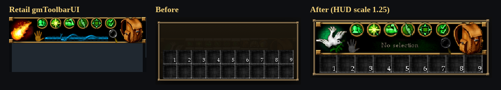
### Radar
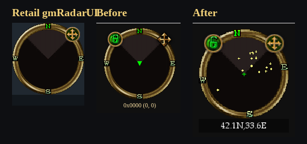
### Chat
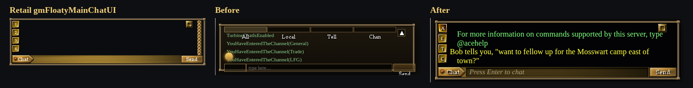
### Status indicators
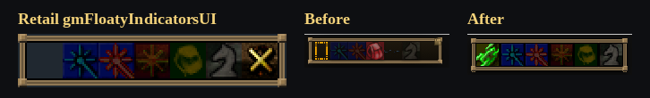
### Character information
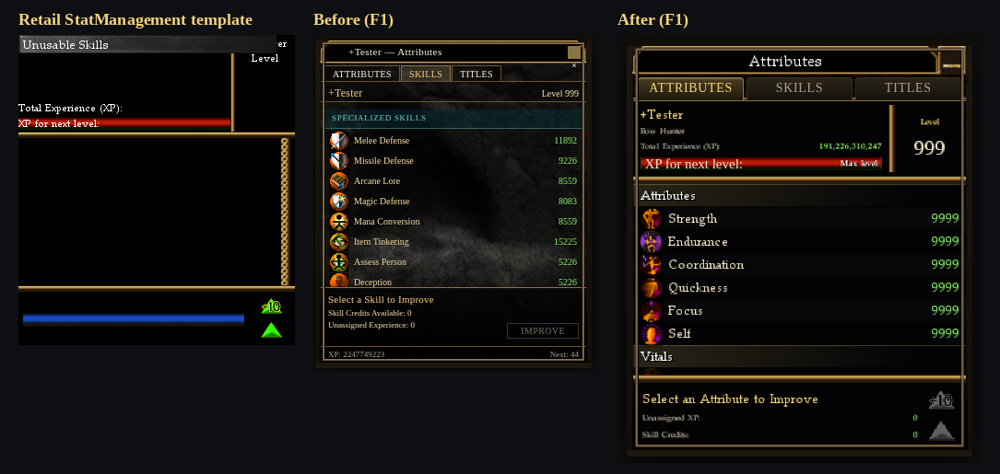
### Inventory
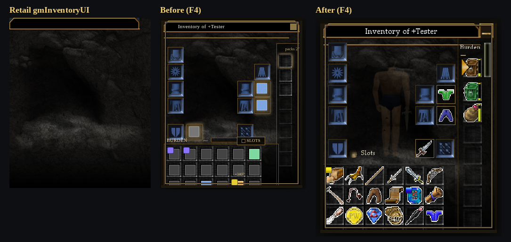
### Loot / chest
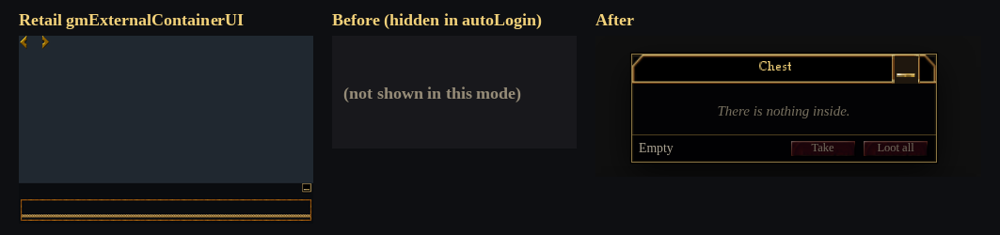
### Spellbook
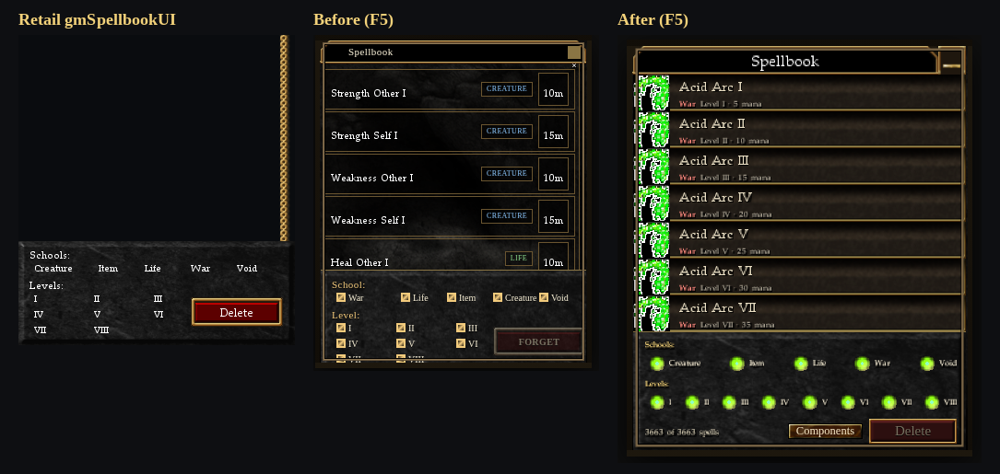
### Map (F3) and the new world map (M)
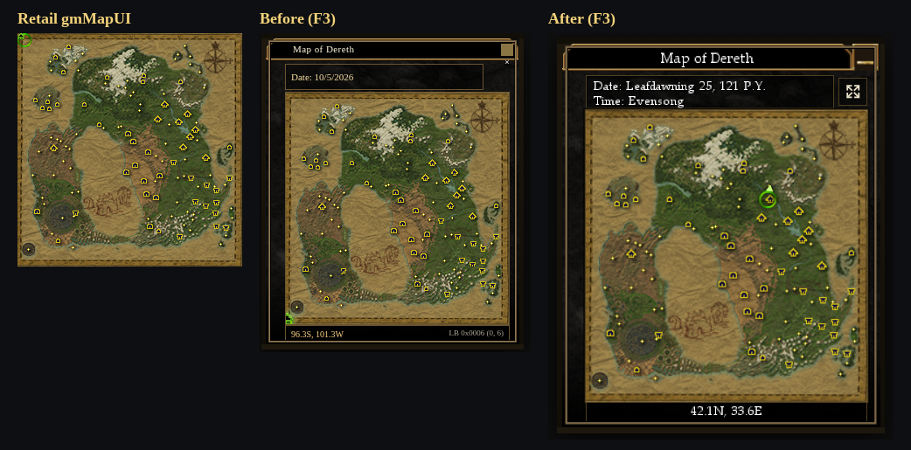
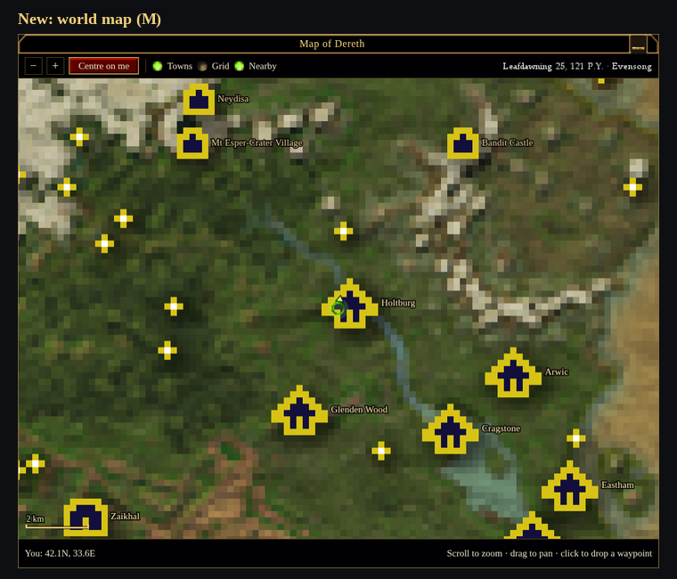
### Social hub (allegiance / fellowship)
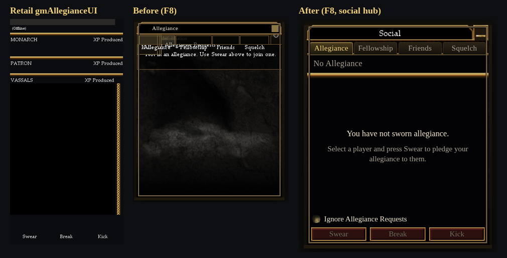
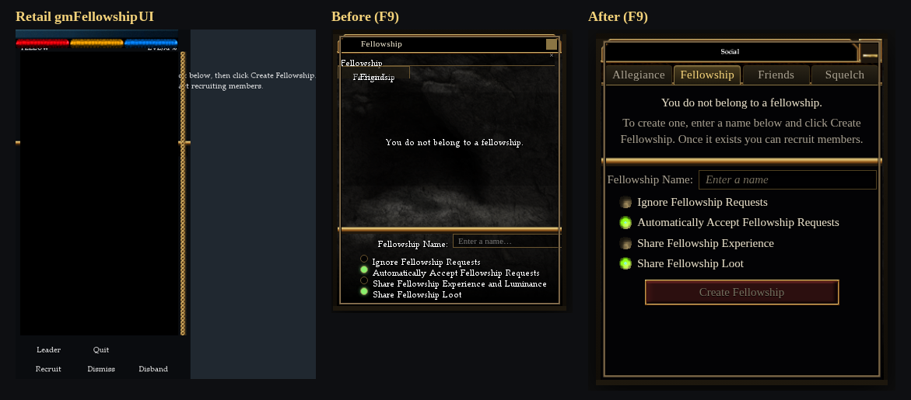
### Contracts and journal
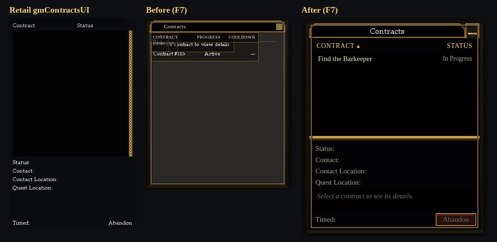
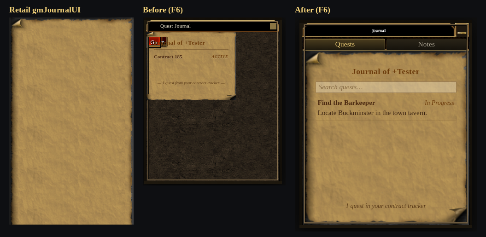
### Options
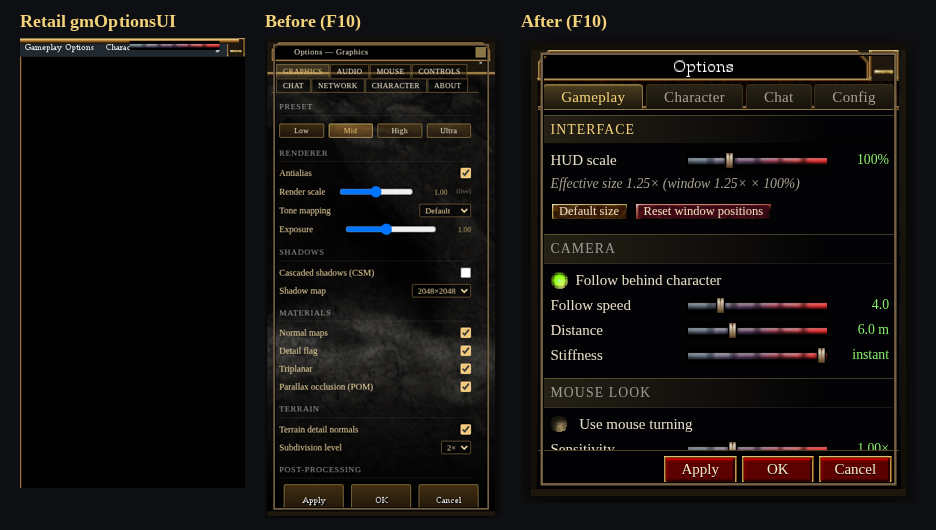
### Emotes
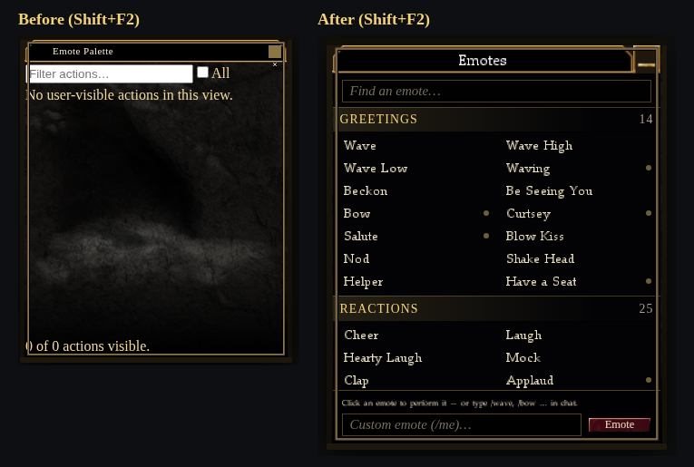
### Combat
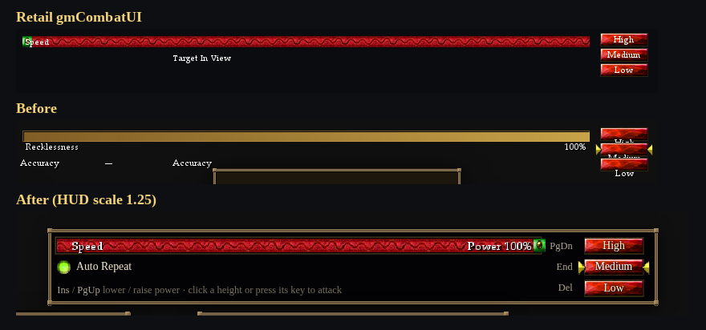
### Vendor and book windows
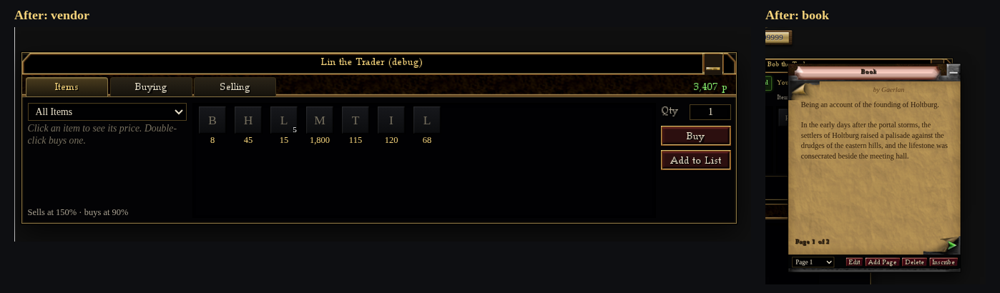

## Follow-ups (not done here)

- Real-GPU eye test on the 1070 (all captures here are `?nullRender=1`): checklist below.
- Rust: expose vital ranks so vital raise cost is exact; a wasm call for fellowship
  open/close (0x0291) and allegiance MOTD; vendor use-radius to JS.
- `scene3d/camera.js` may mirror the pose heading east–west in its position
  prediction (the radar agent flagged it while verifying the heading sign; autofollow in
  the same file flips the sign, prediction does not). Not a HUD change; worth a look.
- Combat height/power keys (PgDn/End/Del, Ins/PgUp) are a holtburger choice — no
  confirmed retail default was found.

## Eye-test checklist (1070, real GPU)

`?nosw=1&autoLogin=1…` at 1920×1080 (HUD scale 1.5) and 2560×1440 (2.0):

1. Toolbar bottom-centre: dove, 6 green buttons, hand / name field / magnifier,
   backpack, one slot row — nothing behind it. Select a monster: name + heart bar.
2. Radar: turn in place — N/E/S/W orbit, blips rotate, something ahead of you is
   straight up; coords `42.1N,33.6E` in Holtburg, hidden in a dungeon.
3. Chat: Enter to type, the "Chat" tag channel menu, a tell line in yellow.
4. F4: drag an item onto a side pack, onto a grid cell, onto a stack, onto the
   paperdoll, onto the ground; relog — the order is the same.
5. Open a chest / loot a corpse: window bottom-centre, Take / Loot all / drag.
6. F1/F3/M/F5/F6/F7/F8/F9/F10, Shift+F2: nothing overlaps, nothing clipped.
7. Options → HUD scale 150 %, then Cancel → back to 100 %.
