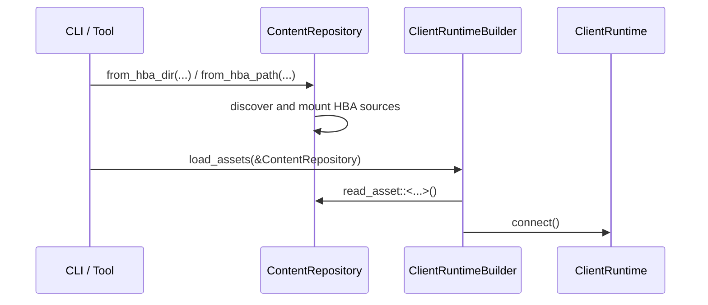

# Content Pipeline Architecture

The library crate responsible for frontend-owned content discovery and typed asset access.

## Core Philosophical Principles
- **Own Content Discovery, Not Runtime Semantics**: This crate owns HBA path discovery, archive mounting, and typed reads over mounted sources. It should not decide which assets a runtime or frontend must load.
- **Asset Access, Not Bootstrap Policy**: Namespace and file IDs may live with the asset types, but startup policy belongs to the caller. `ContentRepository` should not encode a bootstrap asset list or runtime assembly flow.
- **Frontend HBA First**: Runtime consumers are expected to mount namespaced HBA bundles through `holtburger-dat` source composition, not point clients at raw retail DATs.

## Key Components

### 1. Repository Surface ([src/repository.rs](src/repository.rs))
`ContentRepository` is the crate's main entry point.

It owns:

- HBA path or directory discovery
- mounting mixed-namespace HBA sources
- typed asset reads over mounted content sources

This is intentionally a frontend or tool owned seam. `holtburger-core` should not know how archives were discovered or mounted.

### 2. Public Surface ([src/lib.rs](src/lib.rs))
The crate deliberately exports a small API:

- `ContentRepository`
- asset-derived content models such as `CharacterGenCatalog`

That small surface is intentional. The crate should stay focused on content mounting and asset access rather than becoming a generic dumping ground for runtime bootstrap helpers or frontend policy.

## Ownership Boundaries

### What Belongs Here
- HBA discovery and mount ordering
- typed asset loading and parse failures
- asset-derived projections that are useful independently of a specific frontend runtime flow

### What Does Not Belong Here
- runtime bootstrap assembly
- lists of caller-required assets
- authoritative world mutation
- gameplay rule interpretation that belongs in `holtburger-world`
- session or command orchestration that belongs in `holtburger-core`
- frontend-specific render state or control policy that belongs in the frontend app

## Runtime Data Flow

1. A frontend or tool constructs a `ContentRepository` from an HBA path, directory, or explicit mounts.
2. The repository owns source discovery, mounted-source composition, and typed asset parsing.
3. The caller decides which assets matter and issues `read_asset::<...>()` calls accordingly.
4. Shared higher-level projections can still live in this crate, but callers construct them explicitly from typed asset reads.

## Dependencies
- **`holtburger-dat`**: Provides HBA readers, resource source composition, and low-level file parsers.
- **`binrw`**: Parses required binary assets into typed Rust models.
