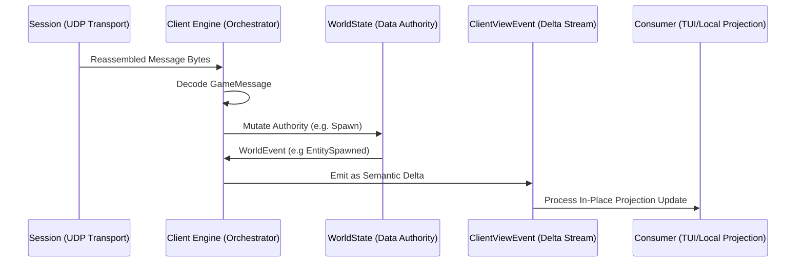

# Core Engine Architecture ⚙️

This crate is the "Brain" and behavior host of the client. It binds together the pure networking from [`holtburger-session`](../holtburger-session) and the data tracking from [`holtburger-world`](../holtburger-world) into a single, cohesive engine.

In addition to orchestration, this crate is allowed to provide reusable client-side behaviors when they are broadly useful across multiple frontends. The key boundary is not "high-level vs low-level" in the abstract, but whether a behavior is a reusable engine capability or a frontend-specific policy.

This crate translates complex network packets into meaningful gameplay events without suffocating the application in massive struct clones or lock contention, and it may also host optional controllers that sit on top of the core movement and interaction primitives.

## Key Components

### 1. The Client ([src/client/mod.rs](src/client/mod.rs))
The top-level entry point. It instantiates the `Session` (networking) from `holtburger-session` and the `WorldState` (data graph) from `holtburger-world`, driving the main async event loop.

#### Bootstrap & Config
To instantiate a client, we use the `ClientBuilder` ([src/client/builder.rs](src/client/builder.rs)). This configures credentials, server endpoints, optional debug features, and runtime asset loading. `ClientRuntimeBuilder::load_assets(&ContentRepository)` is where the builder reads the specific startup assets it needs and assembles `WorldBootstrap`.

#### Event Streams
We use a narrow runtime surface that keeps protocol and UI concerns distinct without inventing an extra public bus:

1. **Session bytes / decoded `GameMessage`**: `holtburger-session` hands reassembled payload bytes to core, and core decodes them into protocol types at the core-to-world boundary.
2. **`WorldEvent`** (World): World-layer events emitted by `holtburger-world`, including authoritative mutations and packet-scoped processing outcomes.
3. **`ClientViewEvent`** ([src/client/types.rs](src/client/types.rs)): The unified semantic delta-event feed exposed to frontends, scripts, and harnesses.
    - Consumers (like `holtburger-cli`) subscribe to `ClientViewEvent` because it broadcasts granular semantic deltas (like `PropertyUpdated { guid, update }`) instead of massive `Box<Entity>` clones.
    - Low-level raw packet dumping, when needed for diagnostics, is configured explicitly through `ClientRuntimeBuilder::message_dump_dir(...)` instead of a general-purpose runtime event bus.

#### Interaction
- **ClientCommand**: Commands sent from the UI to the engine (e.g., `DriveMovement`, `Use`). Handled in [src/client/commands.rs](src/client/commands.rs).
- **Producer-Only Pattern**: The Core Engine is strictly *producer-only* for the public event streams. It never consumes its own broadcast events internally (that would introduce latency and state drift). It uses synchronous direct logic to move from decoded protocol -> state -> view.

### Command and Controller Boundary

The core crate exposes two layers of client-facing behavior:

1. **Primitives**: low-level commands and systems that directly map to protocol or authoritative local-state responsibilities.
    - Examples: `DriveMovement(MovementCommand::...)`, snap-facing, resolved motion-state execution, movement prediction, position sync, and handling server-controlled movement.
2. **Controllers**: optional, reusable higher-level behaviors built on top of those primitives.
    - Examples: approach a target until an arrival distance, maintain combat range, desired-attack maintenance, combat-facing assistance, or sticky-melee steering.

Applications are free to use these controllers, ignore them, or layer their own policies above the primitive command surface. The core crate should not force every client into one control model, but it may provide shared controllers when the behavior is likely to be useful across a TUI, a 3D client, tools, or automated harnesses.

The current primitive movement surface lives in [src/client/movement_types.rs](src/client/movement_types.rs). It defines resolved movement commands built around `MotionState`, plus one-shot `SnapFacing` and `Stop`. [src/client/movement.rs](src/client/movement.rs) remains the sole executor that owns local prediction, packet-edge synthesis, and direct server-facing movement behavior.

The public boundary is `MovementCommand`:

- `MovementCommand::SetMotion` expresses one continuous resolved locomotion and turning state.
- `MovementCommand::PulseMotion` expresses a resolved state with an explicit expiry.
- `MovementCommand::SnapFacing` and `MovementCommand::Stop` remain one-shot primitives.
- `MovementSystem` ingests those commands, coalesces them at the physics boundary, and decides on tick whether a `MoveToState`, stop pulse, or `AutonomousPosition` sync is actually required.

Movement packet metadata and motion-style fallback remain movement-internal concerns on the normal public path. Frontends submit intent; core derives packet-shaping details from world state unless a specialized override path is explicitly justified later.

Frontend adoption pattern today:

1. Hold a reusable controller instance such as [src/client/controllers/approach_target.rs](src/client/controllers/approach_target.rs), [src/client/controllers/maintain_range.rs](src/client/controllers/maintain_range.rs), or [src/client/controllers/combat.rs](src/client/controllers/combat.rs) in frontend state.
2. Feed it world-derived inputs on ticks or relevant events.
3. Interpret its emitted effect vocabulary, such as approach pursuit intent, stop/finish effects, or combat-facing intents, in the frontend's own orchestration layer.
4. Execute those effects through the frontend's preferred runtime path. Command-channel frontends submit `MovementCommand` values through `ClientCommand::DriveMovement`.

The important ownership rule is that frontends submit intent, not packet cadence. Core decides when a drive or stop intent actually requires a server-visible `MoveToState` edge and when a stop pulse is still owed.

The same split applies to entity motion coming back from the server:

1. `holtburger-world` owns compact authoritative motion snapshots per entity.
2. `holtburger-core` projects those snapshots into client-view events for frontends that want to render or inspect motion.
3. Shared gameplay decisions such as combat-target viability should consume world-derived semantics, not re-derive meaning from raw motion updates inside each frontend.

Render-oriented consumers should keep that boundary explicit: core publishes a frontend-facing runtime-body view contract over `ClientViewEvent`, frontends keep mirrored read caches keyed by `SpatialBodyId`, and those caches are updated mechanically rather than ticked into an independent truth.

Projection lifecycle is intentionally authoritative-first. Delta-only motion and kinematics events may refresh cached projection inputs for already tracked entities, but they do not bootstrap tracking and they do not resume suspended projection on their own. Phase 1 freezes the long-term sync model as initial snapshot plus deltas with explicit reset-and-resnapshot recovery. Bootstrap and recovery must therefore come from dedicated runtime-body snapshot/reset events rather than from event-free local ticking.

The required delivery contract for frontend-owned navigation or rendering is:

1. world owns canonical `SpatialBody` runtime advancement and future constraint resolution;
2. core emits runtime-body view snapshots and deltas derived from that world-owned state;
3. frontends keep mirrored read caches only;
4. no cache outside `holtburger-world` may become a second advancing runtime store.

That boundary keeps 3D-client rendering needs compatible with shared combat logic: frontends can observe motion directly, but they should not become the authority for interpreting death motion or similar gameplay signals.

The current kernel lives under [src/client/controllers/mod.rs](src/client/controllers/mod.rs). After extracting real movement and combat controllers, it has been refined down to the proven shared surface and currently standardizes only:

- a broad controller trait shape
- coarse lifecycle status
- a small structured update containing `status` and controller-defined `effects`

It intentionally does not standardize a scheduler, claim system, universal reason ontology, or one closed effect enum. Those decisions stay outside the kernel because the current controller set still does not justify them.

### 2. Specialized Systems

#### Auth & Connection ([src/client/auth.rs](src/client/auth.rs))
Manages the multi-stage handshake with GLS (Global Login Service) and the World server. Handles ticket exchange and character selection.

#### Movement ([src/client/movement.rs](src/client/movement.rs))
The `MovementSystem` runs on the shared fixed 30ms client physics cadence. It ingests resolved movement commands, calculates client-side prediction, and pushes reliable synchronization with the server's authoritative position.

Today, this module owns resolved motion expiry, edge-based movement packet emission, stop-pulse obligations, snap-facing execution, and server-controlled movement reconciliation. Reusable approach behavior lives in [src/client/controllers/approach_target.rs](src/client/controllers/approach_target.rs), and navigation translates those controller outputs into resolved `MovementCommand` values before crossing into the movement executor.

Combat automation now follows the same pattern from [src/client/controllers/combat.rs](src/client/controllers/combat.rs): frontends own a controller, feed it world-derived snapshots, and translate emitted facing or targeted-attack intents into their preferred execution path. Sticky melee range maintenance now does the same through [src/client/controllers/maintain_range.rs](src/client/controllers/maintain_range.rs), which owns the repeat latch and pursuit reissue cadence while leaving activation policy in the frontend.

## Movement Model

Movement in `holtburger-core` should converge on three distinct layers:

1. **Protocol and authority plumbing**
    - Format and send movement-related game actions.
    - Handle server-driven movement and forced reposition.
    - Maintain prediction and synchronization with the authoritative server state.
    - Cache server-authored motion-style state needed to build correct outbound movement packets.
    - Decide when locomotion intent actually implies a new server-visible movement edge or clear.
2. **Primitive client actions**
    - Set heading through a one-shot snap-facing command when a frontend wants an immediate observer-visible reorientation.
    - Start, pulse, or stop locomotion through resolved `MovementCommand` values backed by one `MotionState`.
    - Express turning and locomotion together in one coherent actuator state while still allowing turn-only motion.
3. **Optional reusable controllers**
    - Approach target until arrival distance.
    - Follow or maintain range.
    - Combat-facing assist.
    - Shared retry cadence and cancellation rules.

This structure keeps the core crate powerful without baking one frontend's control policy directly into the engine loop.

## Current State and Intended Direction

The current ownership model is explicit:

1. A frontend owns reusable controllers such as `ApproachTargetController` or `MaintainRangeController`.
2. The frontend feeds those controllers with world-derived inputs on ticks and relevant events, including forced reposition.
3. Navigation or frontend orchestration translates resulting pursuit plans and stop/facing decisions into resolved `MovementCommand` values.
4. `MovementSystem` executes those commands and continues to own local prediction plus server-authoritative movement handling.

This keeps controller state out of hidden engine-owned special cases while preserving a single movement executor for protocol traffic and prediction.

The important boundary is that the core preserves protocol fidelity for motion-style fields and motion-session lifecycle, but it does not own the frontend's movement policy and it does not own canonical runtime body advancement. A 3D client may drive locomotion directly, supply explicit motion-style choices when needed, and provide richer local prediction hints without surrendering steering authority to `NavigationAutomation`.

## Internal Data Flow

1. **Networking**: `holtburger-session` reassembles decrypted UDP payloads.
2. **Engine**: `Client` decodes `GameMessage`, performs any core-owned handling, and emits intents to `holtburger-world`'s `WorldState`.
3. **Authority**: `WorldState` performs the mutation and emits a `WorldEvent`.
4. **Projection**: `Client` translates decoded protocol handling and `WorldEvent` output directly into granular `ClientViewEvent` deltas.
5. **UI**: Consumers receive the delta and mutate their local cached models safely without lock contention (`Arc<RwLock>`) or massive memory allocations.

## 🛠️ Developer Onboarding

### Adding a new Message Handler
1. **Identify**: Find the opcode in the ACE Server source (ground truth).
2. **Update Protocol**: Add the message structure to `holtburger-protocol`.
3. **Handle in Core**: Add a case to the core loop in [src/client/messages.rs](src/client/messages.rs).
4. **Update State**: If the message changes the world, add a method to `holtburger-world` and emit a `WorldEvent`.
5. **Map to View**: Update the direct `ClientViewEvent` emission in [src/client/messages.rs](src/client/messages.rs) or `emit_world_view_projection` inside [src/client/mod.rs](src/client/mod.rs) to share the new delta with the UI.

### Adding or Refactoring a Reusable Controller
1. **Prove the behavior is shared**: Confirm that the behavior is likely useful across multiple clients or modes of control.
2. **Identify the primitive surface**: Separate the controller's decision-making from the low-level commands it needs to emit.
3. **Make state explicit**: Keep controller state isolated from the transport and world-plumbing responsibilities.
4. **Define lifecycle and interruption rules**: Be explicit about what blocks, pauses, interrupts, cancels, or completes the controller.
5. **Keep adoption optional**: Frontends should opt into controllers rather than being forced through them.
6. **Keep the kernel small and evidence-driven**: Prefer controller-local vocabularies and only promote helpers or shared terminology that multiple real controllers demonstrably need.

## Migration Path Toward Reusable Controllers

We do not need a flag day refactor. The current movement behavior can evolve incrementally:

1. **Document current controllers explicitly**
    - Document how frontends own reusable controllers and submit emitted plans or direct intents for execution.
2. **Separate primitive helpers from controller logic**
    - Extract helpers for heading changes, locomotion state, stop/cancel, and sync from the current approach loop.
3. **Isolate controller state**
    - Keep approach-specific state and heuristics grouped together behind a clearer controller boundary.
4. **Introduce additional reusable controllers**
    - Examples include combat-facing assistance or maintain-range behavior.
5. **Let applications arbitrate controller usage**
    - Frontends decide when to invoke or suspend a controller based on local UX needs.

The end state is a core library that owns robust movement and interaction primitives, plus a catalog of optional higher-level controllers that clients can compose as needed.

## Dependencies
- **`holtburger-session`**: Network tracking, transport, and packet parsing.
- **`holtburger-world`**: The World State graph and entity tracking.
- **`holtburger-protocol`**: Binary packet structures.
- **`holtburger-dat`**: File access (DATs).
