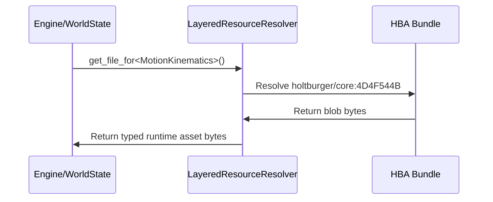

# DAT File Architecture 📚

The library crate responsible for reading, mounting, and parsing Asheron's Call static asset data from retail DAT files and Holtburger HBA bundles.

## Core Philosophical Principles
- **Read Only**: This library is strictly designed to query and project bytes read off the disk into structured domain models. Mutating DAT file contents or building DAT repacking tools is considered out of scope here.
- **Runtime HBA First**: Client/runtime consumers load required assets from namespaced HBA bundles through layered mounted sources. Raw retail DAT access remains valid for tooling and offline derivation, not normal runtime bootstrap.
- **Fast / Memoized**: Heavy lookup calls are structurally optimized or cached so indexing does not block the real-time game engine or UI ticks.

## Key Components

### 1. Resource Backends ([src/lib.rs](src/lib.rs))
The crate exposes two primary resource backends plus one runtime-facing composition layer:

- `DatDatabase` for direct retail DAT access in tooling, diagnostics, and offline derivation
- `HbaReader` for namespaced HBA runtime access
- `ResourceSource` plus `LayeredResourceResolver` for source-oriented runtime composition

`DatDatabase` mounts the underlying local file buffers and reconstructs the DAT B-tree directory structure internally to map resource IDs to disk offsets. The HBA reader resolves namespaced assets from archive metadata and fixed-width index entries.

### 2. File Extractor Systems ([src/file_type/](src/file_type/))
Contains distinct semantic parsers for the actual internal file blobs unpacked from DATs or HBA entries. Because the underlying data is a heterogeneous mix of object binaries, these parsers categorize it:
- **`gfx_obj`**: 3D model data, vertex placements, and polygonal UV mappings.
- **`landblock`**: Contains terrain data, topological maps, and geographic cell linkages.
- **`motion_table` / `setup_model` / `animation`**: Retail motion sources used by tooling to derive runtime locomotion semantics.
- **`motion_kinematics`**: Holtburger-derived runtime asset containing precomputed grounded locomotion rates and setup-model fallback mappings.
- **`skill_table` / `spell_table` / `xp_table`**: Required gameplay tables loaded directly from namespaced resources.

### 3. Layered Resource Resolution
The layered resolver lets runtime code compose multiple mixed-namespace sources and prefer higher-fidelity resources for a full `ResourceKey`.

This is the seam used by `holtburger-core` and `holtburger-world` to hard-require assets such as:

- `eor/portal` gameplay tables
- `holtburger/core:MotionKinematics`

Runtime code should use typed or namespaced resolver APIs rather than reaching into retail DATs directly.

### 4. Geographic Maps ([src/landblock.rs](src/landblock.rs))
Includes specialized interpretation logic mapping Asheron's Call's multi-layered world.
- Understands how outdoor terrain chunking ties physically to indoor basement and dungeon grids.

## Internal Data Flow

1. Runtime lookups begin from a namespaced resource key or typed required asset lookup.
2. The layered resolver selects the best mounted source for that namespace and file id.
3. Relevant file-type parsers unpack the byte buffer into strongly typed runtime models.

For tooling, the flow is similar except the source backend is usually `DatDatabase`, which reads retail records directly before optional derivation into HBA assets.

## 🛠️ Developer Onboarding

### Validating Asset Queries
New parsers and derived assets should be validated against ACE or ACViewer ground truth. Retail DAT fixtures remain valuable for parser tests, while runtime-facing assets should also be validated through HBA-backed integration tests where possible.

## Dependencies
- **`holtburger-common`**: Shared math and data types used in parsed outputs.
- **`memmap2`**: Uses high-performance OS-level memory mapping for rapid DAT tree traversal.
