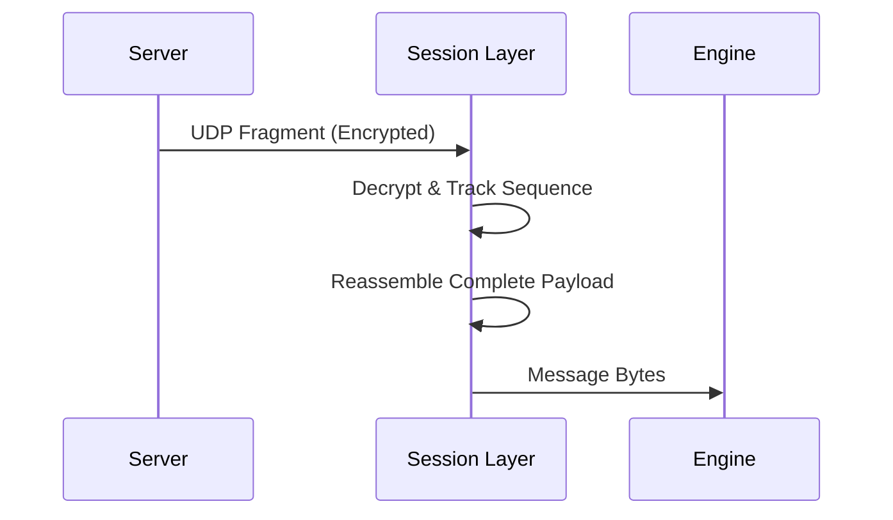

# Session Layer Architecture 🌐

This crate encapsulates pure networking logic. It handles the low-level Asheron's Call protocol transport details, allowing the rest of the application to interact with a clean socket abstraction. This crate perfectly isolates networking concerns from game world logic.

## Core Philosophical Principles
- **No Game Logic**: The `Session` has no concept of "Players", "Monsters", or "Inventories". It only knows about bytes, fragments, and sequence tracking.
- **Asynchronous**: Built heavily on `tokio` to handle concurrent UDP packet flows efficiently.

## Key Components

### 1. Transport Control
Handles the multi-stage networking requirements for the AC protocol:
- **`Session`**: The primary struct. Maintains the underlying UDP socket.
- **Fragment Reassembly**: Incoming UDP datagrams are often fragmented chunks of a larger protocol message. `holtburger-session` buffers and reassembles them before passing them up.
- **Packet Sequencing**: Tracks sequence IDs to ensure ordered, reliable delivery in what is normally an unreliable UDP protocol.
- **Flow Control & Acknowledgments**: Handles the specific ACK/NAK (Acknowledgment / Negative Acknowledgment) responses exactly as the AC server expects.

### 2. Encryption
The connection begins plaintext (`LOGIN_REQUEST`), the server replies with a `CONNECT_REQUEST` carrying per-direction ISAAC seeds, and subsequent encrypted packets use those streams as keyed checksums (one ISAAC key consumed per `ENCRYPTED_CHECKSUM` packet — see `session/auth.rs` and `session/receive.rs`).
- Note: ISAAC integration points are managed here so the checksum can be validated right off the wire before handing the (plaintext) payload to the protocol parser.

## Internal Data Flow

1. **Receive**: Decrypts raw UDP bytes.
2. **Reassemble**: Combines fragments based on sequence ordering.
3. **Emit**: Hands each reassembled payload upward as bytes so core can decode it into `holtburger_protocol::messages::GameMessage` at the core/world boundary.

## 🛠️ Developer Onboarding

### Debugging the Connection
If the client is failing to handshake, the issue is almost always here or in `auth.rs` of the core crate. You can use the `holtburger-debug-harness` to run pure session-level tests without mounting the GUI or world state.

## Dependencies
- **`tokio`**: The async runtime powering the UDP listeners.
- **`holtburger-protocol`**: For packing and unpacking bytes into readable AC struct domains.
