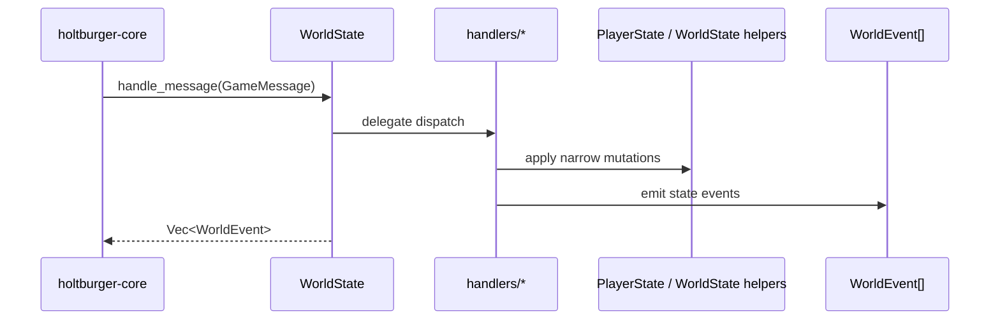

# World State Architecture 🌍

`holtburger-world` is the client's authoritative in-memory world model. It owns the live player
entity, hydrated entities, spatial index, lifecycle/retention rules, and world-domain state, while
keeping protocol routing separate from the state models themselves.

The refactor goal was simple: **handlers orchestrate, models mutate**.

## Core Design Rules

- **No transport ownership**: this crate does not own UDP/session concerns. It receives decoded
    messages from `holtburger-core`.
- **Feature-based routing**: protocol dispatch is grouped by gameplay/domain concern under
    [src/handlers](src/handlers), not by whichever state struct happens to hold most of the fields.
- **Stable facade**: callers still enter through `WorldState::handle_message()`, but that method is
    now just a facade over the handler layer.
- **Narrow mutation surfaces**: handlers call focused mutation helpers on `PlayerState` and
    `WorldState` instead of open-coding state changes.
- **One world authority**: player world/object state lives on the player `Entity` in
    `WorldState.entities`; `PlayerState` is reserved for local-player/session overlays.
- **Retention is part of authority**: whether an entity stays visible to the client is determined by
    `WorldState` retention/lifecycle rules, not by ad hoc handler-local cleanup.

## Ownership Split

### `handlers/` — protocol orchestration
Files: [src/handlers](src/handlers)

This layer is responsible for turning decoded protocol messages into state mutations and
`WorldEvent`s.

- `routing`: central dispatch order plus final event decoration such as spell-name resolution
- `player`: player-local updates, stat hydration, enchantments/spells, and movement sequence tracking
- `movement`: movement and vector synchronization
- `inventory`: ownership, placement, containers, previews, and object lifecycle
- `properties`: property fan-out across player, entities, vendor state, and derived side effects
- `login`: world-facing bootstrap completion for flows such as `PlayerDescription`
- `trade`: trade/vendor protocol flows
- `system`: `SetState` plus oddball protocol/system events such as `UseDone` and `WeenieError*`

Key rule: routing order is explicit and meaningful. Shared flows preserve
**player-first, world-second, event-last** ordering, and `routing.rs` is where that precedence lives.

### `PlayerState` — player-local model
File: [src/player/mod.rs](src/player/mod.rs)

`PlayerState` owns session-local player data:

- attributes, vitals, skills, and their raw bases
- enchantments, spells, hotbars, and derived combat stats
- inventory/equipment membership
- player-local position overlays and protocol sequence tracking
- bootstrap hydration for player-local `PlayerDescription` data

`PlayerState` does **not** own the top-level message router anymore, and it is not a second
authoritative entity snapshot. Its job is to expose mutation helpers that encode player-local
invariants, sequence tracking, and derived-stat recalculation.

### `WorldState` — authoritative world graph
File: [src/state/mod.rs](src/state/mod.rs)

`WorldState` owns the rest of the authoritative world model:

- `EntityManager` and the hydrated entity graph
- `SpatialScene` and movement/placement invariants
- entity lifecycle retention, pruning deadlines, and visibility-based eviction
- vendor state, trade state, open containers, and server time sync
- DAT-backed lookup tables such as XP, skill, and spell data

`WorldState::handle_message()` remains the stable public entry point, but its role is now to
delegate into the handler layer and return emitted `WorldEvent`s.

### Entities & Hydration
Files: [src/entity.rs](src/entity.rs), [src/hydration.rs](src/hydration.rs)

- **`EntityManager`** stores every hydrated object currently known to the client.
- **Hydration** merges partial updates into complete entity state as object descriptions and
    property updates arrive over time.

### Spatial / Physics helpers
Files: [src/spatial.rs](src/spatial.rs), [src/state/physics.rs](src/state/physics.rs)

These modules own movement-facing invariants:

- nearby-entity queries
- player/entity movement synchronization
- retention/visibility housekeeping for the world graph
- conservative visibility tracking for prune deadlines
- authoritative player-entity helpers such as `set_player_position()` and `set_player_vector()`

`SpatialScene` is the world-owned spatial composite and solve/query context. Shared runtime
sampling behavior lives inside it via `BodySamplingStore`, and that world-owned sampling state is
the canonical runtime body model for the client. Any app-facing cache in `holtburger-core` or a
frontend is derived read state only; it must not independently advance runtime bodies.

Shared world no longer performs automatic local collision or local velocity integration during
`tick()`. Those semantics are intentionally deferred until a future client can define a real
client-side physics or prediction model, but when constraint-aware runtime advancement does land it
belongs here on the world-owned runtime body path rather than in a parallel core/frontend cache.

### Lifecycle / retention helpers
Files: [src/state/liveness.rs](src/state/liveness.rs), [src/state/mutations.rs](src/state/mutations.rs)

These modules own the rules for when entities stay in the client-visible graph versus when they can
be pruned:

- explicit delete tracking
- preview retention for trade and opened containers
- ownership/parent retention reconciliation
- lifecycle-aware entity upsert and eviction

### Query traits and projection-facing logic
File: [src/context.rs](src/context.rs)

`WorldContext` and `WorldContextExt` provide a pure query boundary for higher-level logic. That lets
lossy projections or UI layers answer gameplay questions without duplicating rules or depending on
engine-thread state directly.

For runtime spatial reads, the long-term contract is the same: higher layers consume projected or
authoritative samples derived from world-owned `SpatialBody` state through explicit read-model
surfaces. They do not get shared mutable access to canonical runtime bodies, and they do not define
their own interpolation or dead-reckoning truth on the side.

This is also the boundary for shared combat-target semantics. Frontends may receive compact motion
updates for rendering or inspection, but gameplay queries such as combat-target viability should be
derived from world-owned state through `WorldContextExt` rather than reinterpreting motion packets
independently in each client.

## Dispatch Flow

1. `holtburger-core` decodes a protocol message and calls `WorldState::handle_message()`.
2. `WorldState` delegates dispatch to [src/handlers/routing.rs](src/handlers/routing.rs).
3. `routing.rs` applies an explicit precedence order across handler modules.
4. The relevant feature handler applies mutations through `PlayerState` or `WorldState` helpers.
5. Handlers emit `WorldEvent`s describing the observable outcome.
6. Final event decoration, currently including spell-name resolution, happens in the routing layer
    before control returns to the caller.

## Important Invariants

### Player authority invariant
The current player's world/object state lives on the player entity in `WorldState.entities`.

Anything that changes the player's physical position or velocity must update that entity through
the `WorldState` movement helpers so the authoritative entity state and the runtime-body state stay
in sync. `PlayerState` is for local-player overlays and sequencing, not duplicate world storage.

### Handler boundary
Handlers should orchestrate domain flows; they should not become mini state stores.

If a handler needs to do a multi-step update repeatedly, extract a named helper on the owning state
type instead of open-coding the mutation logic again.

### Bootstrap split invariant
`PlayerDescription` is intentionally a shared flow:

- the `player` handler hydrates the session-local player model first
- the `login` handler then hydrates the authoritative player entity and emits `PlayerInfo`/`LevelInfo`

That ordering avoids world helpers reading partially hydrated player state.

### Entity retention invariant
Entity lifetime is not just spawn/despawn.

- open-container previews
- trade previews
- parent/container/wielder ownership
- visibility-based prune deadlines
- explicit delete requests

All of these feed the retention snapshot in [src/state/liveness.rs](src/state/liveness.rs).
If you change entity ownership or visibility rules, update retention reconciliation in the owning
world helpers rather than layering on handler-specific cleanup.

### Event emission boundary
`WorldEvent` emission should describe meaningful observable changes or packet-scoped processing outcomes after mutation, not serve as a
shadow source of truth.

Compact entity motion snapshots now follow this rule too: `holtburger-world` owns the authoritative
per-entity motion snapshot and emits state events when that snapshot changes. Consumers may project
or render from those events, but the motion snapshot itself remains world-owned state.

## Adding New Functionality

When introducing a new tracked domain:

1. Decide whether it is primarily player-local, world-global, or shared.
2. Add state storage to the owning model (`PlayerState`, `WorldState`, or a nested world module).
3. Add focused mutation helpers that encode the new invariants.
4. Route protocol messages through a feature handler under [src/handlers](src/handlers).
5. Emit `WorldEvent`s only for meaningful world/core observations.

## Non-Goals

- This crate is not the protocol decoder.
- This crate is not the transport/session owner.
- This crate should not regress into model-owned router code just because a flow touches many
    fields.

## Dependencies

- **`holtburger-common`**: GUIDs, math, positions, properties, shared traits.
- **`holtburger-protocol`**: decoded message/event types.
- **`holtburger-dat`**: DAT-backed lookup tables and resource providers.
